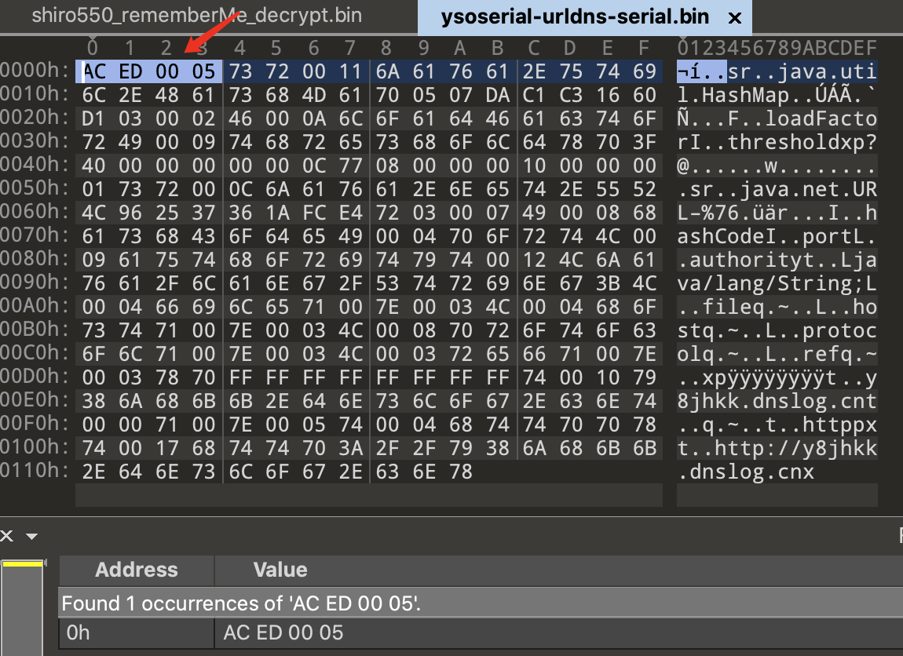
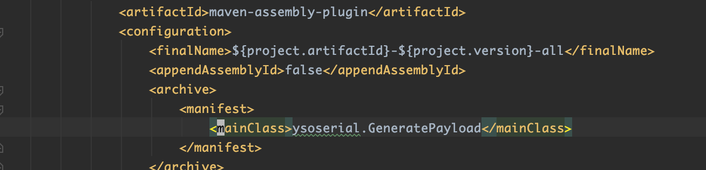
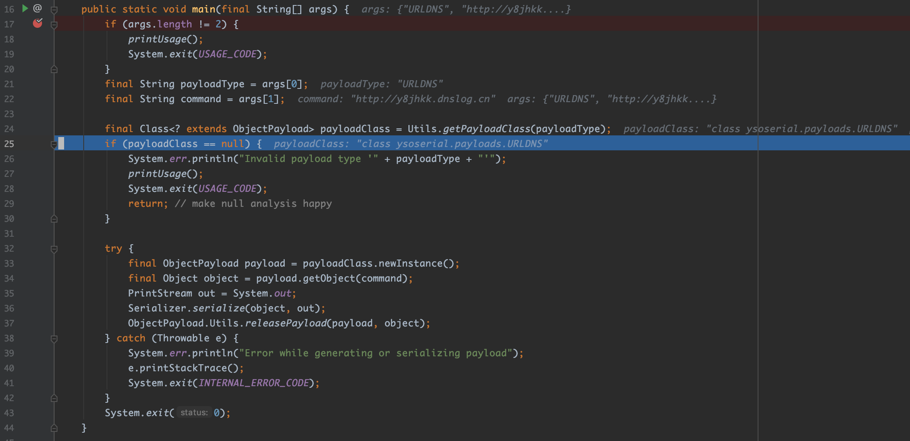
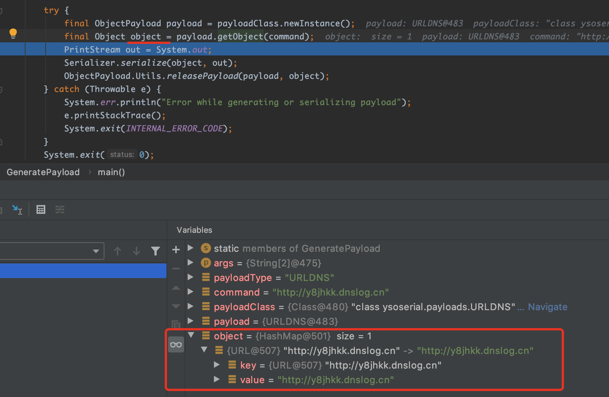
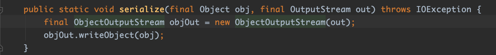

## ysoserial URLDNS模块分析

### 0x01. 序列化过程

当执行以下命令, 会生成向指定域名发起DNS请求的Java反序列化payload，并将其重定向到指定文件中。
```
java -jar ysoserial.jar URLDNS "http://y8jhkk.dnslog.cn" > ~/tmp/ysoserial-urldns-serial.bin
```
用`010 Editor`打开 `~/tmp/ysoserial-urldns-serial.bin`文件，可以看到标识Java序列化数据的`Magic Number`, `AC ED 00 05`。



将`ysoserial`工程导入`IDEA`后，从`pom.xml`文件可以看到入口类是`ysoserial.GeneratePayload`



当执行上述命令时，进入`GeneratePayload`的`main()`方法，首先获取外界传入的参数，其中，`URLDNS`作为payload的类型，通过 `Utils.getPayloadClass(payloadType)方法`获取到对应的payload处理类`ysoserial.payloads.URLDNS`。



接着，通过传入的参数`command`，`URLDNS`调用`getObject(command)`方法获取到一个`Object`对象，该对象实际上是一个`HashMap`对象, 它的`key`是一个与传入的`http://y8jhkk.dnslog.cn`相关联的`URL`对象，它的值则是 `http://y8jhkk.dnslog.cn`



最后通过 `Serializer.serialize(object, out);` 将这个`HashMap`对象序列化。
其实`Serializer.serialize(object, out)`就是调用`Object`的`writeObject`方法。



### 0x02. 反序列化过程