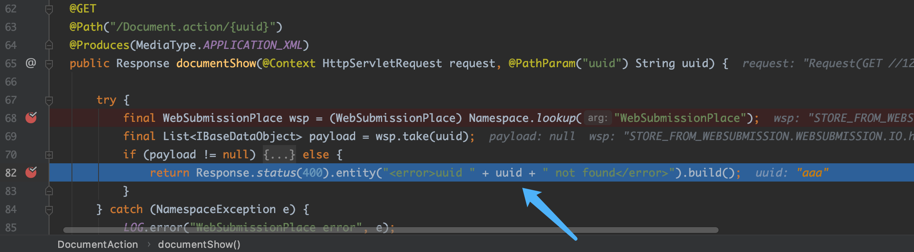
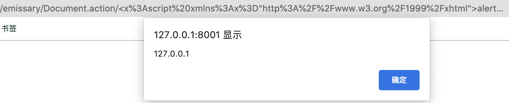

# NSA emissary多个漏洞分析复现和CodeQL实践

## 0x00 前言

先是Sonarsource的安全研究员在审计NSA的开源项目emissary的过程中发现了若干漏洞，其中包括：
- Code Injection (CVE-2021-32096)
- Arbitrary File Upload (CVE-2021-32094)
- Arbitrary File Disclosure (CVE-2021-32093)
- Arbitrary File Delete (CVE-2021-32095)
- Reflected cross-site scripting (CVE-2021-32092)

后来在浏览Github安全实验室的博客时，看到@pwntester在Sonarsource安全研究员的基础上，使用CodeQL编写规则，在emissary项目中除了检测出以上漏洞外，还发现了新的漏洞：
- Unsafe deserialization (CVE-2021-32634)
- Server-side request forgery (CVE-2021-32639)

最近除了在做漏洞分析外，也在学习CodeQL的使用，刚好可以用emissary项目来练手。

## 0x01 漏洞分析和复现

### Reflected cross-site scripting (CVE-2021-32092)

这个XSS漏洞发生在一个文档上传功能里，上传文档后通过`/emissary/Document.action/{uuid}`接口来获取文档的信息，`uuid`参数对应的不同的文档。当`uuid`不存在时，返回一个`XML`格式的内容，提示`uuid`不存在, 但传入的`uuid`参数未经任何的安全过滤就原样显示在回显文本中，可导致反射型XSS。关键代码如下图：



由于返回的文本是XML格式，可在[XSS-Cheat-Sheet](https://portswigger.net/web-security/cross-site-scripting/cheat-sheet)中找到在XML文件中执行的PoC，如下：

```html
<x:script xmlns:x="http://www.w3.org/1999/xhtml">alert(document.domain)</x:script>
```




### Arbitrary File Disclosure (CVE-2021-32093) 


### Code Injection (CVE-2021-32096)


### Unsafe deserialization (CVE-2021-32634)


### Server-side request forgery (CVE-2021-32639)


## 0x02 编写CodeQL规则来检测漏洞


## Reference

[1] https://blog.sonarsource.com/code-vulnerabilities-in-nsa-application-revealed <br>
[2] https://securitylab.github.com/research/NSA-emissary/ <br>