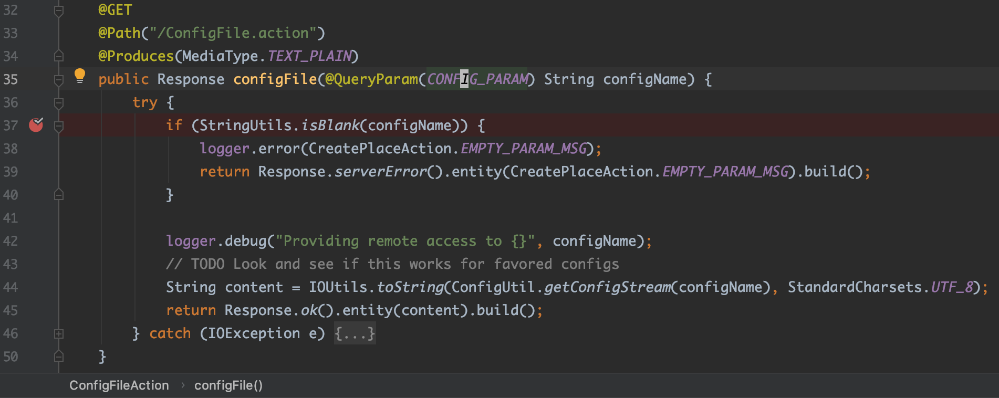
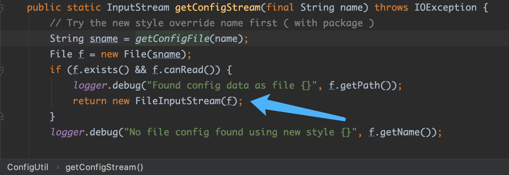
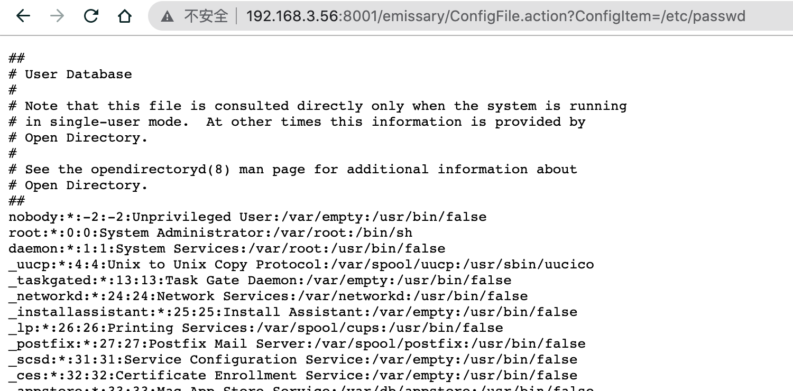
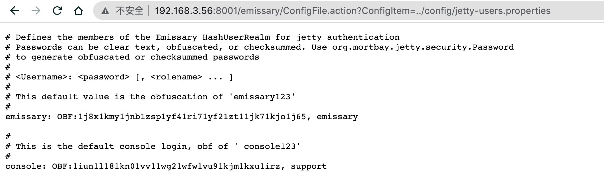
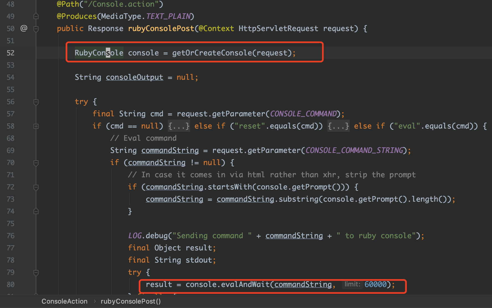
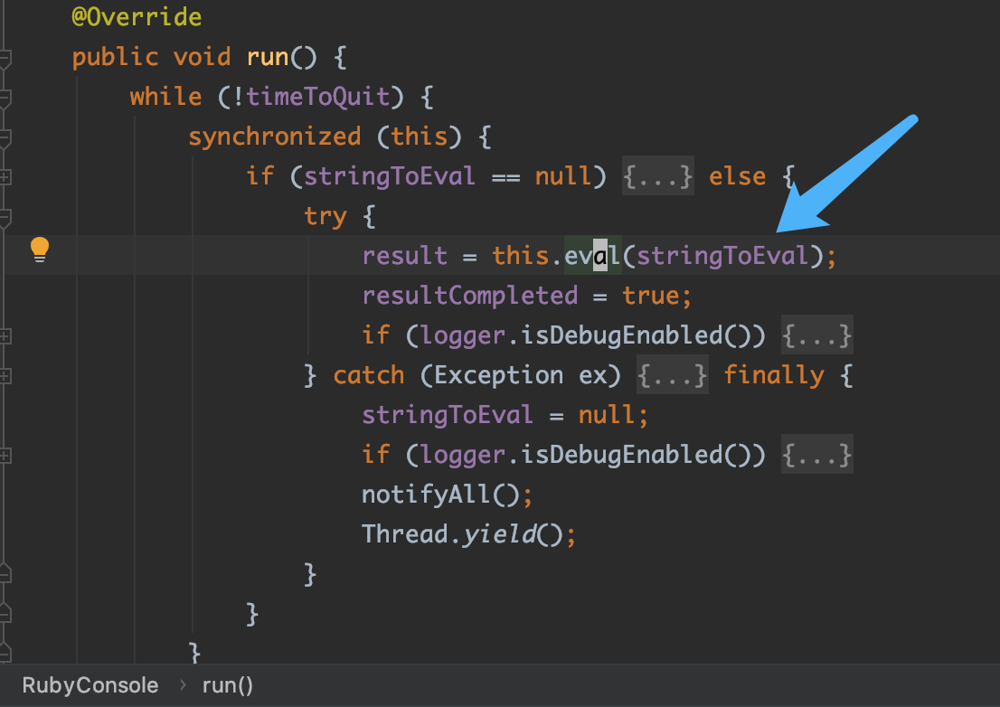
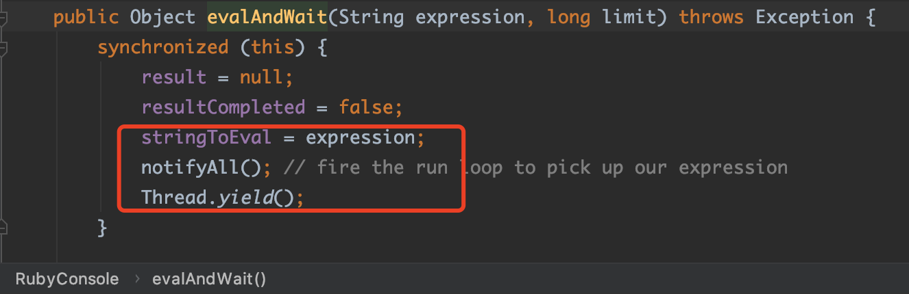
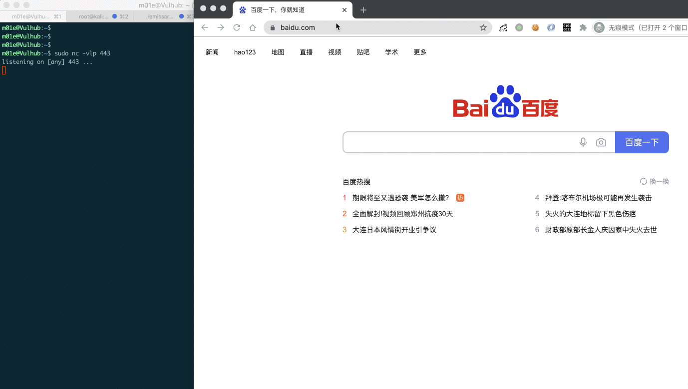
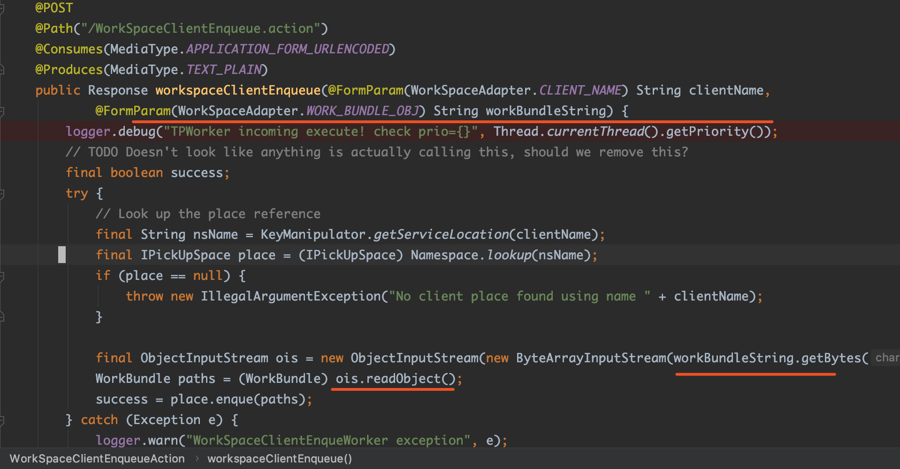

# NSA emissary多个漏洞分析复现和CodeQL实践

## 0x00 前言

先是Sonarsource的安全研究员在审计NSA的开源项目emissary v5.9.0版本的过程中发现了若干漏洞，其中包括：
- Code Injection (CVE-2021-32096)
- Arbitrary File Upload (CVE-2021-32094)
- Arbitrary File Disclosure (CVE-2021-32093)
- Arbitrary File Delete (CVE-2021-32095)
- Reflected cross-site scripting (CVE-2021-32092)

后来在浏览Github安全实验室的博客时，看到@pwntester在Sonarsource安全研究员的基础上，使用CodeQL编写规则，在emissary项目中除了检测出以上漏洞外，还发现了新的漏洞：
- Unsafe deserialization (CVE-2021-32634)
- Server-side request forgery (CVE-2021-32639)

最近笔者除了在做漏洞分析外，也在学习CodeQL的使用，刚好可以用emissary项目来练手。

## 0x01 漏洞分析和复现

### Reflected cross-site scripting (CVE-2021-32092)

这个XSS漏洞发生在一个文档上传功能里，上传文档后通过`/emissary/Document.action/{uuid}`接口来获取文档的信息，`uuid`参数对应的不同的文档。当`uuid`不存在时，返回一个`XML`格式的内容，提示`uuid`不存在, 但传入的`uuid`参数未经任何的安全过滤就原样显示在回显文本中，可导致反射型XSS。关键代码如下图：


由于返回的文本是XML格式，可在[XSS-Cheat-Sheet](https://portswigger.net/web-security/cross-site-scripting/cheat-sheet)中找到在XML文件中执行的PoC，如下：

```html
<x:script xmlns:x="http://www.w3.org/1999/xhtml">alert(document.domain)</x:script>
```


### Arbitrary File Disclosure (CVE-2021-32093) 

漏洞发生在接口`/emissary/ConfigFile.action`，该接口没有对传入的参数`ConfigItem`做任何安全校验和过滤，导致可读取服务器上任意文件。关键代码如下：





示例如下，读取系统文件，及读取emissary的配置文件获取用户名/密码：






### Code Injection (CVE-2021-32096)

该漏洞出现在接口`/emissary/Console.action`，该接口允许用户执行Ruby代码。关键代码如下：







严格来说，这个是emissary提供的功能，不应该算漏洞。另外，该接口需要登录后才能调用。但由于emissary的用户认证使用的是HTTP摘要认证(HTTP Digest authentication)(参考[3])，在浏览器端登录后的HTTP请求，会自动带上请求头`Authorization`，如下：

```
GET / HTTP/1.1
Host: 192.168.3.56:8001
Authorization: Digest username="emissary", realm="EmissaryRealm", nonce="6GNGeEbPjv0BCgLtxLiqHifkF1eNRMM3", uri="/", algorithm=MD5, response="daa5a9a9144b7665f5ff1f5585d3432f", qop=auth, nc=00000001, cnonce="9f3c3b06c42dba3b"
```

这种认证方式可以被CSRF攻击。所以可构造页面让登录用户去访问，然后获取反弹shell，如下图演示：




### Unsafe deserialization (CVE-2021-32634)

该漏洞发生在接口`/emissary/WorkSpaceClientEnqueue.action`，代码如下图：



可以看到参数`WorkSpaceAdapter.WORK_BUNDLE_OBJ`在第52、53行被读取并反序列化。而且emissary依赖了`commons-collections-3.2.1`，所以可以使用`ysoserial`生成`CC`链的payload进行反序列化攻击。由于这个接口也是登录后才可调用，因此可配合CSRF进行利用。

### Server-side request forgery (CVE-2021-32639)

这里有两个接口存在SSRF漏洞，分别是`/emissary/RegisterPeer.action`和`/emissary/AddChildDirectory.action`。

#### /RegisterPeer.action


#### /AddChildDirectory.action


## 0x02 使用CodeQL来检测漏洞


## Reference

[1] https://blog.sonarsource.com/code-vulnerabilities-in-nsa-application-revealed <br>
[2] https://securitylab.github.com/research/NSA-emissary/ <br>
[3] https://blog.csdn.net/andrewpj/article/details/45727853