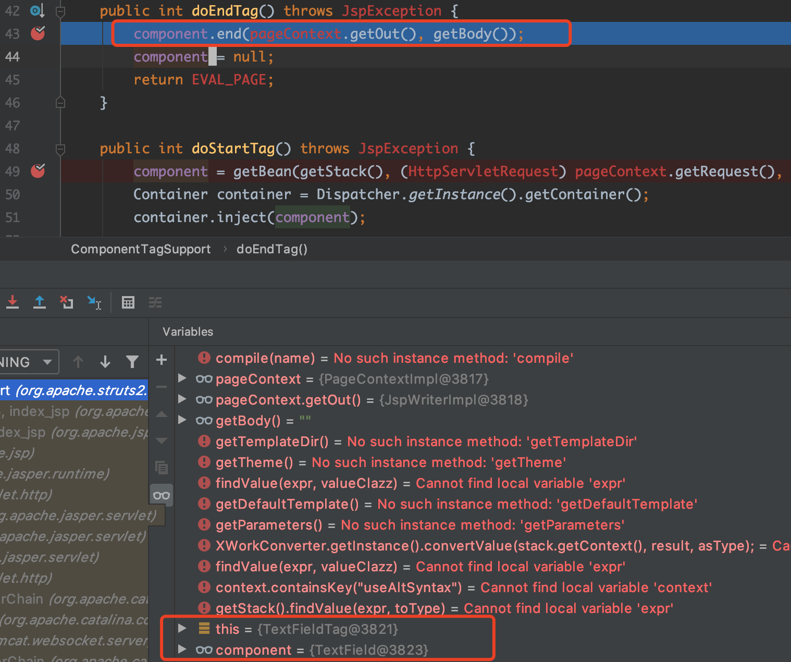

# struts2历史漏洞回顾与分析

## 目录

- [前言](#preface)
- [S2-001](#s2-001)
- [S2-003](#s2-003)
- [S2-005](#s2-005)
- [S2-007](#s2-007)
- [S2-008](#s2-008)
- [S2-009](#s2-009)
- [S2-012](#s2-012)
- [S2-013](#s2-013)
- [S2-015](#s2-015)
- [S2-016](#s2-016)
- [S2-032](#s2-032)
- [S2-045](#s2-045)
- [S2-052](#s2-052)
- [S2-053](#s2-053)
- [S2-057](#s2-057)
- [S2-059](#s2-059)
- [S2-061](#s2-061)

<a name="preface"></a>
## 前言

尽管现在struts2用的越来越少了，但对于Java Web方向的漏洞研究来说，还是有很大的学习价值的。毕竟Struts2作为一个很经典的MVC框架，无论对涉及到的框架知识，还是对过去多年出现的高危漏洞的原理进行学习，都会对之后学习和审计其他同类框架很有帮助。

<a name="s2-001"></a>
## S2-001

官方漏洞描述：<br>
https://cwiki.apache.org/confluence/display/WW/S2-001

## 漏洞复现和分析

根据漏洞描述，可知struts2中有个名为`altSyntax`的特性，该特性允许在表单中提交包含`OGNL`表达式的字符串(一般是通过文本字段，即struts2的`<s:textfile>`标签)，且可对包含OGNL的表达式进行递归计算。

漏洞复现环境使用的是docker镜像：`medicean/vulapps:s_struts2_s2-001`

这里先使用最简单的`PoC`进行调试：`%{2+5}`


Submit提交后，OGNL表达式返回结果并填充在`textfield`文本框中：


下面就来调试分析一下。<br>
由于漏洞是在struts2对文本标签`<s:textfield>`处理的过程中触发的，所以先找到相对应的处理类。在IDEA里，对着`<s:textfield>`处点击便可定位到文件`struts-tags.tld`，其中可看到该标签相关的一些属性定义，包括该标签的对应的处理类为：`org.apache.struts2.views.jsp.ui.TextFieldTag`。


在该类中搜索处理开始标签和结束标签的方法，发现其使用的是父类`ComponentTagSupport`的处理方法：`doStarTag`和`doEndTag`。


在这两个方法中下断点。经调试发现，触发漏洞是在`doEndTag`方法中。因此，当当前标签时`TextField`类型时，单步跟进调试。



调试进入`UIBean#evaluateParams()`方法中，当请求的参数中`value`为null时，则会根据`name`属性的值去获取对应的`value`属性的值。且`altSyntax`特性默认是开启的(该属性设置在struts2的文件`default.properties`中)，所以这里会用`OGNL`表达式的标识符`%{}`把`name`属性的值包住，比如当前表单的用户名文本输入框中，`name`属性的值为`username`，则加了`OGNL`表达式标识符后变为：`%{username}`，如下图：


继续跟进`findValue()`方法，后面会进入到`TextParserUtil#translateVariables()`方法中，如下图：


在`TextParserUtil#translateVariables()`方法中，有一个`while(true)`循环，这里会调用`OgnlValueStack#findValue()`方法来计算`OGNL`表达式(其实底层调用的还是`OGNL`的API)计算。<br>
计算`%{username}`，截取`%{}`里面的内容`username`，会从值栈ValueStack的`Root`对象中获取key为`username`的值，即`%{2+5}`。由于获取到的值`%{2+5}`仍然是一个`OGNL`表达式，故会再次进行计算，此时便是计算`2+5`得到值`7`。

>PS：本文不会详细讨论struts2的ValueStack、OGNL等知识点。
>想了解的朋友可参考陆舟的《Struts2技术内幕》一书中的第6章, 以及第8章的8.2小节。

到此，漏洞原理的部分已经分析完了。

由于比较好奇这里为什么表单文本框的内容提交后`OGNL`表达式的计算结果会以替换文本输入框内容的方式进行回显。于是便进一步调试。
发现在`UIBean#evaluateParams()`计算完成后，会进入`UIBean#mergeTemplate()`方法构造一个页面返回到客户端。跟进该方法，如下图：


可看到该方法中使用了模板引擎Freemarker进行页面的构造，这里主要先针对用户名的文本框进行构造，所需参数由`getParameters()`方法返回，返回的值里就包含了上面OGNL表达式`%{2+5}`的计算结果`7`，保存在`key`为`nameValue`的值中。<br>
再来看看此时使用的模板`template`参数的值`/template/xhtml/text`，最后定位到具体的模板文件`/template/simple/text.ftl`，内容如下图：


这就一目了然了：这里会判断参数`parameters`中的`nameValue`的值是否存在，存在的话便填充到该文本输入框的`value`属性中。

### 可回显PoC

这里使用OGNL上下文对象`context`去获取`HttpServletResponse`对象，如下图：


于是有：
```java
%{#p=(new java.lang.ProcessBuilder(new java.lang.String[]{"whoami"})).start(),
#is=#p.getInputStream(),
#br=new java.io.BufferedReader(new java.io.InputStreamReader(#is)),
#arr=new char[50000],
#br.read(#arr),
#str=new java.lang.String(#arr),
#writer=#context.get("com.opensymphony.xwork2.dispatcher.HttpServletResponse").getWriter(),
#writer.println(#str),
#writer.flush(),
#writer.close()}
```

## 漏洞修复

在struts2 `2.0.9`版本中，依赖的XWork的版本为`2.0.4`，在该版本中，`com.opensymphony.xwork2.util.TextParseUtil#translateVariables()` 判断循环的次数，如果超过`1`次，就退出`while(true)`循环体，从而避免`OGNL`表达式的递归执行，如下图所示。


换言之，在处理完`%{username}`后，就不能对获取到的值再进行OGNL表达式计算了。

<a name="s2-003"></a>
## S2-003


<a name="s2-005"></a>
## S2-005


<a name="s2-007"></a>
## S2-007


<a name="s2-008"></a>
## S2-008


<a name="s2-009"></a>
## S2-009


<a name="s2-012"></a>
## S2-012


<a name="s2-013"></a>
## S2-013


<a name="s2-015"></a>
## S2-015


<a name="s2-016"></a>
## S2-016


<a name="s2-032"></a>
## S2-032


<a name="s2-045"></a>
## S2-045


<a name="s2-052"></a>
## S2-052


<a name="s2-053"></a>
## S2-053


<a name="s2-057"></a>
## S2-057


<a name="s2-059"></a>
## S2-059


<a name="s2-061"></a>
## S2-061


