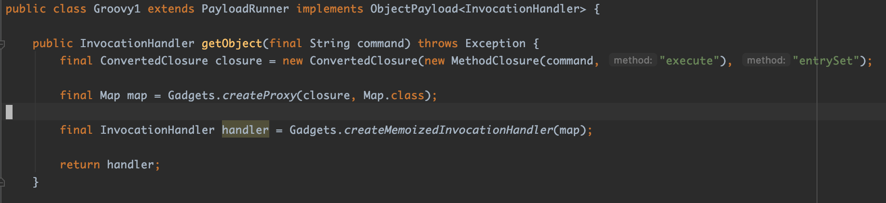
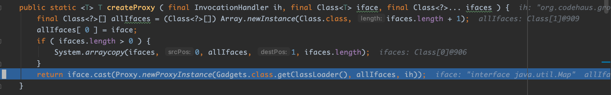
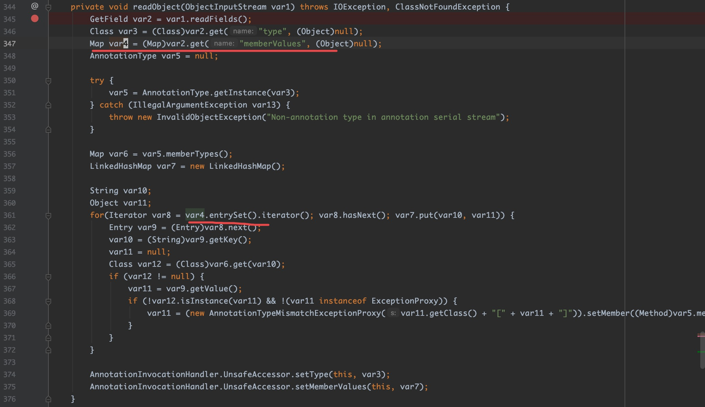
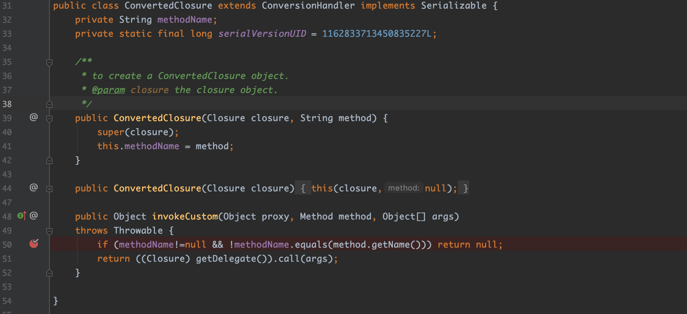
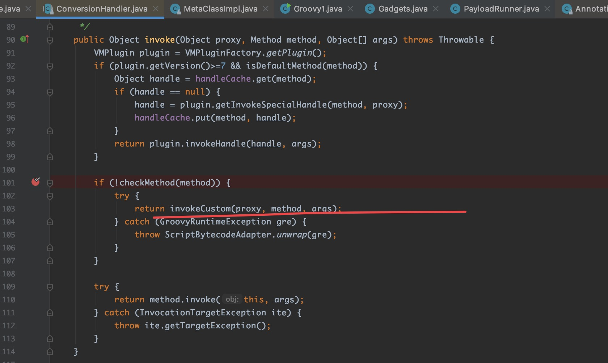
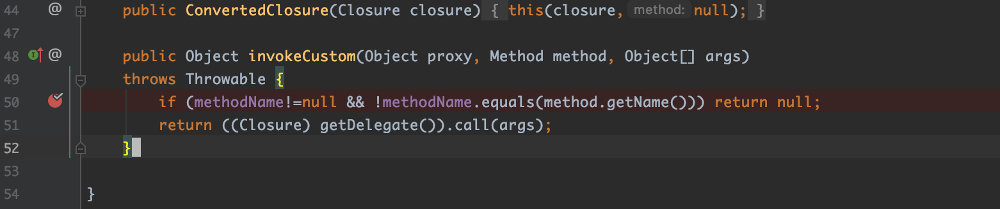
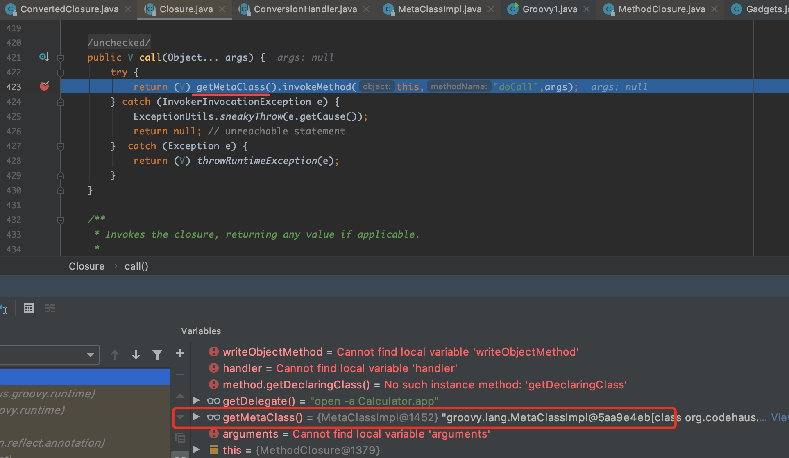
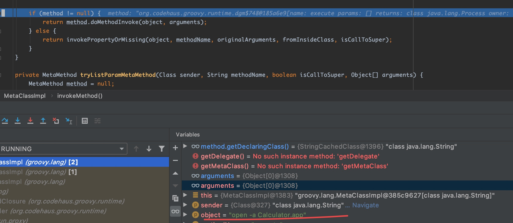
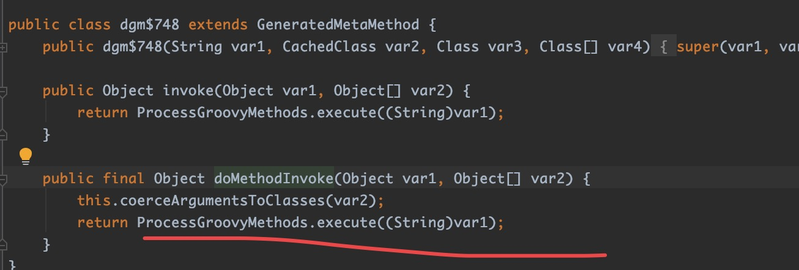
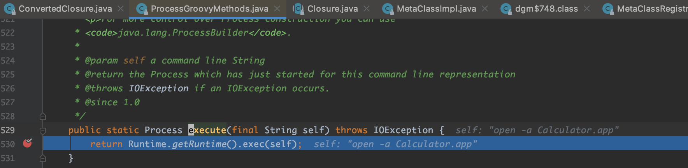

## ysoserial Groovy1模块分析

### 0x00. 前置知识

#### 1、Java动态代理

由于`ysoserial`中很多模块都用到了动态代理技术。所以这里有必要先简单介绍下Java的动态代理。

在`Java`中，所有`interface`类型的变量总是通过向上转型并指向某个实例的，如：
```java
CharSequence cs = new StringBuilder();
```

那么是否可以不创建实现类，直接在运行期创建某个`interface`的实例呢？
是可以的。因为`Java`标准库提供了一种动态代理（Dynamic Proxy）的机制：可以在运行期动态创建某个`interface`的实例。

何为动态创建？来先看看静态的代码写法：

定义接口：
```java
public interface Hello {
    void morning(String name);
}
```

编写实现类：
```java
public class HelloWorld implements Hello {
    public void morning(String name) {
        System.out.println("Good morning, " + name);
    }
}
```

创建实例，转型为接口并调用：
```java
Hello hello = new HelloWorld();
hello.morning("Bob");
```

这种就是我们通常编写代码的方式。

还有一种方式是动态代码，我们仍然先定义了接口`Hello`，但是我们并不去编写实现类，而是直接通过JDK提供的一个`Proxy.newProxyInstance()`创建了一个`Hello`接口对象。这种没有实现类但是在运行期动态创建了一个接口对象的方式，我们称为动态代码。JDK提供的动态创建接口对象的方式，就叫动态代理。

一个最简单的动态代理实现如下：
```java
import java.lang.reflect.InvocationHandler;
import java.lang.reflect.Method;
import java.lang.reflect.Proxy;

public class Main {
    public static void main(String[] args) {
        InvocationHandler handler = new InvocationHandler() {
            @Override
            public Object invoke(Object proxy, Method method, Object[] args) throws Throwable {
                System.out.println(method);
                if (method.getName().equals("morning")) {
                    System.out.println("Good morning, " + args[0]);
                }
                return null;
            }
        };
        Hello hello = (Hello) Proxy.newProxyInstance(
            Hello.class.getClassLoader(), // 传入ClassLoader
            new Class[] { Hello.class }, // 传入要实现的接口
            handler); // 传入处理调用方法的InvocationHandler
        hello.morning("Bob");
    }
}

interface Hello {
    void morning(String name);
}
```

如上代码：
- 定义一个InvocationHandler实例，它负责实现接口的方法调用；
- 通过`Proxy.newProxyInstance()`创建`interface`实例，它需要3个参数：
  - 使用的ClassLoader，通常就是接口类的ClassLoader；
  - 需要实现的接口数组，至少需要传入一个接口进去；
  - 用来处理接口方法调用的InvocationHandler实例。
- 将返回的Object强制转型为接口。

动态代理实际上是JDK在运行期动态创建class字节码并加载的过程，它并没有什么黑魔法，把上面的动态代理改写为静态实现类大概长这样：
```java
public class HelloDynamicProxy implements Hello {
    InvocationHandler handler;
    public HelloDynamicProxy(InvocationHandler handler) {
        this.handler = handler;
    }
    public void morning(String name) {
        handler.invoke(
           this,
           Hello.class.getMethod("morning", String.class),
           new Object[] { name });
    }
}
```

至此，已简单介绍了Java的动态代理技术，有了这个前置知识，下面在分析`Groovy1`模块的代码就比较好理解了。

### 0x01. 序列化过程

`Groovy1`模块的Payload来自于自身的`getObject()`方法的返回结果。所以还是从`getObject()`方法入手分析，其代码如下：



在这个方法中，第一行，用到了两个类，分别是`ConvertedClosure`和`MethodClosure`，且这两个类均来自于依赖包`org.codehaus.groovy`，已知`Groovy1`模块的Payload就是依赖于`org.codehaus.groovy`，所以很明显这两个类是与`Groovy1`利用链强相关的。至于该行代码，到底起什么作用暂且不管，先继续往下看。

第二行调用了`Gadgets.createProxy()`方法，看它的代码实现：



看到了熟悉的Java动态代理，即用`Proxy.newProxyInstance()`创建了一个`Map`类型的接口对象，接口方法的处理对象就是传入的`ConvertedClosure`对象。

第三行调用了`Gadgets.createMemoizedInvocationHandler()`，该方法中，利用反射来创建一个`sun.reflect.annotation.AnnotationInvocationHandler`类的对象，参数为第二行得到的`Map`类型接口对象。为啥要用反射呢？是因为`AnnotationInvocationHandler`的构造方法不是`public`类型的。

到此，我们知道了序列化的数据其实是`AnnotationInvocationHandler`对象。但是单从这几行代码，是不明白作者为什么要这么做的。没关系，在下面分析其反序列化的过程，就能明白。

### 0x02. 反序列化过程

既然知道了序列化的数据是`AnnotationInvocationHandler`对象，那么对其反序列化时，必定会调用它的`readObject()`方法，代码如下：



可以看到，`var4.entrySet()`，而这里的`var4`，正是前面我们利用动态代理技术创建的`Map`类型的接口对象。最开始讲动态代理技术时提到，无论调用接口对象的任何方法，都会调用接口方法处理类的`invoke()`方法进行处理。而这里的接口方法处理类，就是讲序列化过程时，提到的`ConvertedClosure`类，其代码如下：



可以看到，`ConvertedClosure`中并没有`invoke()`方法，猜测应该是在父类`ConversionHandler`中。果然如此：



这里会有一个判断，当`checkMethod(method)`返回`false`时，则调用`invokeCustom()`方法。
首先这里的`checkMethod()`将返回`false`，因为这个函数其实是判断传入的`method`参数是否为`Object`类的方法，是则`true`，不是则`false`。因为这里的`method`其实是`Map#entrySet()`方法，并不属于`Object`类的方法，所以`checkMethod(method)`返回`false`。
所以接着会调用`invokeCustom()`方法。该方法是`ConversionHandler`里的一个抽象方法，因此会调用子类`ConvertedClosure`的实现。



根据`ConvertedClosure`的构造方法可知，这里的`((Closure)getDelegate())`指向的就是前面序列化时传入的`MethodClosure`对象。这里这里继续跟进`MethodClosure#call()`方法的代码。
发现类`MethodClosure`中并没有`call()`方法，那就是调用其父类`Closure`的`call()`方法，代码如下：



`Closure#call()`中又会继续调用`MetaClassImpl#invokeMethod()`方法。该方法代码比较长，这里只截取关键的部分：

```java
    public Object invokeMethod(Class sender, Object object, String methodName, Object[] originalArguments, boolean isCallToSuper, boolean fromInsideClass) {
        ...(省略)...

        final boolean isClosure = object instanceof Closure;
        if (isClosure) {
            final Closure closure = (Closure) object;

            final Object owner = closure.getOwner();

            if (CLOSURE_CALL_METHOD.equals(methodName) || CLOSURE_DO_CALL_METHOD.equals(methodName)) {
                final Class objectClass = object.getClass();
                if (objectClass == MethodClosure.class) {
                    final MethodClosure mc = (MethodClosure) object;
                    methodName = mc.getMethod();
                    final Class ownerClass = owner instanceof Class ? (Class) owner : owner.getClass();
                    final MetaClass ownerMetaClass = registry.getMetaClass(ownerClass);
                    return ownerMetaClass.invokeMethod(ownerClass, owner, methodName, arguments, false, false);
                } else if (objectClass == CurriedClosure.class) {
                   ...(省略)... 
                }
                if (method==null) invokeMissingMethod(object,methodName,arguments);
            }

            ...(省略)...

        if (method != null) {
            return method.doMethodInvoke(object, arguments);
        } else {
            return invokePropertyOrMissing(object, methodName, originalArguments, fromInsideClass, isCallToSuper);
        }
    }
```

可以看到，在该方法中，由于此时传入的`object`参数，指向的是`MethodClosure`对象，它的父类是`Closure`，因此后面会进入 `if(isClosure)`条件分支，然后递归调用`invokeMethod()`方法。
当递归调用结束时，会进入方法最下面的 `if(method != null)`条件分支，执行`method.doMethodInvoke(object, arguments)`方法。
此时，`method`指向的是`dgm$748`的实例对象，参数`object`指向的是我们指定要执行的命令`open -a Calculator.app`。



找到`dgm$748#doMethodInvoke()`的实现代码：



可以看到它调用了 `ProcessGroovyMethods#execute()`，继续跟进，终于看到了熟悉的`Runtime#exec()`。




#### 小结

如上所述，`Groovy1`模块的反序列化利用链如下所示：

```
AnnotationInvocationHandler#readObject()
  ConvertedClosure#invoke()
    ConversionHandler#invoke()
      ConvertedClosure#invokeCustom()
        MethodClosure#call()
          Closure#call()
            MetaClassImpl#invokeMethod()
              dgm$748#doMethodInvoke()
                ProcessGroovyMethods#execute()
                  Runtime#exec()
```