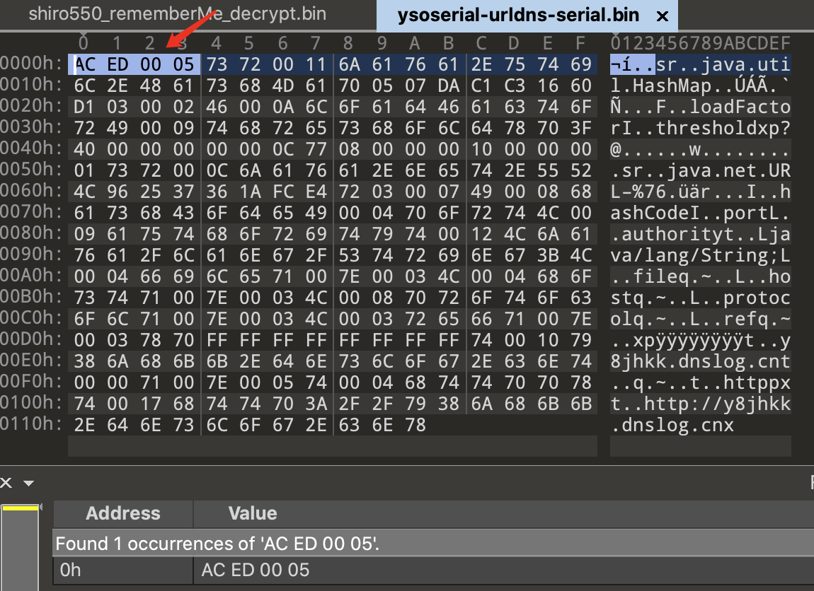
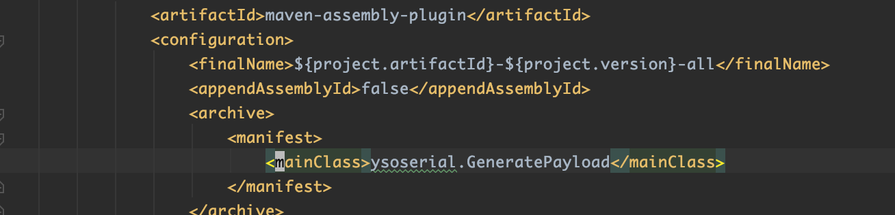
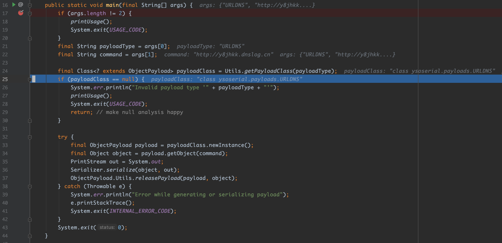
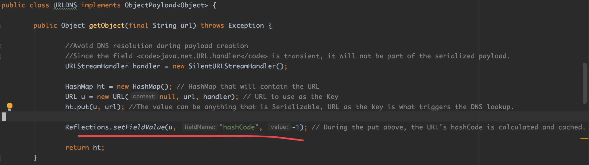
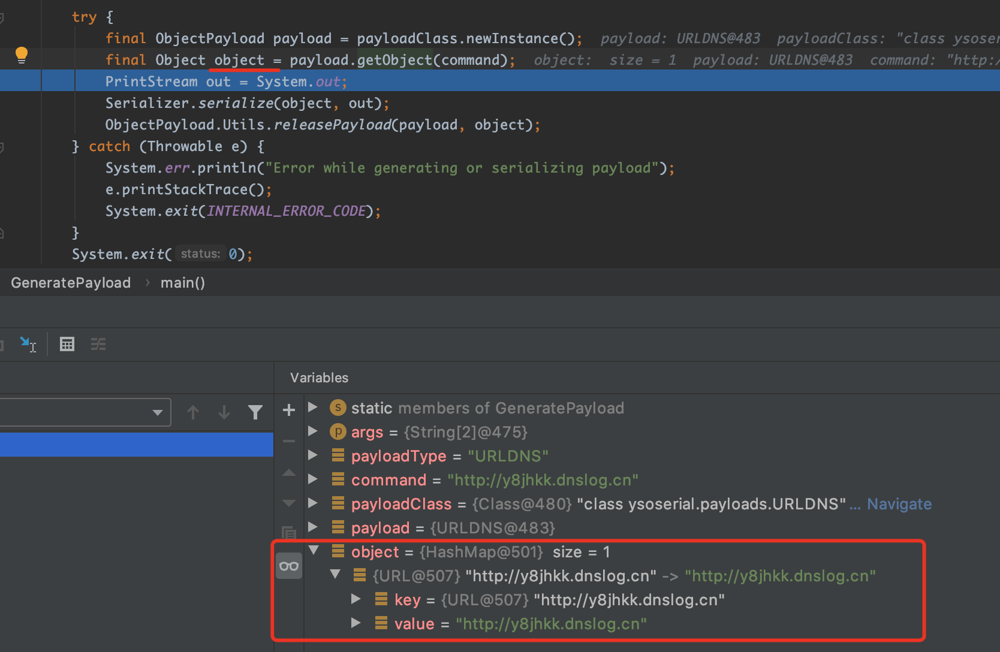
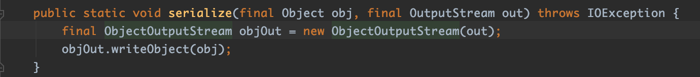
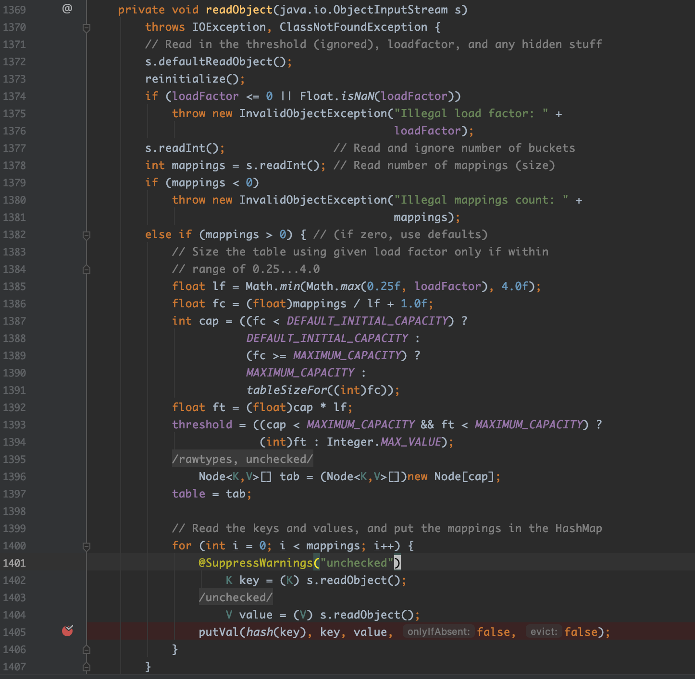
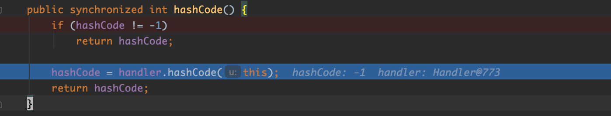
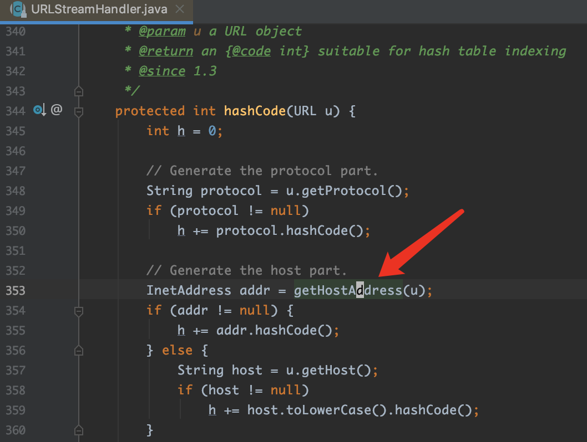
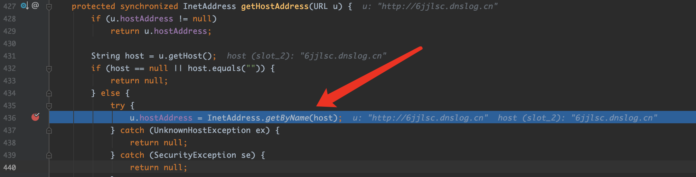

## ysoserial URLDNS模块分析

### 0x00. 前言

2015年Gabriel Lawrence (@gebl)和Chris Frohoff (@frohoff)在AppSecCali上提出了利⽤Apache Commons Collections来构造命令执⾏的利⽤ 链，并在年底因为对Weblogic、JBoss、Jenkins等著名应⽤的利⽤，⼀⽯激起千层浪，彻底打开了⼀⽚ Java安全的蓝海。<br>

⽽ `ysoserial`就是两位原作者在此议题中释出的⼀个⼯具，它可以让⽤户根据⾃⼰选择的利⽤链，⽣成反 序列化利⽤数据，通过将这些数据发送给⽬标，从⽽执⾏⽤户预先定义的命令。<br>

`URLDNS`就是`ysoserial`中⼀个利⽤链的名字，但准确来说，这个其实不能称作“利⽤链”。因为其参数不 是⼀个可以“利⽤”的命令，⽽仅为⼀个URL，其能触发的结果也不是命令执⾏，⽽是⼀次DNS请求。<br>

虽然这个“利⽤链”实际上是不能“利⽤”的，但因为其如下的优点，⾮常适合我们在检测反序列化漏洞时使⽤：<br>
- 使⽤Java内置的类构造，对第三⽅库没有依赖。
- 在⽬标没有回显的时候，能够通过DNS请求得知是否存在反序列化漏洞。

### 0x01. 序列化过程

当执行以下命令, 会生成向指定域名发起DNS请求的Java反序列化payload，并将其重定向到指定文件中。
```
java -jar ysoserial.jar URLDNS "http://y8jhkk.dnslog.cn" > ~/tmp/ysoserial-urldns-serial.bin
```
用`010 Editor`打开 `~/tmp/ysoserial-urldns-serial.bin`文件，可以看到标识Java序列化数据的`Magic Number`, `AC ED 00 05`。



将`ysoserial`工程导入`IDEA`后，从`pom.xml`文件可以看到入口类是`ysoserial.GeneratePayload`



当执行上述命令时，进入`GeneratePayload`的`main()`方法，首先获取外界传入的参数，其中，`URLDNS`作为payload的类型，通过 `Utils.getPayloadClass(payloadType)方法`获取到对应的payload处理类`ysoserial.payloads.URLDNS`。



接着，通过传入的参数`command`，`URLDNS`调用`getObject(command)`方法获取到一个`Object`对象，该对象实际上是一个`HashMap`对象, 它的`key`是一个与传入的`http://y8jhkk.dnslog.cn`相关联的`URL`对象，它的值则是 `http://y8jhkk.dnslog.cn`



至于这里，`getObject()`方法，最后为什么要把该`URL`对象的`hashCode`的值置为`-1`，待下面讨论`URLDNS`的反序列化过程时会提到。


最后通过 `Serializer.serialize(object, out);` 将这个`HashMap`对象序列化。
其实`Serializer.serialize(object, out)`就是调用`Object`的`writeObject`方法。



### 0x02. 反序列化过程

上面已经阐述了`URLDNS`模块的payload生成的原理，为什么`URLDNS`模块的payload反序列化的过程中会根据指定域名发起`DNS`请求呢？

从上面的序列化过程中可知，这里`URLDNS`模块产生的序列化对象其实是一个`HashMap`对象。因此我们来看一下`HashMap`类的源码。如下图，可以看到它重写了`readObject()`方法。



如上代码所示，在1400-1405这几行中，是还原`HashMap`对象的过程，其中在填充键值对映射关系时，调用了`hash(key)`方法, 跟进该方法的实现：
```java
static final int hash(Object key) {
    int h;
    return (key == null) ? 0 : (h = key.hashCode()) ^ (h >>> 16);
}
```

可以看到，实际会调用`key`的`hashCode()`方法。而此时的`key`是指定url的URL对象。
所以继续来看`URL`类的`hashCode()`方法：



可以看到，当`hashCode`的值为`-1`，才会调用`URLStreamHandler`对象的`hashCode(URL url)`方法，否则直接返回。同时这也解释了为什么上面讨论序列化过程时，`URLDNS`的`getObject()`方法中，为什么要把`URL`对象的`hashCode`的值设置为`-1`。

继续跟进`URLStreamHandler`类的`hashCode(URL url)`方法的实现，其中会调用`getHostAddress()`方法，



`getHostAddress()`方法，又会调用`InetAddress.getByName()`方法进行DNS查询。



### 问题1

为什么`SilentURLStreamHandler`继承`URLStreamHandler`后，要重写`openConnection`和`getHostAddress`方法且为空操作？

因为在payload生成的时候，会调用`HashMap#put()`方法，`key`为`URL`对象。所以后面也会调用`URL#hashCode()`方法。因此为了避免在payload生成的时候就发起DNS请求，所以这里将`SilentURLStreamHandler`类重写的`openConnection`和`getHostAddress`方法作空操作处理。

也许你会有疑问：这样的话，反序列化的时候不就不会发起HTTP请求了吗？

不会的，因为`URL`中的`handler`属性是被`transient`关键字修饰的，所以payload生成的过程中，`SilentURLStreamHandler`并不会被序列化。所以反序列化的时候调用的还是`URLStreamHandler#getHostAddress()`方法。

这样的话，既让payload生成的时候不会发起DNS请求，又让payload被反序列化的时候能发起DNS请求。(真的很巧妙啊^_^)


### 小结

下面再回顾下`URLDNS` payload的反序列化过程：

- 因为`URLDNS`模块的payload其实就是`HashMap`对象的序列化数据。而`HashMap`又重写了`readObject()`方法，因此反序列化过程便会调用`HashMap`对象的`readObject()`方法。

- 在`HashMap`的`readObject()`方法中，会将序列化数据还原为`HashMap`对象，其中，会对`key`进行hash运算，即调用`hash(key)`方法，且在该方法中，会调用`key`的`hashCode()`方法，而这里的`key`其实是一个`URL`对象，所以调用的是`URL#hashCode()`。

- 在`URL#hashCode()`方法中，当`hashCode`成员变量为`-1`时，会执行`URLStreamHandler#hashCode()`方法。

- 在`URLStreamHandler#hashCode()`方法中，会调用`getHostAddress()`方法。

- 在`getHostAddress()`方法中，会调用`InetAddress.getByName()`方法发起DNS请求。