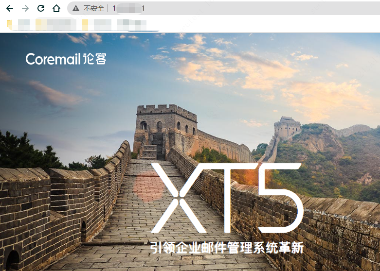
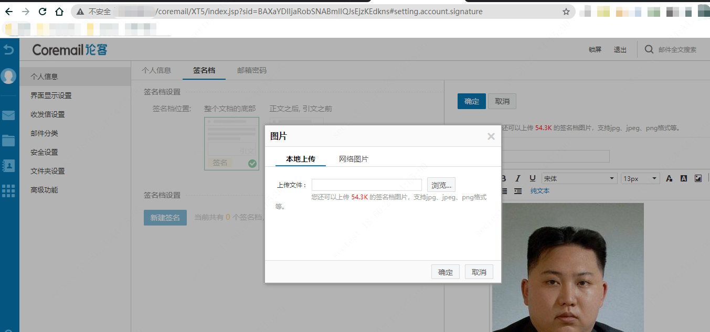
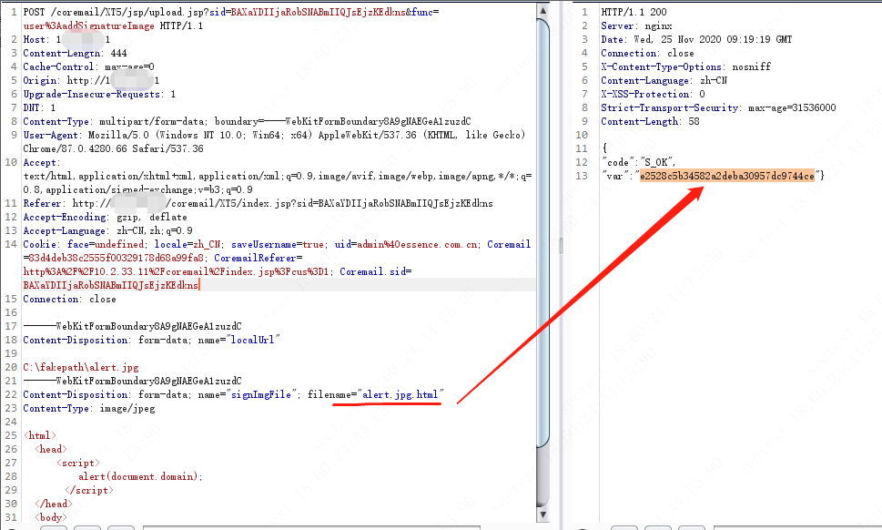
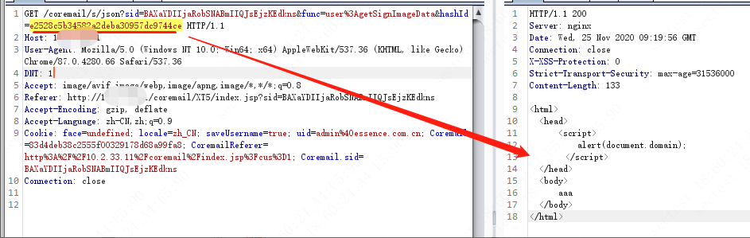
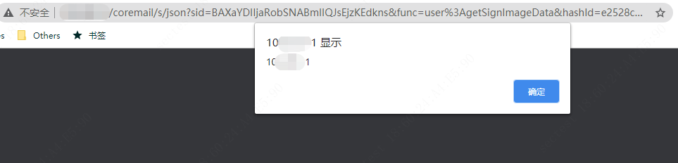

# Coremail XT5.0 allows upload and parse HTML files that can lead to Reflected XSS, or phishing attack.

## Vulnerability Type:
Reflected XSS  
File uploaded

## Vulnerability Version:
Coremail XT5.0

## Vulnerability Description AND recurrence:

### step 1

Login the Coremail, and go to the personal information page, then add new signature, you can see a rich-text editor. You can upload an image file in it.

### step 2
Because the upload file interface `/coremail/XT5/jsp/upload.jsp` doesn't verify the type of uploaded file, you can upload any type of file to server. The JSP file can't be parsed and executed, but the HTML file can be.

## Vulnerability Impact

It allows upload and parse HTML files that can lead to Reflected XSS, or phishing attack.
