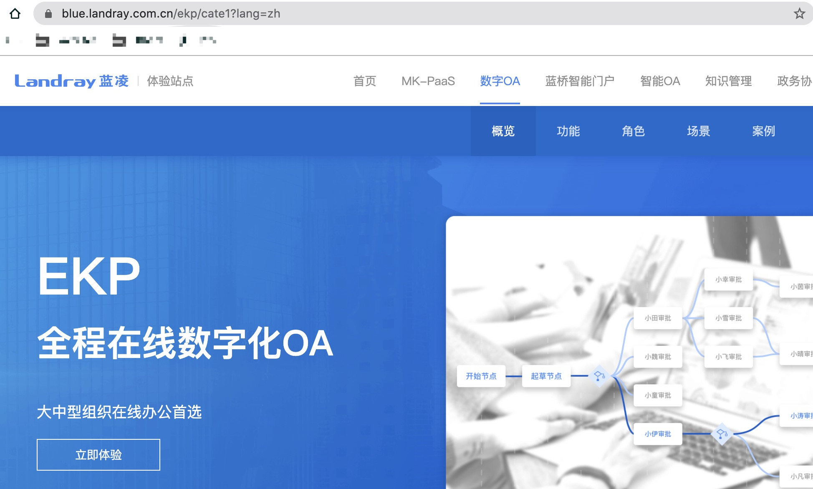

# Landray EKP OA system allows bypass file extension blacklist and upload svg/shtml/mht files that can lead to Stored XSS, or phishing attack.

## What is Landray EKP?

Landray EKP is one of a series of OA-system products of Landray company.
It is used by many large and medium-sized enterprises in China.

## Vulnerability Type:
Stored XSS  
File uploade

## Vulnerability Version:
Landrary EKP V12.0.9.R.20160325

## Vulnerability Description AND recurrence:

### step 1

Login the EKP OA system, then click the menu to go into a working process creating page.

### step 2

In the working process creating page, I can upload attachments. I try to upload `jsp`、`html` files at first, but I failed. Because there is a security check with a file extension blacklist in both frontend and backend. Just as screenshot shown as below:

But, the file extensions `.svg`、`.shtml`、`mht` are not in the blacklist. So I try to upload `svg/shtml/mht` files to lead to stored xss, and I make it.

After I upload, I save and submit the working process, and then, I click the menu to pass the working process to another user to read.

### step 3

Login another user who mentioned above, and you can see there is a new message waiting to be read in the right side of the home page.

Click the link and go to read the new message, then click the `.svg` file link to preview. Oh, this user is attacked by stored xss!

In the same way, uploading the `shtml` or `mht` file can lead to the same attacking, but the `shtml` or `mht` files only can be parsed and triggered XSS in IE browser.

## Vulnerability Impact

It allows bypass file extension blacklist and upload `svg`、`shtml`、`mht` files that can lead to Stored XSS, or phishing attack.