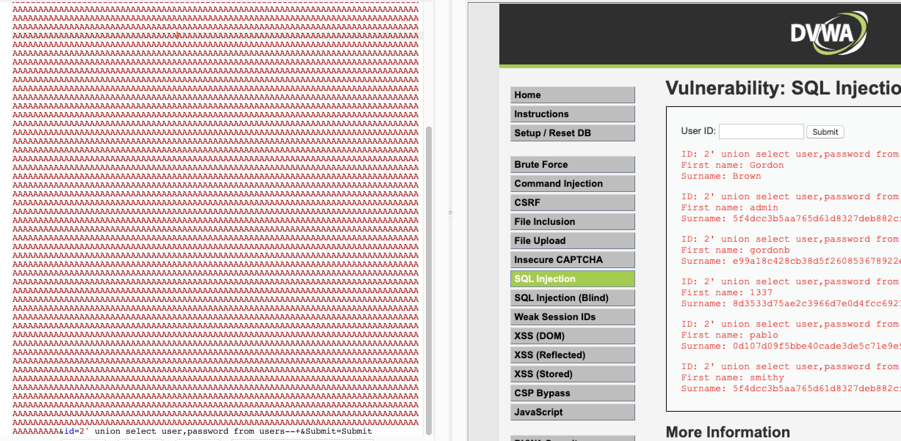

# 0x00 学习目标

拥有对waf各种绕过漏洞的深入理解和独立挖掘waf通杀绕过漏洞的能力以及思维。

# 0x01 搜索来源

- B站、Youtube
关键字：
>waf bypass
waf 绕过

- google、github
关键字：
> waf bypass
waf 绕过
waf bypass cookbook
waf bypass tutorial
awesome waf

---
ZP出的课程的waf bypass部分的目录：
1、x里云盾WAF access注入防御绕过
2、x里云盾WAF mysql注入防御绕过
3、x里云盾WAF mssql注入防御绕过
4、x里云盾WAF oracle注入防御绕过
5、x里云盾WAF PostgreSQL注入防御绕过
6、D盾WAF access注入防御绕过
7、D盾WAF mysql注入防御绕过
8、D盾WAF mssql注入防御绕过
9、D盾WAF oracle注入防御绕过
10、D盾WAF PostgreSQL注入防御绕过
11、某狗 access注入防御绕过
12、某狗 mysql注入防御绕过
13、某狗 mssql注入防御绕过
14、某狗 oracle注入防御绕过
15、某狗 PostgreSQL注入防御绕过
16、云锁 access注入防御绕过
17、云锁 mysql注入防御绕过
18、云锁 oracle注入防御绕过
19、云锁 mssql注入防御绕过
20、云锁 PostgreSQL注入防御绕过
21、通杀国内外所有主流 WAF Bypass 技巧（sql注入）
22、通杀国内外所有主流WAF Bypass 技巧（XSS）
23、通杀国内外所有主流WAF Bypass 技巧（上传）
24、绕过 WAF 连接菜刀马（通杀所有常见WAF）
25、Webshell免杀技巧（以PHP为例）
26、Webshell免杀技巧（以asp为例）
27、Webshell免杀技巧（以java为例）
28、通杀所有常见 WAF Bypass 技巧（命令执行）
29、coludflare mysql 注入防御绕过
30、coludflare oracle 注入防御绕过
31、coludflare mssql注入防御绕过
32、coludflare PostgreSQL注入防御绕过

---

# 0x02 WAF 101

## WAF的防御思想

### 攻击的特点

- 攻击的特点：
  - 攻击二象限：已知攻击与未知攻击
  - 攻击的两个维度：形式(http/https)与漏洞(Web漏洞)

## WAF的核心原理

- 运用'黑'，'白'思想
>即黑、白名单。
- 规则匹配、特征匹配、漏洞签名
>针对某个漏洞，比如`struts2`、`weblogic`的RCE漏洞
- 对匹配结果进行响应(拦截、记录)

## WAF的主流产品形态

- 云WAF
>阿里云盾
>腾讯网站管家
>创宇盾
>CloudFlare
>...

- 软件产品类

>安全狗
>云锁
>360主机卫士
>ModSecurity
>...

- 硬件设备类

>启明星辰
>绿盟
>天融信
>飞塔(Fortinet)
>Impreva
>...

## WAF的几种部署模式

- 基于DNS解析
>修改DNS，让域名解析到反向代理服务器。所有流量经过反向代理进行检测，检测无问题之后再转发给后端的Web服务器。
>这种模式是云WAF用的比较多。

- 串联模式
>一般指的是反向代理模式、透明代理模式。反向代理模式会改变原有的网络拓扑，真实客户端IP会以HTTP Header传递给后端Web Server。透明代理模式可以在不改变原有网络拓扑结构的情况下直接部署。

透明代理模式，如下图所示：

反向代理模式，如下图所示：

- 旁路模式
>利用流量镜像技术，将业务流量分流给WAF产品，这种部署模式的优点是不会影响业务稳定性，所以WAF会投入更多的性能在检出率上面。但缺点也很明显，不借助其他手段无法对检测出的攻击行为进行阻断。

- 软件嵌入中间件+检测引擎模式
>在使用Nginx作为反向代理的业务下，WAF提供Nginx模块嵌入到原有的Nginx，将请求转发给检测引擎，可以做到在不改动原有网络拓扑的情况下完成检测任务。

# 0x03 WAF绕过原理

## WAF为什么会被绕过?

- 鱼（安全）和熊掌（业务性能）不可兼得;
>安全面对业务性能上会做妥协，会考虑到性能的损耗度，知道什么情况下就不检测了。那这种情况就可能会被一些比如很长的请求包给绕过了。

- WAF为了考虑通用性的问题，无法100%覆盖某些语言、中间件、数据库的特性;
>比如PHP的一些语法糖，各种中间件的在url解析过程中的编解码处理，不同数据库sql语句的多样性。

- 硬件WAF自身往往存在漏洞。
>对http协议的兼容性不如Web中间件。比如有的硬件WAF当遇到一些不是很正常的http包时会产生一些不可预知的bug(比如进程崩溃)，导致流量直接就到后端Web Server里去，从而bypass。

## WAF绕过角度

>如上图，这三个绕过角度，在理解上，并不是相互独立的，而是互有交叉的。比如云WAF，绕过它的其中一个手段便是找到站点的真实IP，所以这里的绕过角度，既可以看作是利用了WAF的架构（基于DNS解析的部署），也可以看作是利用了WAF的特性（云WAF的特性）。
>另外，在实际的waf bypass，也要视情况，灵活组合运用。

### 1. 架构

### 2. 规则缺陷/特性

- 2.1 服务器特性

- 2.2 应用层特性

- 2.3 WAF层特性

- 2.4 数据库特性

### 3.协议

## WAF的本质

所谓的Bypass WAF, 实际上是去寻找位于WAF设备之后处理应用层数据包的硬件/软件的特性, 然后利用特性构造WAF不能命中，但是在应用程序中能够执行成功的payload，绕过防护。

# 0x04 WAF bypass分类

## 1.文件上传bypass

## 2.命令执行bypass

## 3.SQL注入bypass

## 4.XSS bypass

## 5.针对并发访问频率限制bypass

# 0x05 WAF绕过实战

## 绕过安全狗-mysql

环境：`安全狗Apache最新版(V4.0)`+`Apache 2.4（phpstudy2018）`+`Windows服务器`

靶场：`DVWA`

- 绕过方式1：超长数据包bypass (绕过角度：规则缺陷/特性)
>GET型请求转POST
>Content-Length头长度大于4021
>正常参数放置在脏数据后面，否则无效

- 绕过方式2：空格替换bypass （绕过角度：规则缺陷/特性）
>拒绝传统的%20 -> %09 %0d %0a %08...
>GET请求转POST

- 绕过方式3：协议转换bypass （绕过角度：协议）
>使用文件上传时用的`Content-Type: multipart/form-data;`
>关键词换行

- PS:
>其实对于安全狗，还有多种方式，因为安全狗算是比较弱的waf了，主要还是基于关键词+正则匹配的检测。

## 绕过云锁-mysql

## 绕过云锁-mssql

## 绕过云锁-postgrepsql

# 附录

## ASCII对照表
https://tool.oschina.net/commons?type=4
https://www.runoob.com/charsets/ref-html-ascii.html
https://www.runoob.com/charsets/ref-html-ascii.htm
