# 堆的基础知识


## 0x00 什么是堆

栈：通常用于为函数分配固定大小的局部内存。

堆：可根据运行时的需要进行动态分配和释放的内存，大小可变。
- 申请堆内存：`malloc`/`new`
- 释放堆内存：`free`/`delete`

堆的实现重点关注内存块的组织和管理方式，尤其是空闲内存块。
- 如何提高分配和释放效率。
- 如何降低碎片化，提高空间利用率。
比如浏览器的DOM树通常分配在堆上，堆的实现算法影响网页加载和动态效果的速度，且影响浏览器对内存的使用效率。

### 堆的特点

堆是从低地址往高地址生长。

### 常见堆的实现

- dlmalloc - 通用分配器
- ptmalloc2 - `glibc`在用
>基于dlmalloc fork出来，在2006年增加了对多线程的支持
- jemalloc - `FreeBSD`、`Firefox`、`Android`在用
- tcmalloc - `Chrome`在用
- libumem - `Solaris`在用
- segment heap - `Windows10`在用


## 0x01 ptmalloc2的多线程支持

不同的线程维护不同的堆，称为：per thread arena；
主线程创建的堆，称为：main arena;
Arena数量受到CPU核数的限制：
 - 对于32位系统：arena数量上限=2*核数
 - 对于64位系统：arena数量上限=8*核数

## 0x02 glibc的堆管理实现

- **arena**

  - 指的是堆内存区域本身，并非结构；
  - 主线程的main arena通过`sbrk()`创建;
  - 其他线程的arena通过`mmap()`创建;

- **malloc_state**
  - 管理arena的核心结构，包含堆的状态信息、bins链表等;
  - main_arena对应的malloc_state结构存储在glibc的全局变量中;
  - 其他线程arena对应的malloc_state存储在arena本身当中.

- **bins**
  - bins用来管理空闲内存块，通常使用链表结构来进行组织.

- **chunks**
  - 内存块的结构.


#### 注意！
>以下介绍的堆管理环境为glibc 2.26以下（不含2.26），即出现tcache之前的堆管理方式；
>以下演示的环境均为64位程序及操作系统。

### arena的头部结构：malloc_state

`malloc_state`存储了arena的状态，其中包括了用于管理空闲块的`bins`链表。
```cpp
struct malloc_state
{
  /* Serialize access.  */
  mutex_t mutex;

  /* Flags (formerly in max_fast).  */
  int flags;

  /* Fastbins */
  mfastbinptr fastbinsY[NFASTBINS];

  /* Base of the topmost chunk -- not otherwise kept in a bin */
  mchunkptr top;

  /* The remainder from the most recent split of a small request */
  mchunkptr last_remainder;

  /* Normal bins packed as described above */
  mchunkptr bins[NBINS * 2 - 2];

  /* Bitmap of bins */
  unsigned int binmap[BINMAPSIZE];

  /* Linked list */
  struct malloc_state *next;

  /* Linked list for free arenas.  Access to this field is serialized
     by free_list_lock in arena.c.  */
  struct malloc_state *next_free;

  /* Number of threads attached to this arena.  0 if the arena is on
     the free list.  Access to this field is serialized by
     free_list_lock in arena.c.  */
  INTERNAL_SIZE_T attached_threads;

  /* Memory allocated from the system in this arena.  */
  INTERNAL_SIZE_T system_mem;
  INTERNAL_SIZE_T max_system_mem;
};

struct malloc_chunk {

  INTERNAL_SIZE_T      prev_size;  /* Size of previous chunk (if free).  */
  INTERNAL_SIZE_T      size;       /* Size in bytes, including overhead. */

  struct malloc_chunk* fd;         /* double links -- used only if free. */
  struct malloc_chunk* bk;

  /* Only used for large blocks: pointer to next larger size.  */
  struct malloc_chunk* fd_nextsize; /* double links -- used only if free. */
  struct malloc_chunk* bk_nextsize;
};

typedef struct malloc_chunk* mchunkptr;
```

主线程的`malloc_state`结构存储在glibc的全局变量中，变量名为：`main_arena`。
```cpp
static struct malloc_state main_arena;
```

### Main Arena概览

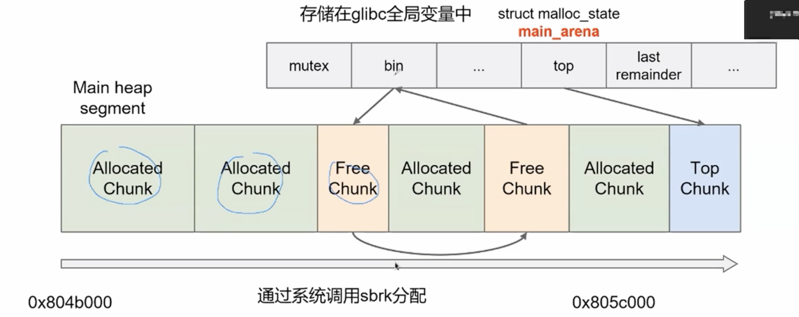

### 空闲内存块（free chunk）结构

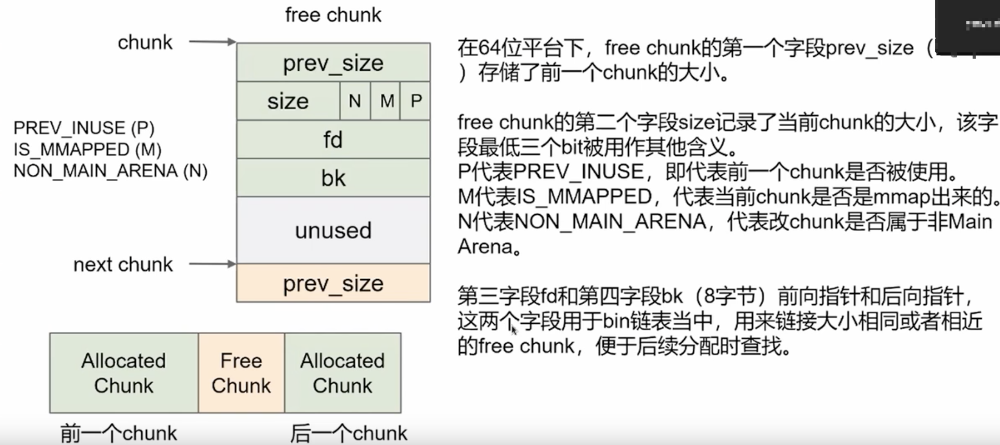

第一个字段`prev_size`仅当前一个`chunk`也是`free chunk`的时候，才会用上。


### 已分配内存块（allocated chunk）结构

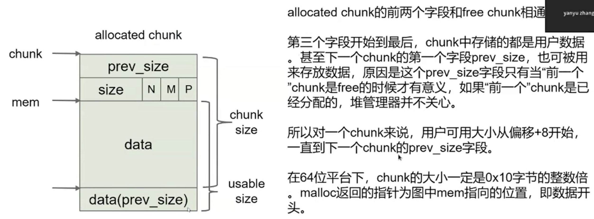

>allocated chunk和free chunk最大的区别：
如果当前的chunk是free chunk时，下一个chunk的第一个字段pre_size就是其前一个chunk的大小；
如果当前的chunk是allocated chunk时，下一个chunk的第一个字段pre_size则还是上一个chunk的数据。
>这其实是glibc疯狂压榨内存使用率的一种方式。


### malloc()参数与chunk大小的关系

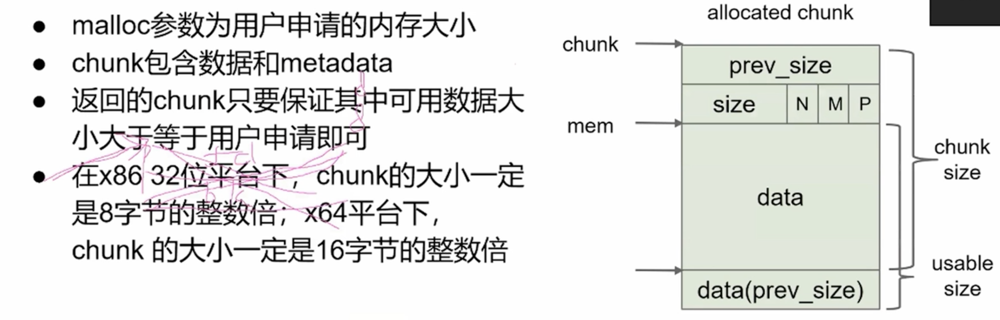


### Bins结构

Bins是用来管理和组织**空闲**内存块的链表结构，根据chunk的大小和状态，有许多种不同的Bins结构。

- Fast bins
>用来管理小的chunk
- Bins
  - small bins: 用于管理中等大小的chunk;
  - large bins: 用于管理较大的chunk;
  - unsorted bins: 用于存放未整理的chunk.


#### Fast bins

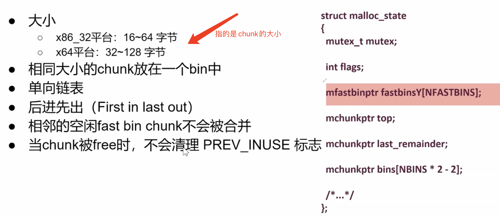

```cpp
struct malloc_chunk {

  INTERNAL_SIZE_T      prev_size;  /* Size of previous chunk (if free).  */
  INTERNAL_SIZE_T      size;       /* Size in bytes, including overhead. */

  struct malloc_chunk* fd;         /* double links -- used only if free. */
  struct malloc_chunk* bk;

  /* Only used for large blocks: pointer to next larger size.  */
  struct malloc_chunk* fd_nextsize; /* double links -- used only if free. */
  struct malloc_chunk* bk_nextsize;
};

typedef struct malloc_chunk *mfastbinptr;
```

下面以一个简单的C程序来说明Fast bins在内存中的结构：

代码如下：
```cpp
#include <stdio.h>
#include <stdlib.h>
#include <string.h>

int main(int argc, char *argv[])
{
  char* a1 = malloc(0x10);
  memset(a1, 0x41, 0x10);
  char* a2 = malloc(0x10);
  memset(a2, 0x42, 0x10);
  char* a3 = malloc(0x10);
  memset(a3, 0x43, 0x10);
  printf("Malloc done!\n");
  
  free(a2);
  free(a1);
  free(a3);
  return 0;
}
```
使用VS2019+virsualGDB进行断点调试，当使用`malloc()`分别给 `a1`、`a2`、`a3`分配好内存并填充数据后，此时`a1`、`a2`、`a3`所在的chunk的内存空间如下图所示。可以看到此时`a1`、`a2`、`a3`所在的chunk是连续的，且以`16`字节对齐。
另外，上面提到，每个chunk的第二个字段（8个字节，且除去最低3个bit位）为当前chunk的大小，所以这里chunk大小就是`0x00000021`将最低`3`个bit位置0，也就是`0x20`，即`16`个字节。

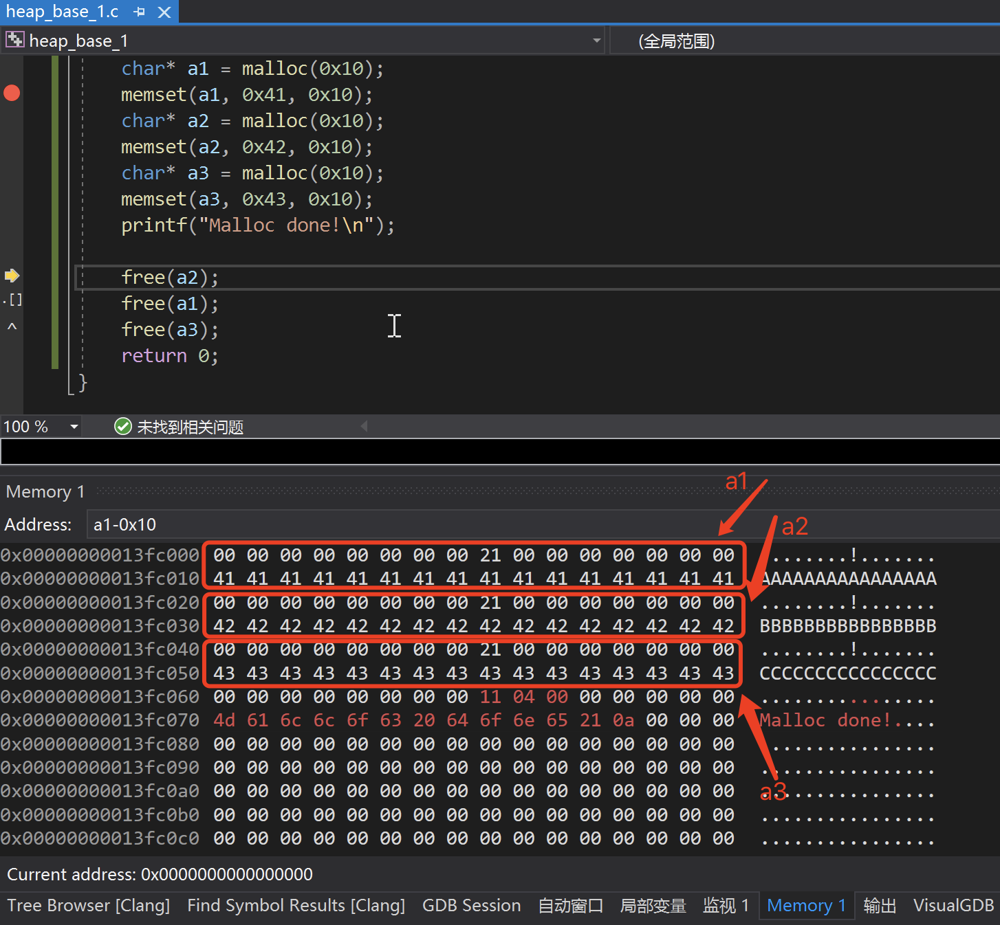

然后，使用`free()` 陆续将`a2`、`a1`、`a3` 3个chunk进行释放。如下图，
代码中先释放`a2`的chunk，所以`a2`chunk的`fd`字段的8字节被清零，由于Fast bins是单向链表，所以这里释放chunk的时候，不会对`bk`字段的8字节进行清零和使用。
接着是释放`a1`的chunk，`a1`chunk的`fd`字段指向了前一个被释放的chunk(即`a2`的chunk)的首地址`0x013fc020`（注意这里是小端）。同理，释放`a3`的chunk后，`a3`chunk的`fd`字段指向了`a1`chunk的首地址`0x013fc000`。

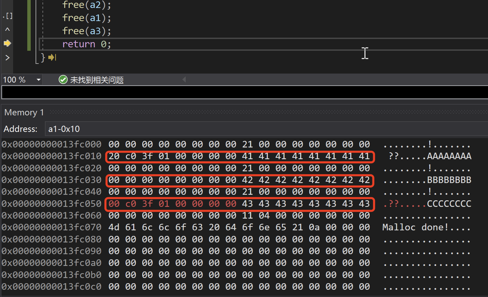


#### Small bins

```cpp
struct malloc_chunk {

  INTERNAL_SIZE_T      prev_size;  /* Size of previous chunk (if free).  */
  INTERNAL_SIZE_T      size;       /* Size in bytes, including overhead. */

  struct malloc_chunk* fd;         /* double links -- used only if free. */
  struct malloc_chunk* bk;

  /* Only used for large blocks: pointer to next larger size.  */
  struct malloc_chunk* fd_nextsize; /* double links -- used only if free. */
  struct malloc_chunk* bk_nextsize;
};

//跟Fast bins的mfastbinptr一样，都是指向结构体malloc_chunk
typedef struct malloc_chunk* mchunkptr;
```

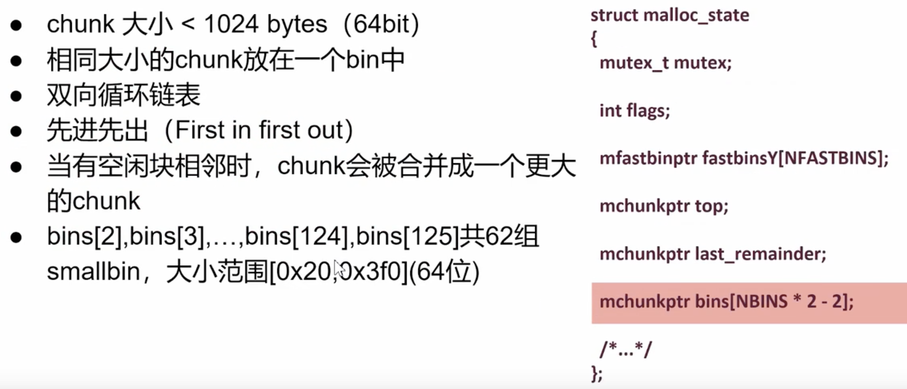


#### Large bins

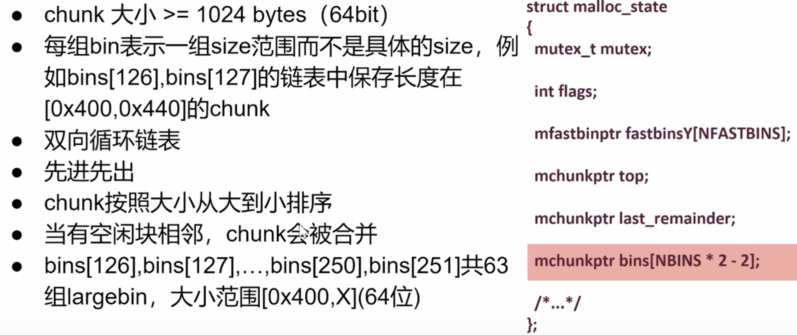

#### Unsorted bins

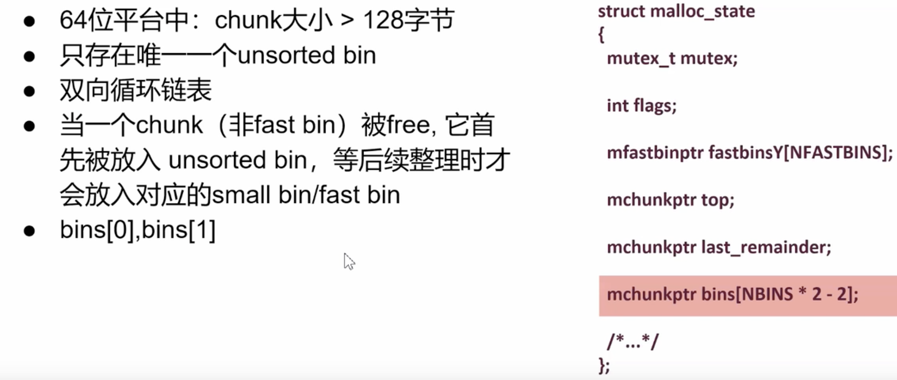

一开始只要不是放在fast bins的，都会先放到unsorted bins中，整理之后才会根据chunk的大小放到small bins或large bins中。


#### 其他的chunk


### 申请内存块 - malloc()的工作流程


### 释放内存块 - free()的工作流程


可以看出，`free()`后chunk的去处只有3个：`fast bin`, `top chunk`, 以及`unsorted bin`。
换言之，只是`free()`的话，是得不到`small bin`和`large bin`的。


#### 案例分析

(1)
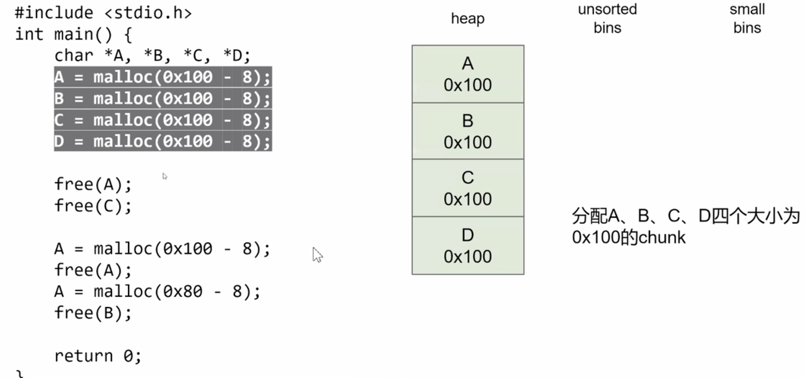

(2)
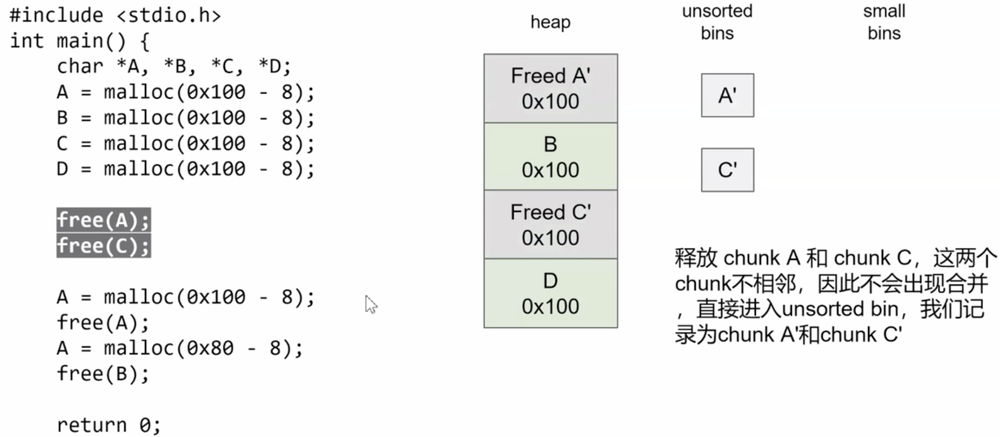

(3)
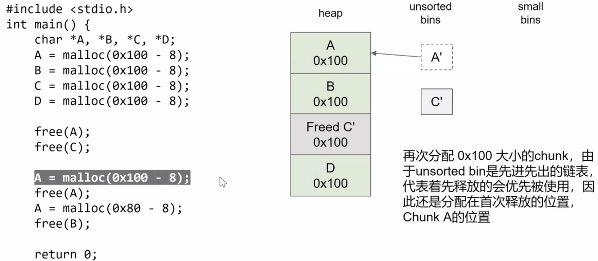

(4)
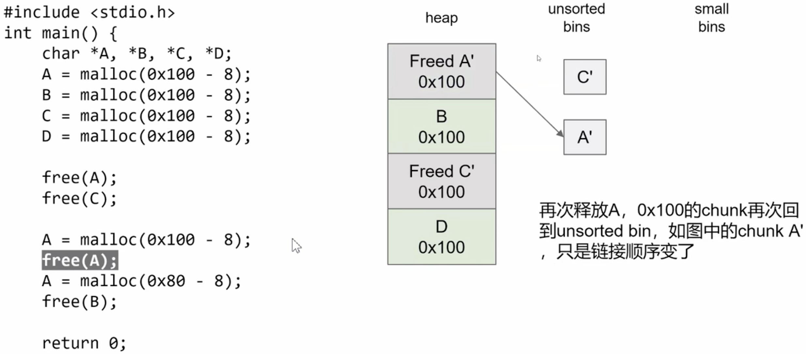

(5)
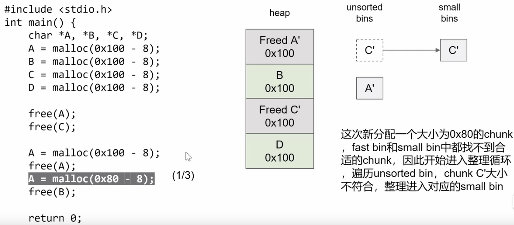

(6)
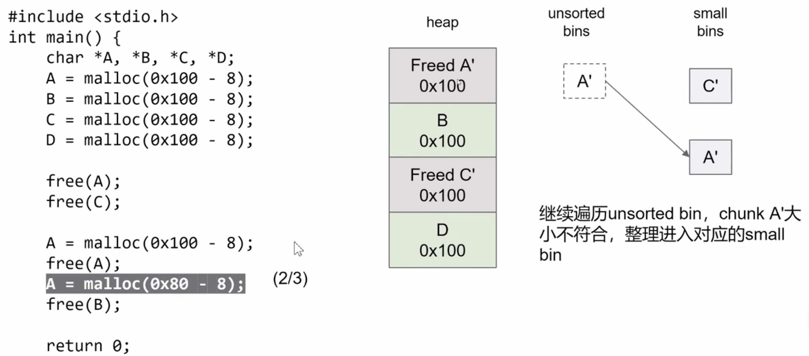

(7)
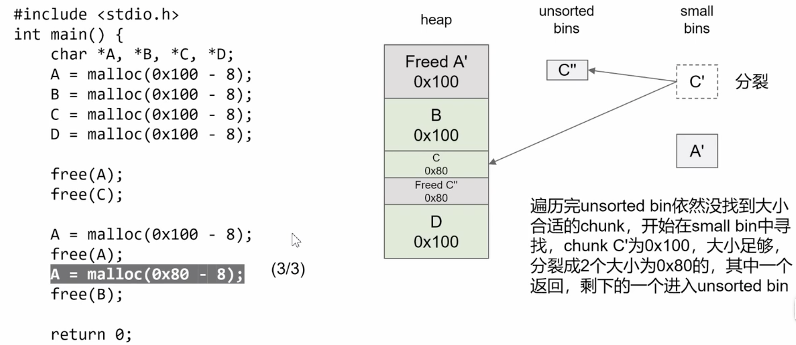

(8)
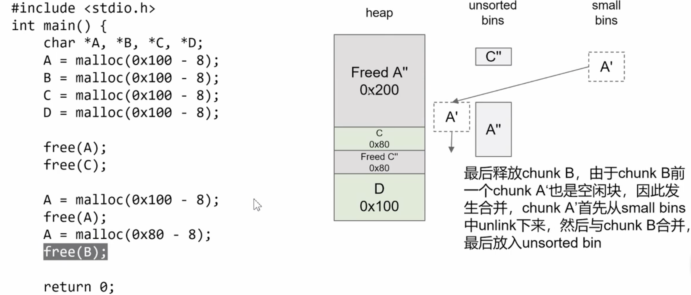


Reference:
[1] https://ctf-wiki.org/pwn/linux/glibc-heap/implementation/malloc/
[2] https://ctf-wiki.org/pwn/linux/glibc-heap/implementation/free/
[3] https://ctf-wiki.org/pwn/linux/glibc-heap/implementation/tcache/