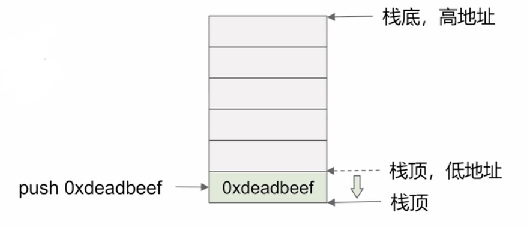

## 栈

- 一种先进后出的数据结构
- 被用于函数的局部内存管理
  - 保存局部变量
  - 保存函数的调用信息 (例如返回地址)

- 在`x86`的进程空间中，栈是从高地址往低地址的方向增长的，如下图所示。
- `esp`寄存器永远指向栈顶
- 栈操作（这里以`x86`为例）
  - 入栈： ```push: esp = esp - 4```
  - 出栈： ```pop: esp = esp + 4```

