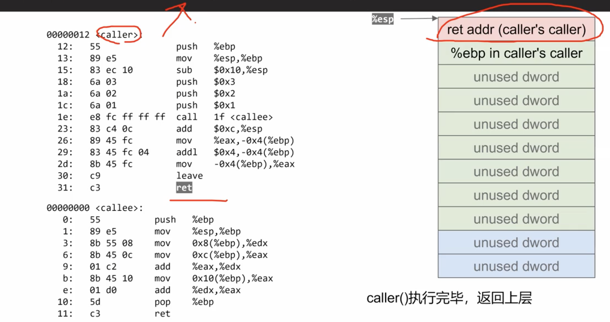

# 调用约定

## 1.什么是调用约定

- 实现层面(底层)的规范
- 约定了函数之间如何传递参数
- 约定了函数如何传递返回值

## 2.常见x86调用约定

- 调用者负责清理栈上的参数(Caller Clean-up)
  - cdecl
  - optlink

- 被调者负责清理栈上的参数(Callee Clean-up)
  - stdcall
  - fastcall

### 2.1 调用约定 cdecl

- x86(32位) cdecl调用约定
  - 用栈来传递参数
  - 用寄存器`%eax`来保存返回值

- amd64(64位) cdecl调用约定
  - 使用寄存器 `%rdi`,`%rsi`,`%rdx`,`%rcx`,`%r8`,`%r9`来传递前6个参数
  - 第七个及后面的参数通过栈来传递

- 栈帧指针`%ebp(%rbp)`的用途
  - 索引栈上的参数(例如`x86`下，`%ebp+8`指向第一个参数)
  - 保存栈顶位置`%esp(%rsp)`

#### 调用约定 cdecl(x86,32位) 示例：
```cpp
int callee(int a, int b, int c) {
    return a + b + c;
}

int caller(void) {
    int ret;
    ret = callee(1, 2, 3);
    ret += 4;
    return ret;
}
```

图1: <br>


图2：<br>


图3：<br>

<br>
PS: 在栈上为给局部变量开辟多少空间，不会完全按照你需要多少字节，就开辟多少字节，多数情况是会比需要的字节数更多，因为会涉及字节对齐的约定，比如16字节对齐，32字节对齐等。

图4：<br>


图5：<br>


图6：<br>


图7：<br>


图8：<br>


图9：<br>


图10：<br>


图11：<br>


图12：<br>


图13：<br>


图14：<br>

