# 使用VisualStudio+VisualGDB对Linux平台开源项目进行源码调试


## 常见的Linux下的开发+调试环境

- 1、Linux: `vim/emacs` + `GDB`
- 2、Windows+Linux：`sourceinsight`+`winscp`+`gdb`
- 3、Linux：`eclipse`+`cdt`

以上的1、2两种方式都无法解决一个问题，就是需要学习大量的`gdb`命令，而且调试体验远远比不上`visual studio`那种图形界面。
至于第3种方式，据说还不错，但必须使用Linux桌面版本。Linux桌面版本的使用体验真的不尽如人意。（本人用过一年的Ubuntu桌面系统作为主力工作系统）。

## 使用`Visual Studio` + `VisualGDB`进行Linux平台的源码调试

下面介绍第4种方式：`Visual Studio` + `VisualGDB`

偶然在网友的一篇经验贴子推荐了一个插件：`VisualGDB`:
>linux上，visualgdb远程调试内核还是命令程序都是受到良好支持的，是理解内核中的关键机制很给力的工具。linux从内核到命令任何开源c/c++，你基本都能编译调试版。命令行版如gdb，lldb其实并不适合调试源码，因为导航太差。

这个插件在`Visual Studio`的扩展库里也能搜得到，不过是收费的，网上能找到破解版。（官方网站：https://visualgdb.com/)

使用`VisualGDB`，便可以使用`Visual Studio`的强大的图形界面的调试功能，远程编译、调试Linux平台的软件源码。

下面以编译、调试`sudo`的源码为例，讲述`Visual Studio 2019`+`VisualGDB 5.4`的使用。

- step 1
在`Visual Studio`中创建新项目，选择`Linux Project Wizard`类型（安装`VisualGDB`才会有）。

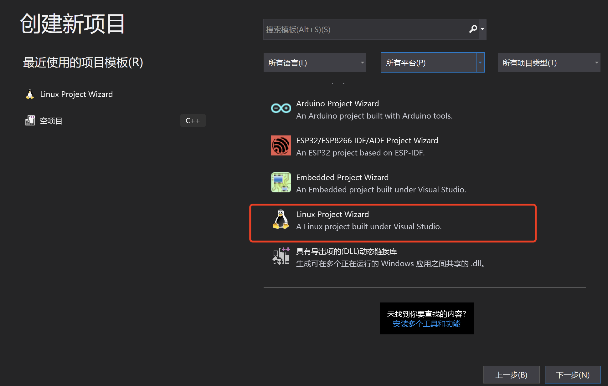

- step 2
选择导入项目：

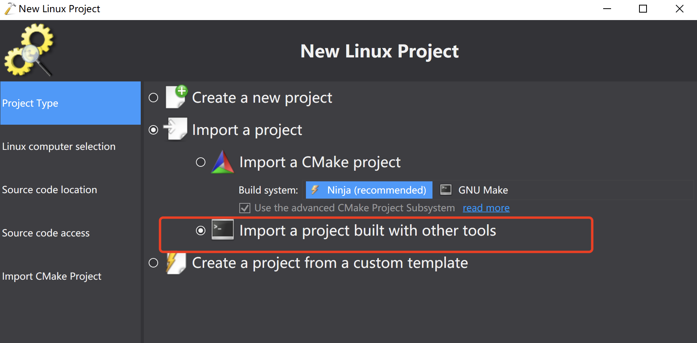

- step 3
建立与远程linux机器的ssh连接：

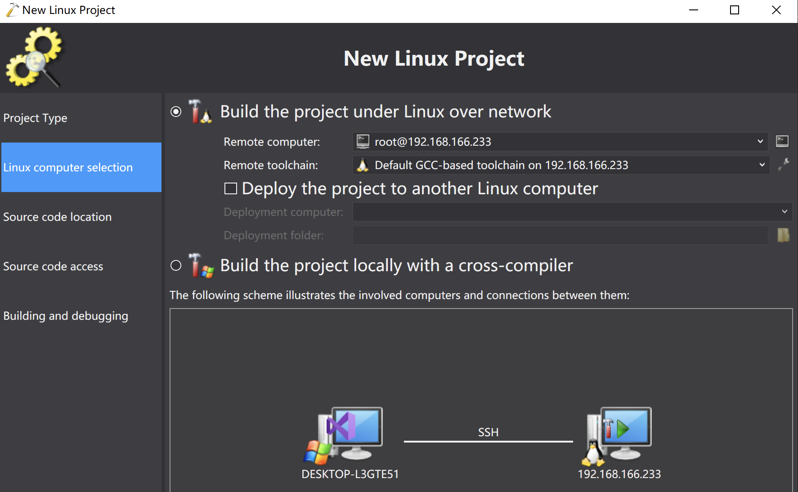

- step 4 
选择远程linux机器上的源码目录：

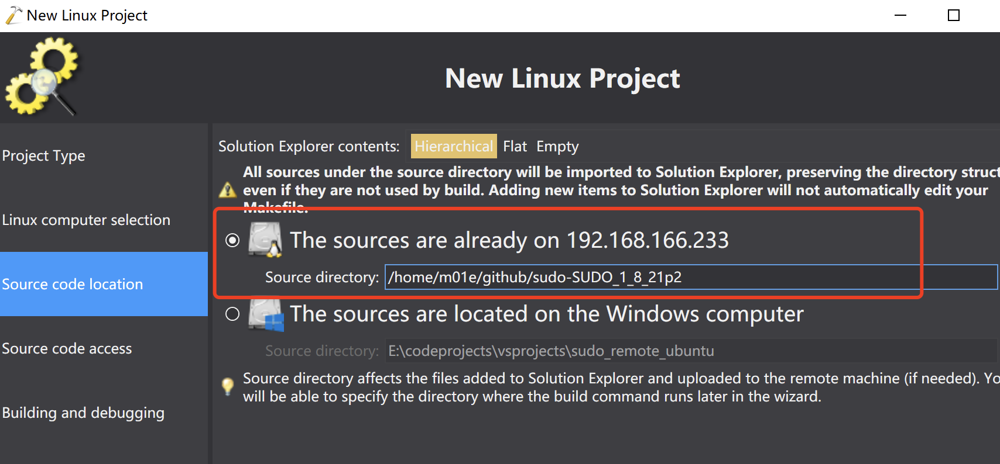

- step 5
选择通过`Samba`将远程linux机器上的源码目录挂载到Windows机器上。

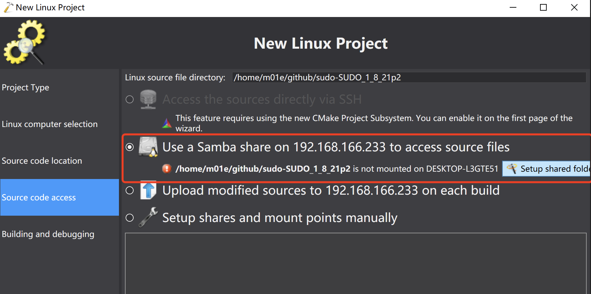

这里为了方便下次使用，我把共享目录的范围设置为用户的home目录：
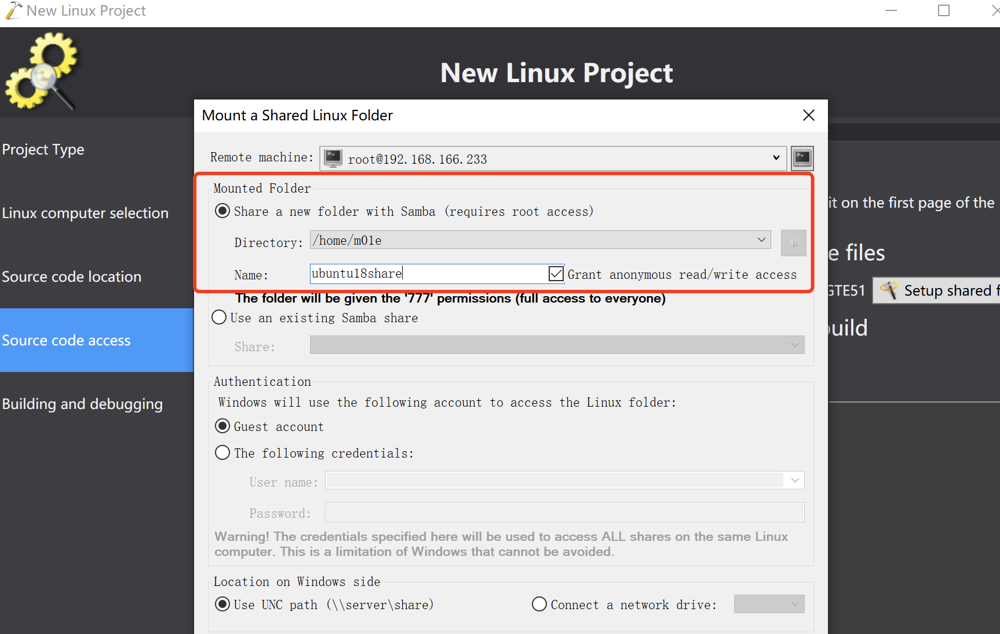

如果linux机器上没有按照`Samba`服务，`VisualGDB`可以帮你安装。
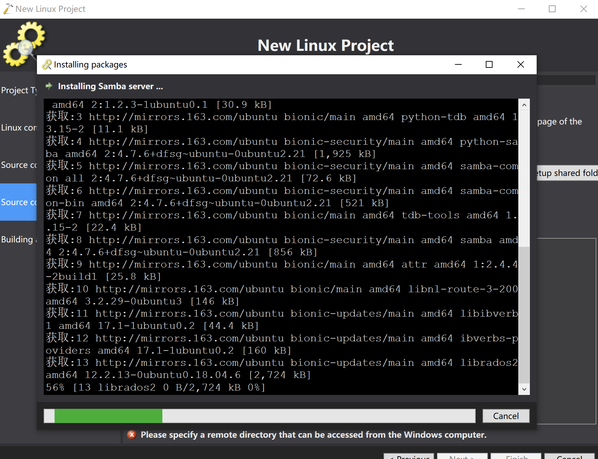

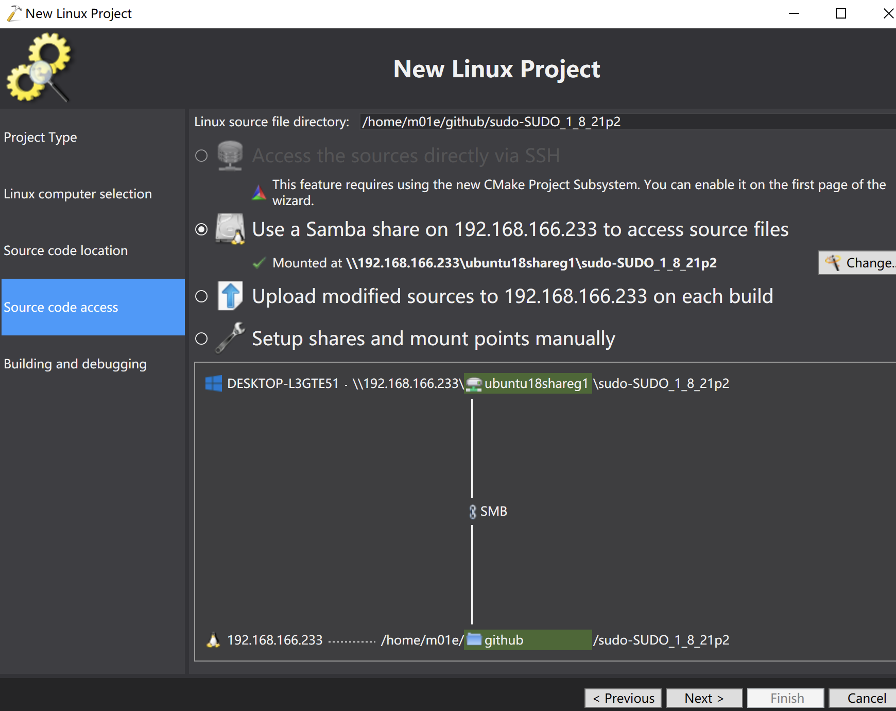

- step 6
设置编译命令、源码编译目录

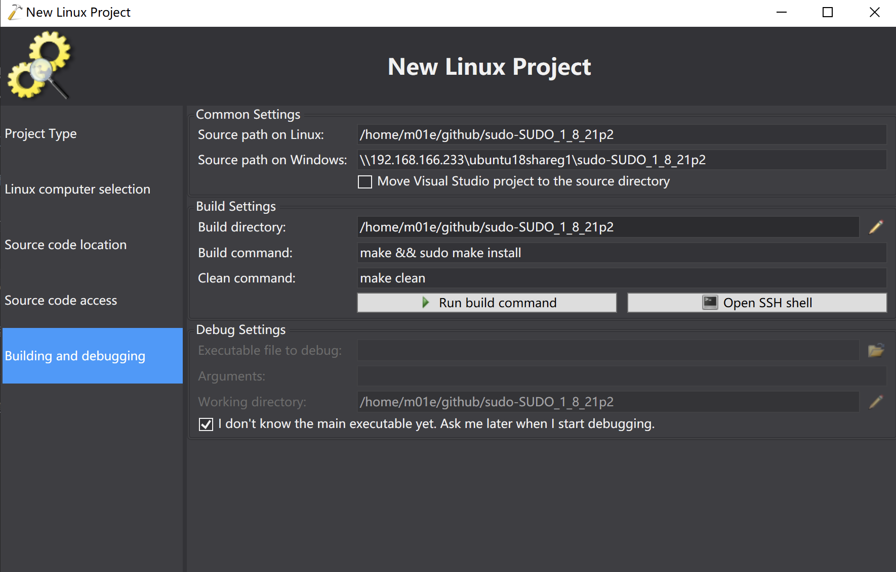

- step 7
创建项目成功后，在右边的解决方案视图中便能看到源码。
然后在`sudo.c`中的`main()`函数下断点：

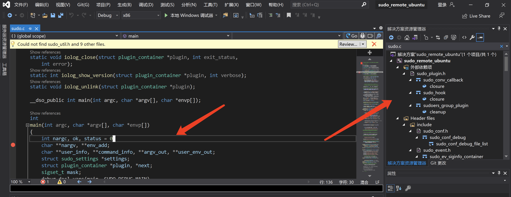

- step 8
在linux机器上，源码目录中执行以下命令，开启调试选项，以及编译后二进制程序所在的目录：
```
/configure --prefix=/home/m01e/opt --enable-env-debug
```
然后回到VS, 使用VisualGDB开启调试.

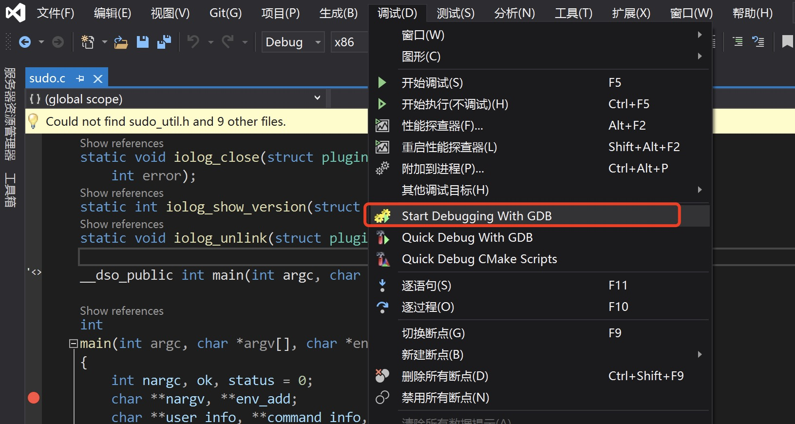

设置好要调试的二进制程序、以及程序启动参数，这里就以`sudo`最新的提权漏洞`CVE-2021-3156`的`PoC`为例：
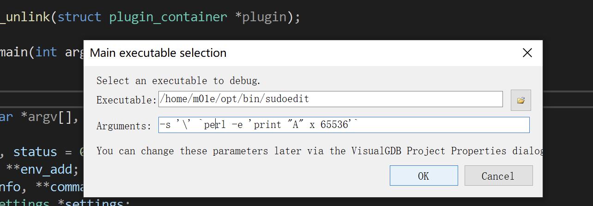

- step 9
启动调试。可以看到可以使用VS的可视化调试界面进行很方便的调试：

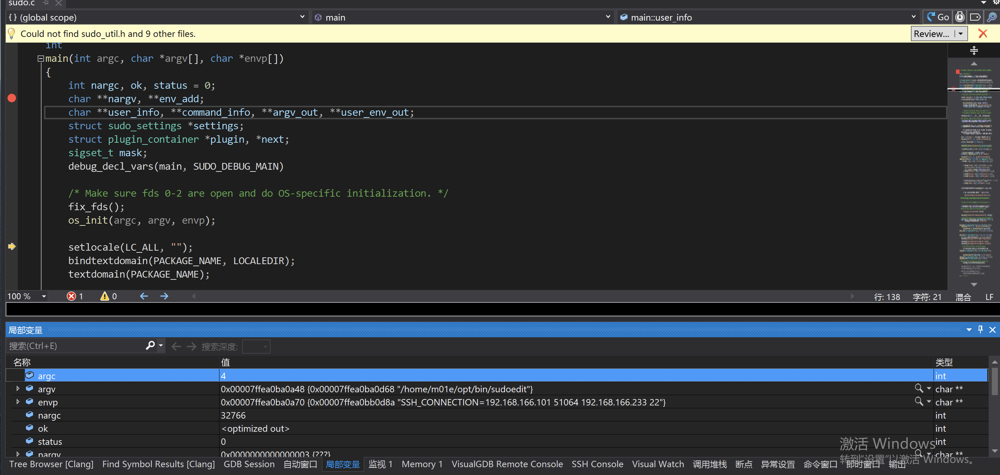

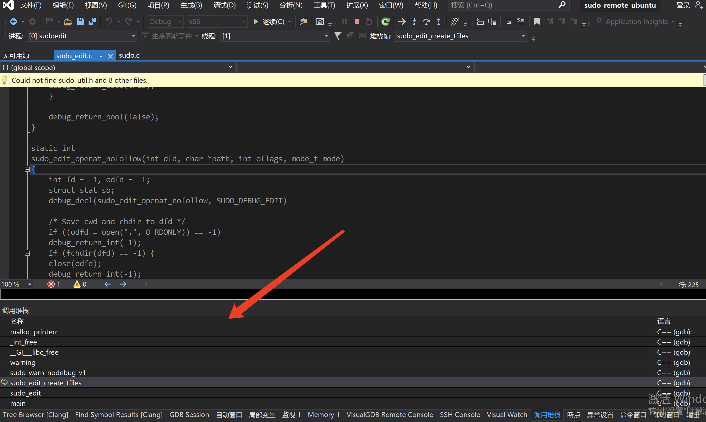

继续执行程序，可以看到最终`buf`这块缓冲区溢出了，被填充了一堆的`AAAA...`
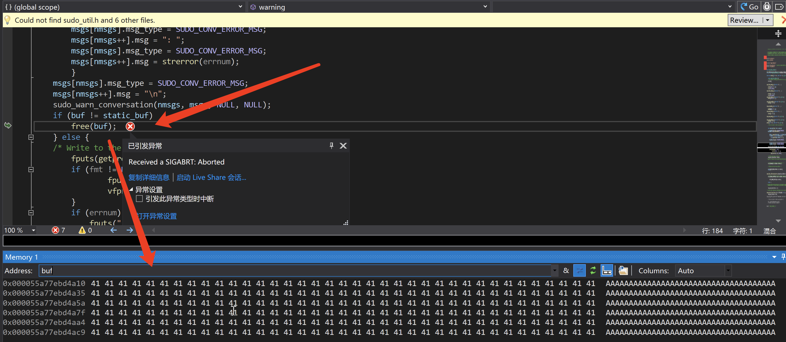


## Reference

[1] https://www.cnblogs.com/robinex/p/7854227.html