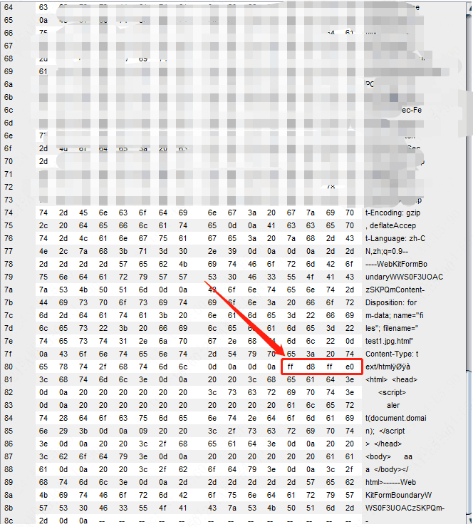

# 一次文件上传功能的审计

近期工作中遇到个系统，审计了一下它的文件上传功能。虽然最终结果是无法利用，
但是它本身的安全校验还是存在缺陷且可被绕过，因此还是值得说道说道的。

## 黑盒测试

黑盒测试的时候，看到一处文件上传功能，burpsuite抓包改了文件名后缀后，依旧上传成功，
且响应包返回了可访问的`url`。感觉有戏。但很快被泼了冷水:
- 后台从文件内容中识别文件类型并进行校验。

## 代码审计

好吧，既然有代码，就审计下后台是如何校验的吧。
将项目导入IDEA，一看是基于`springboot`，心凉了一大截。
因为`springboot`的项目，即便能上传jsp，大概率也是无法被解析的。除非有反序列化漏洞可以利用进行命令执行的回显或者注入内存webshell...

先不管了，大不了上传个`html`或`svg`造成`XSS`也好呀，或者文件名和文件存放位置可操纵的话，说不定能传个`ssh`的`authorized_key`文件上去从而ssh直接登陆上去。

通过阅读源码，发现上传接口有两处，但两处的安全校验逻辑是相同的,都是通过一个拦截器`UploadInterceptor`去实现的。它的校验逻辑如下：
>通过文件内容的头4个字节来判断(获取)文件类型，然后用它与文件后缀白名单进行比对校验。

校验部分大致代码如下：

但并没有对上传的文件名的后缀进行白名单校验，故在文件头4个字节设置为`jpg`对应的4个字节的便可绕过校验。如下：

>PS: 本地搭环境测试了一下，`jsp`、`html`文件在能被解析的前提下，文件的头部添加4个任意字节，都不影响它的执行。

文件上传成功后，我们通过服务器返回的`url`去访问，发现`html`、`jsp`文件无法解析。该`url`是一个接口的形式，并不是一个文件访问路径。

于是继续审计代码，看看上传功能是如何保存文件的，以及返回的接口`url`为什么不能解析文件。

从上图中代码可知，文件上传后，文件保存的路径为`/mnt/xxx/img/file` 这个固定目录下，且文件名=`当前日期时间`+`随机的uuid值`+`文件后缀名`。换言之，文件上传后，保存在服务器上文件名是不可控的。

再继续看上传后返回的那个文件访问`url`接口的实现。

可以看到，仅仅是读取文件的内容并原样返回。
>PS：当然这里有个系统任意文件读取的漏洞，但这不是本文的重点，就不说了。

## 小结

综上，该文件上传功能的安全校验虽然可被绕过，但由于上面提到的原因，无法进行进一步的利用。但也算是一次代码审计的训练吧，做个记录。
