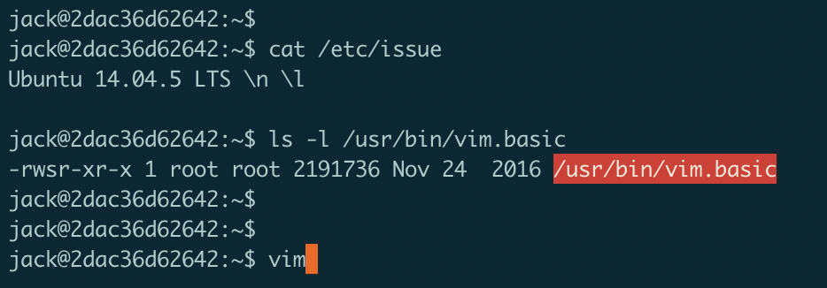
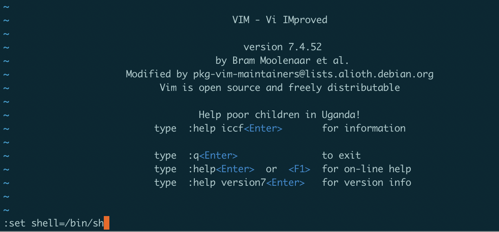
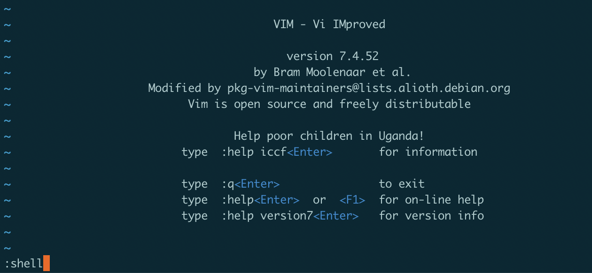
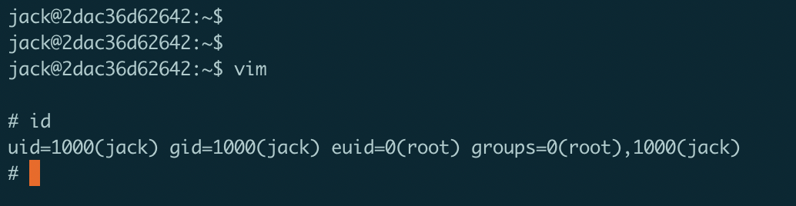
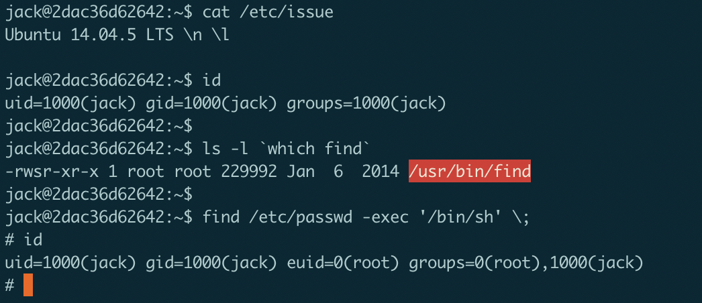
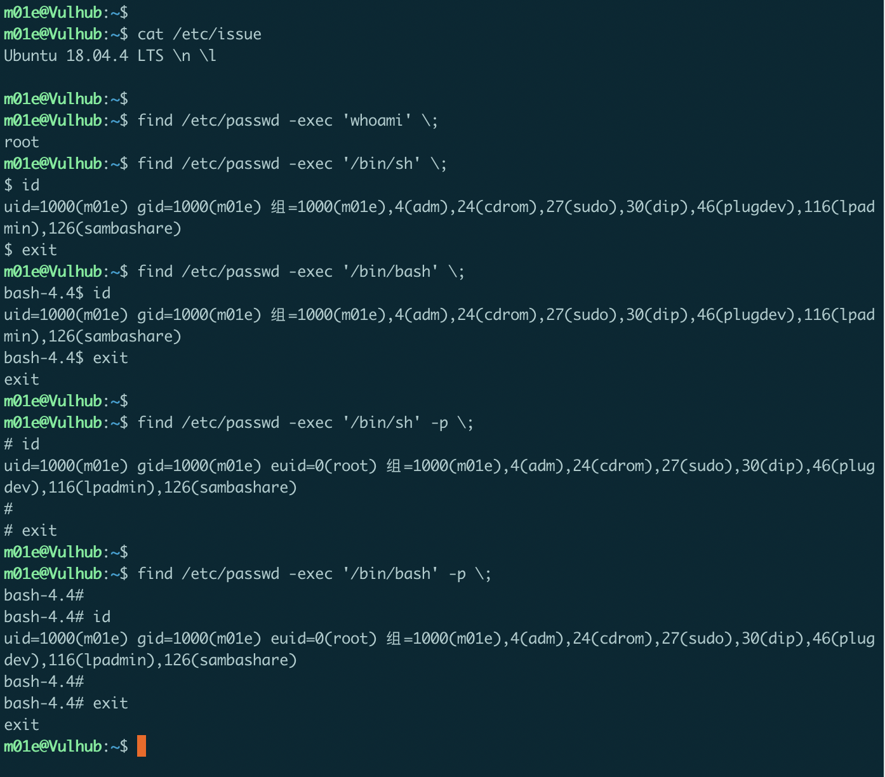

## 利用suid提权

### 什么是SUID

SUID，即`Set User Id`。它是一种文件权限类型。它允许用户使用指定用户的权限去执行文件。比如某二进制程序的`uid`为 `root`，用户`A`在执行该二进制程序时将以`root`用户的权限去执行。

---

可通过以下命令查找系统上拥有suid的文件

```
find / -perm -u=s -type f 2>/dev/null
或：
find / -perm -4000 -type f 2 >/dev/null
```

---
- 在以下环境可成功提权： <br>
Ubuntu 14.04.5 <br>
Debian 8 <br>
Debian 9 <br>
>
- 在以下环境不行 <br>
Ubuntu 16.04 <br>
Debian 10  <br>

>这是因为在一些高版本的linux发行版中，默认情况下`sh`或`bash`在执行时，如果发现`uid`和`euid`不匹配，则会将`euid`(即suid) 强制重置为 uid。如果使用了 `-p`参数，则不会覆盖。
但是在下面这些命令实例中，我只在 `find`命令中，成功通过`-p`参数在一些高版本的linux发行版中进行提权。其他命令在提权过程中无法加上 `-p`参数(语法问题)。

---

下面仅列举部分常见的可利用的命令:<br>
- `vi/vim`
- `find`
- `sh/bash`

想了解更多可利用的命令，请参考：
https://gtfobins.github.io/

### 1、利用具有suid位的vi/vim提权






### 2、利用具有suid位的find提权



在`Ubuntu 18.04`中：




### 3、利用具有suid位的sh/bash提权

